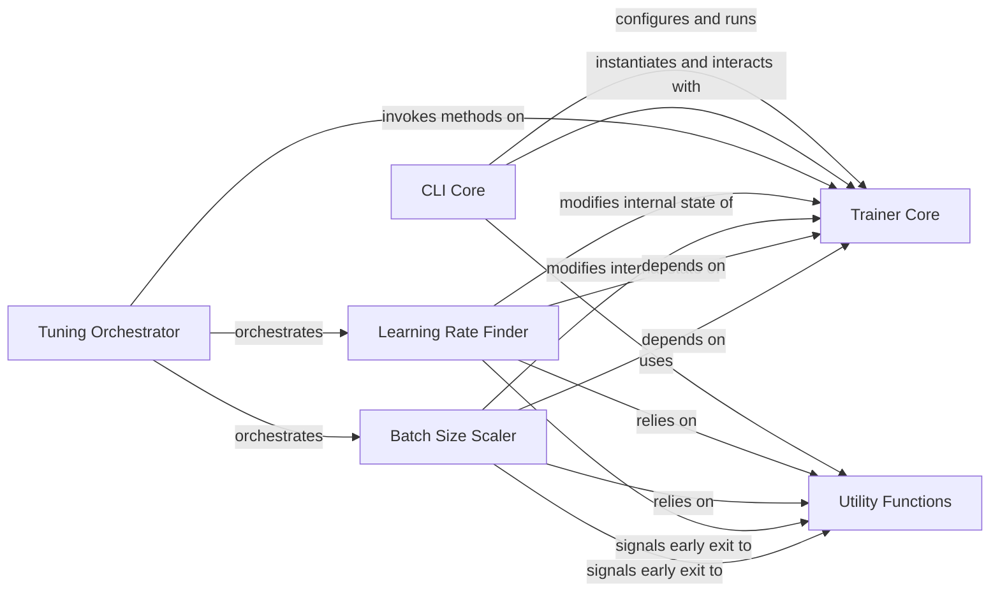

## Component Details

This subsystem provides core functionalities for automated hyperparameter optimization and a command-line interface for configuring and running Lightning models and trainers. It encompasses components for parsing CLI arguments, orchestrating training runs, and specialized tools for learning rate finding and batch size scaling, all supported by a set of general utility functions.

### CLI Core
The CLI Core component provides the main command-line interface for PyTorch Lightning applications. It is responsible for parsing command-line arguments and configuration files, setting up the application environment, instantiating core Lightning classes like models, datamodules, and the Trainer, and orchestrating the execution of various subcommands such as 'fit', 'validate', 'test', and 'predict'. It also handles automatic configuration of optimizers and learning rate schedulers.

**Related Classes/Methods**:

- <a href="https://github.com/Lightning-AI/lightning/blob/master/src/lightning/pytorch/cli.py#L85-L211" target="_blank" rel="noopener noreferrer">`lightning.pytorch.cli.LightningArgumentParser` (85:211)</a>
- <a href="https://github.com/Lightning-AI/lightning/blob/master/src/lightning/pytorch/cli.py#L311-L744" target="_blank" rel="noopener noreferrer">`lightning.pytorch.cli.LightningCLI` (311:744)</a>
- <a href="https://github.com/Lightning-AI/lightning/blob/master/src/lightning/pytorch/cli.py#L115-L160" target="_blank" rel="noopener noreferrer">`lightning.pytorch.cli.LightningArgumentParser:add_lightning_class_args` (115:160)</a>
- <a href="https://github.com/Lightning-AI/lightning/blob/master/src/lightning/pytorch/cli.py#L314-L405" target="_blank" rel="noopener noreferrer">`lightning.pytorch.cli.LightningCLI:__init__` (314:405)</a>
- <a href="https://github.com/Lightning-AI/lightning/blob/master/src/lightning/pytorch/cli.py#L407-L411" target="_blank" rel="noopener noreferrer">`lightning.pytorch.cli.LightningCLI:_setup_parser_kwargs` (407:411)</a>
- <a href="https://github.com/Lightning-AI/lightning/blob/master/src/lightning/pytorch/cli.py#L413-L420" target="_blank" rel="noopener noreferrer">`lightning.pytorch.cli.LightningCLI.init_parser` (413:420)</a>
- <a href="https://github.com/Lightning-AI/lightning/blob/master/src/lightning/pytorch/cli.py#L422-L431" target="_blank" rel="noopener noreferrer">`lightning.pytorch.cli.LightningCLI.setup_parser` (422:431)</a>
- <a href="https://github.com/Lightning-AI/lightning/blob/master/src/lightning/pytorch/cli.py#L461-L472" target="_blank" rel="noopener noreferrer">`lightning.pytorch.cli.LightningCLI._add_arguments` (461:472)</a>
- <a href="https://github.com/Lightning-AI/lightning/blob/master/src/lightning/pytorch/cli.py#L492-L509" target="_blank" rel="noopener noreferrer">`lightning.pytorch.cli.LightningCLI._add_subcommands` (492:509)</a>
- <a href="https://github.com/Lightning-AI/lightning/blob/master/src/lightning/pytorch/cli.py#L511-L519" target="_blank" rel="noopener noreferrer">`lightning.pytorch.cli.LightningCLI:_prepare_subcommand_parser` (511:519)</a>
- <a href="https://github.com/Lightning-AI/lightning/blob/master/src/lightning/pytorch/cli.py#L522-L532" target="_blank" rel="noopener noreferrer">`lightning.pytorch.cli.LightningCLI.link_optimizers_and_lr_schedulers` (522:532)</a>
- <a href="https://github.com/Lightning-AI/lightning/blob/master/src/lightning/pytorch/cli.py#L547-L561" target="_blank" rel="noopener noreferrer">`lightning.pytorch.cli.LightningCLI._add_instantiators` (547:561)</a>
- <a href="https://github.com/Lightning-AI/lightning/blob/master/src/lightning/pytorch/cli.py#L566-L572" target="_blank" rel="noopener noreferrer">`lightning.pytorch.cli.LightningCLI.instantiate_classes` (566:572)</a>
- <a href="https://github.com/Lightning-AI/lightning/blob/master/src/lightning/pytorch/cli.py#L577-L586" target="_blank" rel="noopener noreferrer">`lightning.pytorch.cli.LightningCLI.instantiate_trainer` (577:586)</a>
- <a href="https://github.com/Lightning-AI/lightning/blob/master/src/lightning/pytorch/cli.py#L588-L611" target="_blank" rel="noopener noreferrer">`lightning.pytorch.cli.LightningCLI:_instantiate_trainer` (588:611)</a>
- <a href="https://github.com/Lightning-AI/lightning/blob/master/src/lightning/pytorch/cli.py#L640-L700" target="_blank" rel="noopener noreferrer">`lightning.pytorch.cli.LightningCLI:_add_configure_optimizers_method_to_model` (640:700)</a>
- <a href="https://github.com/Lightning-AI/lightning/blob/master/src/lightning/pytorch/cli.py#L706-L719" target="_blank" rel="noopener noreferrer">`lightning.pytorch.cli.LightningCLI:_run_subcommand` (706:719)</a>
- <a href="https://github.com/Lightning-AI/lightning/blob/master/src/lightning/pytorch/cli.py#L731-L744" target="_blank" rel="noopener noreferrer">`lightning.pytorch.cli.LightningCLI:_set_seed` (731:744)</a>
- <a href="https://github.com/Lightning-AI/lightning/blob/master/src/lightning/pytorch/cli.py#L751-L756" target="_blank" rel="noopener noreferrer">`lightning.pytorch.cli._global_add_class_path` (751:756)</a>
- <a href="https://github.com/Lightning-AI/lightning/blob/master/src/lightning/pytorch/cli.py#L759-L763" target="_blank" rel="noopener noreferrer">`lightning.pytorch.cli._add_class_path_generator` (759:763)</a>
- <a href="https://github.com/Lightning-AI/lightning/blob/master/src/lightning/pytorch/cli.py#L802-L822" target="_blank" rel="noopener noreferrer">`lightning.pytorch.cli._InstantiatorFn` (802:822)</a>
- <a href="https://github.com/Lightning-AI/lightning/blob/master/src/lightning/pytorch/cli.py#L214-L308" target="_blank" rel="noopener noreferrer">`lightning.pytorch.cli.SaveConfigCallback` (214:308)</a>
- <a href="https://github.com/Lightning-AI/lightning/blob/master/src/lightning/pytorch/cli.py#L766-L783" target="_blank" rel="noopener noreferrer">`lightning.pytorch.cli.instantiate_class` (766:783)</a>
- <a href="https://github.com/Lightning-AI/lightning/blob/master/src/lightning/pytorch/cli.py#L786-L793" target="_blank" rel="noopener noreferrer">`lightning.pytorch.cli._get_short_description` (786:793)</a>
- <a href="https://github.com/Lightning-AI/lightning/blob/master/src/lightning/pytorch/cli.py#L796-L799" target="_blank" rel="noopener noreferrer">`lightning.pytorch.cli._get_module_type` (796:799)</a>
- <a href="https://github.com/Lightning-AI/lightning/blob/master/src/lightning/pytorch/cli.py#L747-L748" target="_blank" rel="noopener noreferrer">`lightning.pytorch.cli._class_path_from_class` (747:748)</a>

### Learning Rate Finder
The Learning Rate Finder component provides a callback and associated logic to perform a learning rate range test. This test helps users identify an optimal initial learning rate for their models by iteratively training with varying learning rates and observing the corresponding loss. It includes mechanisms for early stopping and plotting the results.

**Related Classes/Methods**:

- <a href="https://github.com/Lightning-AI/lightning/blob/master/src/lightning/pytorch/tuner/lr_finder.py#L213-L310" target="_blank" rel="noopener noreferrer">`lightning.pytorch.tuner.lr_finder._lr_find` (213:310)</a>
- <a href="https://github.com/Lightning-AI/lightning/blob/master/src/lightning/pytorch/callbacks/lr_finder.py#L111-L126" target="_blank" rel="noopener noreferrer">`lightning.pytorch.callbacks.lr_finder.LearningRateFinder:lr_find` (111:126)</a>
- <a href="https://github.com/Lightning-AI/lightning/blob/master/src/lightning/pytorch/callbacks/lr_finder.py#L129-L130" target="_blank" rel="noopener noreferrer">`lightning.pytorch.callbacks.lr_finder.LearningRateFinder:on_fit_start` (129:130)</a>
- <a href="https://github.com/Lightning-AI/lightning/blob/master/src/lightning/pytorch/tuner/lr_finder.py#L48-L66" target="_blank" rel="noopener noreferrer">`lightning.pytorch.tuner.lr_finder:_determine_lr_attr_name` (48:66)</a>
- <a href="https://github.com/Lightning-AI/lightning/blob/master/src/lightning/pytorch/tuner/lr_finder.py#L107-L133" target="_blank" rel="noopener noreferrer">`lightning.pytorch.tuner.lr_finder:_LRFinder:_exchange_scheduler` (107:133)</a>
- <a href="https://github.com/Lightning-AI/lightning/blob/master/src/lightning/pytorch/tuner/lr_finder.py#L135-L177" target="_blank" rel="noopener noreferrer">`lightning.pytorch.tuner.lr_finder:_LRFinder:plot` (135:177)</a>
- <a href="https://github.com/Lightning-AI/lightning/blob/master/src/lightning/pytorch/tuner/lr_finder.py#L325-L335" target="_blank" rel="noopener noreferrer">`lightning.pytorch.tuner.lr_finder:__lr_finder_reset_params` (325:335)</a>
- <a href="https://github.com/Lightning-AI/lightning/blob/master/src/lightning/pytorch/tuner/lr_finder.py#L69-L210" target="_blank" rel="noopener noreferrer">`lightning.pytorch.tuner.lr_finder:_LRFinder` (69:210)</a>
- <a href="https://github.com/Lightning-AI/lightning/blob/master/src/lightning/pytorch/tuner/lr_finder.py#L445-L479" target="_blank" rel="noopener noreferrer">`lightning.pytorch.tuner.lr_finder:_LinearLR` (445:479)</a>
- <a href="https://github.com/Lightning-AI/lightning/blob/master/src/lightning/pytorch/tuner/lr_finder.py#L482-L516" target="_blank" rel="noopener noreferrer">`lightning.pytorch.tuner.lr_finder:_ExponentialLR` (482:516)</a>
- <a href="https://github.com/Lightning-AI/lightning/blob/master/src/lightning/pytorch/tuner/lr_finder.py#L352-L442" target="_blank" rel="noopener noreferrer">`lightning.pytorch.tuner.lr_finder:_LRCallback` (352:442)</a>
- <a href="https://github.com/Lightning-AI/lightning/blob/master/src/lightning/pytorch/tuner/lr_finder.py#L313-L322" target="_blank" rel="noopener noreferrer">`lightning.pytorch.tuner.lr_finder.__lr_finder_dump_params` (313:322)</a>
- <a href="https://github.com/Lightning-AI/lightning/blob/master/src/lightning/pytorch/tuner/lr_finder.py#L338-L349" target="_blank" rel="noopener noreferrer">`lightning.pytorch.tuner.lr_finder.__lr_finder_restore_params` (338:349)</a>

### Batch Size Scaler
The Batch Size Scaler component offers a callback and underlying algorithms to automatically determine the largest possible batch size that can be used without encountering an out-of-memory (OOM) error. It supports different search strategies like 'power' and 'binary search' to efficiently find the optimal batch size for a given hardware configuration.

**Related Classes/Methods**:

- <a href="https://github.com/Lightning-AI/lightning/blob/master/src/lightning/pytorch/tuner/batch_size_scaling.py#L28-L98" target="_blank" rel="noopener noreferrer">`lightning.pytorch.tuner.batch_size_scaling._scale_batch_size` (28:98)</a>
- <a href="https://github.com/Lightning-AI/lightning/blob/master/src/lightning/pytorch/callbacks/batch_size_finder.py#L175-L187" target="_blank" rel="noopener noreferrer">`lightning.pytorch.callbacks.batch_size_finder.BatchSizeFinder:scale_batch_size` (175:187)</a>
- <a href="https://github.com/Lightning-AI/lightning/blob/master/src/lightning/pytorch/callbacks/batch_size_finder.py#L190-L191" target="_blank" rel="noopener noreferrer">`lightning.pytorch.callbacks.batch_size_finder.BatchSizeFinder:on_fit_start` (190:191)</a>
- <a href="https://github.com/Lightning-AI/lightning/blob/master/src/lightning/pytorch/callbacks/batch_size_finder.py#L194-L198" target="_blank" rel="noopener noreferrer">`lightning.pytorch.callbacks.batch_size_finder.BatchSizeFinder:on_validation_start` (194:198)</a>
- <a href="https://github.com/Lightning-AI/lightning/blob/master/src/lightning/pytorch/callbacks/batch_size_finder.py#L201-L202" target="_blank" rel="noopener noreferrer">`lightning.pytorch.callbacks.batch_size_finder.BatchSizeFinder:on_test_start` (201:202)</a>
- <a href="https://github.com/Lightning-AI/lightning/blob/master/src/lightning/pytorch/callbacks/batch_size_finder.py#L205-L206" target="_blank" rel="noopener noreferrer">`lightning.pytorch.callbacks.batch_size_finder.BatchSizeFinder:on_predict_start` (205:206)</a>
- <a href="https://github.com/Lightning-AI/lightning/blob/master/src/lightning/pytorch/tuner/batch_size_scaling.py#L101-L119" target="_blank" rel="noopener noreferrer">`lightning.pytorch.tuner.batch_size_scaling:__scale_batch_dump_params` (101:119)</a>
- <a href="https://github.com/Lightning-AI/lightning/blob/master/src/lightning/pytorch/tuner/batch_size_scaling.py#L122-L138" target="_blank" rel="noopener noreferrer">`lightning.pytorch.tuner.batch_size_scaling:__scale_batch_reset_params` (122:138)</a>
- <a href="https://github.com/Lightning-AI/lightning/blob/master/src/lightning/pytorch/tuner/batch_size_scaling.py#L141-L164" target="_blank" rel="noopener noreferrer">`lightning.pytorch.tuner.batch_size_scaling:__scale_batch_restore_params` (141:164)</a>
- <a href="https://github.com/Lightning-AI/lightning/blob/master/src/lightning/pytorch/tuner/batch_size_scaling.py#L167-L206" target="_blank" rel="noopener noreferrer">`lightning.pytorch.tuner.batch_size_scaling:_run_power_scaling` (167:206)</a>
- <a href="https://github.com/Lightning-AI/lightning/blob/master/src/lightning/pytorch/tuner/batch_size_scaling.py#L209-L270" target="_blank" rel="noopener noreferrer">`lightning.pytorch.tuner.batch_size_scaling:_run_binary_scaling` (209:270)</a>
- <a href="https://github.com/Lightning-AI/lightning/blob/master/src/lightning/pytorch/tuner/batch_size_scaling.py#L273-L318" target="_blank" rel="noopener noreferrer">`lightning.pytorch.tuner.batch_size_scaling:_adjust_batch_size` (273:318)</a>
- <a href="https://github.com/Lightning-AI/lightning/blob/master/src/lightning/pytorch/tuner/batch_size_scaling.py#L321-L328" target="_blank" rel="noopener noreferrer">`lightning.pytorch.tuner.batch_size_scaling:_reset_dataloaders` (321:328)</a>
- <a href="https://github.com/Lightning-AI/lightning/blob/master/src/lightning/pytorch/tuner/batch_size_scaling.py#L331-L336" target="_blank" rel="noopener noreferrer">`lightning.pytorch.tuner.batch_size_scaling:_try_loop_run` (331:336)</a>
- <a href="https://github.com/Lightning-AI/lightning/blob/master/src/lightning/pytorch/tuner/batch_size_scaling.py#L339-L345" target="_blank" rel="noopener noreferrer">`lightning.pytorch.tuner.batch_size_scaling:_reset_progress` (339:345)</a>

### Tuning Orchestrator
The Tuning Orchestrator component provides a high-level interface for initiating and managing various hyperparameter tuning processes within PyTorch Lightning. It acts as a facade for the underlying tuning callbacks, such as the Learning Rate Finder and Batch Size Scaler, simplifying their usage and integrating them seamlessly with the Trainer.

**Related Classes/Methods**:

- <a href="https://github.com/Lightning-AI/lightning/blob/master/src/lightning/pytorch/tuner/tuning.py#L25-L184" target="_blank" rel="noopener noreferrer">`lightning.pytorch.tuner.tuning.Tuner` (25:184)</a>
- <a href="https://github.com/Lightning-AI/lightning/blob/master/src/lightning/pytorch/tuner/tuning.py#L31-L106" target="_blank" rel="noopener noreferrer">`lightning.pytorch.tuner.tuning.Tuner:scale_batch_size` (31:106)</a>
- <a href="https://github.com/Lightning-AI/lightning/blob/master/src/lightning/pytorch/tuner/tuning.py#L108-L184" target="_blank" rel="noopener noreferrer">`lightning.pytorch.tuner.tuning.Tuner:lr_find` (108:184)</a>
- <a href="https://github.com/Lightning-AI/lightning/blob/master/src/lightning/pytorch/tuner/tuning.py#L187-L208" target="_blank" rel="noopener noreferrer">`lightning.pytorch.tuner.tuning:_check_tuner_configuration` (187:208)</a>
- <a href="https://github.com/Lightning-AI/lightning/blob/master/src/lightning/pytorch/tuner/tuning.py#L211-L220" target="_blank" rel="noopener noreferrer">`lightning.pytorch.tuner.tuning:_check_lr_find_configuration` (211:220)</a>
- <a href="https://github.com/Lightning-AI/lightning/blob/master/src/lightning/pytorch/tuner/tuning.py#L223-L235" target="_blank" rel="noopener noreferrer">`lightning.pytorch.tuner.tuning:_check_scale_batch_size_configuration` (223:235)</a>

### Trainer Core
The Trainer Core is the fundamental component in PyTorch Lightning responsible for orchestrating the entire machine learning workflow. It manages the training, validation, testing, and prediction loops, handles device placement, distributed training, logging, checkpointing, and integrates with various callbacks and plugins.

**Related Classes/Methods**:

- <a href="https://github.com/Lightning-AI/lightning/blob/master/src/lightning/pytorch/trainer/trainer.py#L89-L1727" target="_blank" rel="noopener noreferrer">`lightning.pytorch.trainer.trainer.Trainer` (89:1727)</a>

### Utility Functions
This component encompasses a collection of general-purpose helper functions and classes used across the Lightning framework. These utilities provide common functionalities such as exception handling, random seed management for reproducibility, CUDA memory garbage collection, checking for out-of-memory errors, and flexible attribute access and manipulation on Lightning objects.

**Related Classes/Methods**:

- <a href="https://github.com/Lightning-AI/lightning/blob/master/src/lightning/fabric/utilities/exceptions.py#L16-L17" target="_blank" rel="noopener noreferrer">`lightning.fabric.utilities.exceptions.MisconfigurationException` (16:17)</a>
- <a href="https://github.com/Lightning-AI/lightning/blob/master/src/lightning/fabric/utilities/seed.py#L20-L69" target="_blank" rel="noopener noreferrer">`lightning.fabric.utilities.seed.seed_everything` (20:69)</a>
- <a href="https://github.com/Lightning-AI/lightning/blob/master/src/lightning/pytorch/utilities/exceptions.py#L31-L32" target="_blank" rel="noopener noreferrer">`lightning.pytorch.utilities.exceptions._TunerExitException` (31:32)</a>
- <a href="https://github.com/Lightning-AI/lightning/blob/master/src/lightning/pytorch/utilities/memory.py#L83-L92" target="_blank" rel="noopener noreferrer">`lightning.pytorch.utilities.memory.garbage_collection_cuda` (83:92)</a>
- <a href="https://github.com/Lightning-AI/lightning/blob/master/src/lightning/pytorch/utilities/memory.py#L49-L50" target="_blank" rel="noopener noreferrer">`lightning.pytorch.utilities.memory.is_oom_error` (49:50)</a>
- <a href="https://github.com/Lightning-AI/lightning/blob/master/src/lightning/pytorch/utilities/parsing.py#L288-L307" target="_blank" rel="noopener noreferrer">`lightning.pytorch.utilities.parsing.lightning_getattr` (288:307)</a>
- <a href="https://github.com/Lightning-AI/lightning/blob/master/src/lightning/pytorch/utilities/parsing.py#L310-L331" target="_blank" rel="noopener noreferrer">`lightning.pytorch.utilities.parsing.lightning_setattr` (310:331)</a>
- <a href="https://github.com/Lightning-AI/lightning/blob/master/src/lightning/pytorch/utilities/parsing.py#L279-L285" target="_blank" rel="noopener noreferrer">`lightning.pytorch.utilities.parsing.lightning_hasattr` (279:285)</a>
- <a href="https://github.com/Lightning-AI/lightning/blob/master/src/lightning/pytorch/utilities/model_helpers.py#L29-L46" target="_blank" rel="noopener noreferrer">`lightning.pytorch.utilities.model_helpers.is_overridden` (29:46)</a>
- <a href="https://github.com/Lightning-AI/lightning/blob/master/src/lightning/pytorch/loggers/logger.py#L51-L97" target="_blank" rel="noopener noreferrer">`lightning.pytorch.loggers.logger.DummyLogger` (51:97)</a>
- <a href="https://github.com/Lightning-AI/lightning/blob/master/src/lightning/pytorch/core/optimizer.py#L366-L371" target="_blank" rel="noopener noreferrer">`lightning.pytorch.core.optimizer._validate_optimizers_attached` (366:371)</a>
- <a href="https://github.com/Lightning-AI/lightning/blob/master/src/lightning/pytorch/utilities/types.py#L81-L94" target="_blank" rel="noopener noreferrer">`lightning.pytorch.utilities.types.LRSchedulerConfig` (81:94)</a>
- <a href="https://github.com/Lightning-AI/lightning/blob/master/src/lightning/pytorch/utilities/seed.py#L23-L46" target="_blank" rel="noopener noreferrer">`lightning.pytorch.utilities.seed.isolate_rng` (23:46)</a>

### [FAQ](https://github.com/CodeBoarding/GeneratedOnBoardings/tree/main?tab=readme-ov-file#faq)