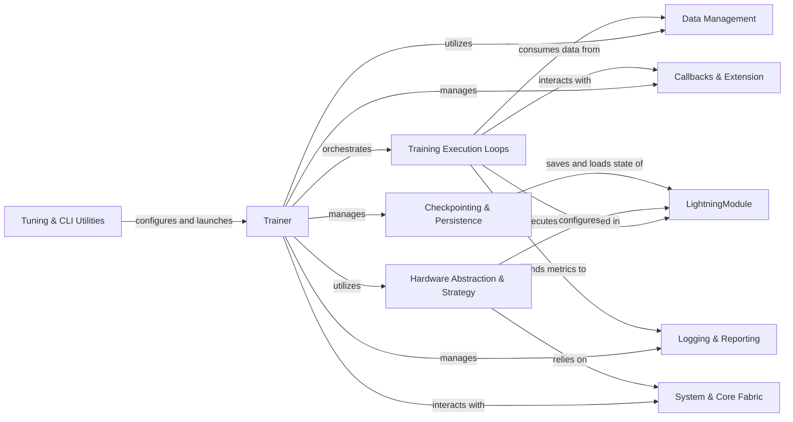

## Component Details

The architecture of `lightning` is centered around the `Trainer` component, which orchestrates the entire deep learning workflow, including training, validation, testing, and prediction. It leverages `LightningModule` for defining the model and its core logic, and `Data Management` for handling data loading and preprocessing. The `Training Execution Loops` component performs the iterative training steps, interacting with `LightningModule` and `Data Management`. `Hardware Abstraction & Strategy` provides the necessary infrastructure for device management, distributed training, and precision handling, relying on the foundational `System & Core Fabric`. Extensibility and monitoring are provided by `Callbacks & Extension` and `Logging & Reporting` respectively. `Checkpointing & Persistence` ensures model state can be saved and loaded. Finally, `Tuning & CLI Utilities` offer tools for hyperparameter optimization and command-line interaction, configuring and launching the `Trainer` to initiate the entire process.

### Trainer
The central orchestrator of the deep learning workflow, managing training, validation, testing, and prediction. It coordinates all other components to execute the model's lifecycle.

**Related Classes/Methods**:

- <a href="https://github.com/Lightning-AI/lightning/blob/master/src/lightning/pytorch/trainer/trainer.py#L89-L1727" target="_blank" rel="noopener noreferrer">`lightning.src.lightning.pytorch.trainer.trainer.Trainer` (89:1727)</a>

### LightningModule
Defines the neural network architecture, forward pass, and core training/evaluation/prediction logic. It also defines optimizer and LR scheduler configurations.

**Related Classes/Methods**:

- <a href="https://github.com/Lightning-AI/lightning/blob/master/src/lightning/pytorch/core/module.py#L88-L1595" target="_blank" rel="noopener noreferrer">`lightning.src.lightning.pytorch.core.module.LightningModule` (88:1595)</a>

### Data Management
Manages data loading, preprocessing, and splitting, providing DataLoader instances for various stages. It also handles attaching data to the Trainer.

**Related Classes/Methods**:

- <a href="https://github.com/Lightning-AI/lightning/blob/master/src/lightning/pytorch/core/datamodule.py#L34-L319" target="_blank" rel="noopener noreferrer">`lightning.src.lightning.pytorch.core.datamodule.LightningDataModule` (34:319)</a>
- <a href="https://github.com/Lightning-AI/lightning/blob/master/src/lightning/pytorch/trainer/connectors/data_connector.py#L46-L226" target="_blank" rel="noopener noreferrer">`lightning.src.lightning.pytorch.trainer.connectors.data_connector._DataConnector` (46:226)</a>

### Training Execution Loops
Defines the iterative processes for different phases of model training (fit, evaluation, prediction) and manages batch processing, epoch progression, and parameter updates via optimizers and schedulers.

**Related Classes/Methods**:

- <a href="https://github.com/Lightning-AI/lightning/blob/master/src/lightning/pytorch/loops/fit_loop.py#L58-L529" target="_blank" rel="noopener noreferrer">`lightning.src.lightning.pytorch.loops.fit_loop._FitLoop` (58:529)</a>
- <a href="https://github.com/Lightning-AI/lightning/blob/master/src/lightning/pytorch/loops/evaluation_loop.py#L57-L613" target="_blank" rel="noopener noreferrer">`lightning.src.lightning.pytorch.loops.evaluation_loop._EvaluationLoop` (57:613)</a>
- <a href="https://github.com/Lightning-AI/lightning/blob/master/src/lightning/pytorch/loops/prediction_loop.py#L47-L404" target="_blank" rel="noopener noreferrer">`lightning.src.lightning.pytorch.loops.prediction_loop._PredictionLoop` (47:404)</a>
- <a href="https://github.com/Lightning-AI/lightning/blob/master/src/lightning/pytorch/core/optimizer.py#L39-L171" target="_blank" rel="noopener noreferrer">`lightning.src.lightning.pytorch.core.optimizer.LightningOptimizer` (39:171)</a>
- <a href="https://github.com/Lightning-AI/lightning/blob/master/src/lightning/pytorch/core/optimizer.py#L174-L197" target="_blank" rel="noopener noreferrer">`lightning.src.lightning.pytorch.core.optimizer._init_optimizers_and_lr_schedulers` (174:197)</a>

### Hardware Abstraction & Strategy
Provides an abstraction layer for interacting with different hardware devices and implements various distributed training paradigms, managing device setup, model/optimizer distribution, and precision.

**Related Classes/Methods**:

- <a href="https://github.com/Lightning-AI/lightning/blob/master/src/lightning/pytorch/strategies/ddp.py#L68-L419" target="_blank" rel="noopener noreferrer">`lightning.src.lightning.pytorch.strategies.ddp.DDPStrategy` (68:419)</a>
- <a href="https://github.com/Lightning-AI/lightning/blob/master/src/lightning/pytorch/strategies/deepspeed.py#L74-L922" target="_blank" rel="noopener noreferrer">`lightning.src.lightning.pytorch.strategies.deepspeed.DeepSpeedStrategy` (74:922)</a>
- <a href="https://github.com/Lightning-AI/lightning/blob/master/src/lightning/pytorch/strategies/fsdp.py#L92-L673" target="_blank" rel="noopener noreferrer">`lightning.src.lightning.pytorch.strategies.fsdp.FSDPStrategy` (92:673)</a>
- <a href="https://github.com/Lightning-AI/lightning/blob/master/src/lightning/pytorch/strategies/single_device.py#L30-L101" target="_blank" rel="noopener noreferrer">`lightning.src.lightning.pytorch.strategies.single_device.SingleDeviceStrategy` (30:101)</a>
- <a href="https://github.com/Lightning-AI/lightning/blob/master/src/lightning/pytorch/strategies/xla.py#L43-L362" target="_blank" rel="noopener noreferrer">`lightning.src.lightning.pytorch.strategies.xla.XLAStrategy` (43:362)</a>
- <a href="https://github.com/Lightning-AI/lightning/blob/master/src/lightning/pytorch/strategies/model_parallel.py#L60-L364" target="_blank" rel="noopener noreferrer">`lightning.src.lightning.pytorch.strategies.model_parallel.ModelParallelStrategy` (60:364)</a>
- <a href="https://github.com/Lightning-AI/lightning/blob/master/src/lightning/fabric/strategies/strategy.py#L42-L412" target="_blank" rel="noopener noreferrer">`lightning.src.lightning.fabric.strategies.strategy.Strategy` (42:412)</a>
- <a href="https://github.com/Lightning-AI/lightning/blob/master/src/lightning/pytorch/accelerators/cuda.py#L34-L114" target="_blank" rel="noopener noreferrer">`lightning.src.lightning.pytorch.accelerators.cuda.CUDAAccelerator` (34:114)</a>
- <a href="https://github.com/Lightning-AI/lightning/blob/master/src/lightning/pytorch/accelerators/cpu.py#L27-L81" target="_blank" rel="noopener noreferrer">`lightning.src.lightning.pytorch.accelerators.cpu.CPUAccelerator` (27:81)</a>
- <a href="https://github.com/Lightning-AI/lightning/blob/master/src/lightning/pytorch/accelerators/mps.py#L28-L88" target="_blank" rel="noopener noreferrer">`lightning.src.lightning.pytorch.accelerators.mps.MPSAccelerator` (28:88)</a>
- <a href="https://github.com/Lightning-AI/lightning/blob/master/src/lightning/pytorch/accelerators/xla.py#L24-L55" target="_blank" rel="noopener noreferrer">`lightning.src.lightning.pytorch.accelerators.xla.XLAAccelerator` (24:55)</a>
- <a href="https://github.com/Lightning-AI/lightning/blob/master/src/lightning/pytorch/plugins/precision/precision.py#L33-L190" target="_blank" rel="noopener noreferrer">`lightning.src.lightning.pytorch.plugins.precision.precision.Precision` (33:190)</a>
- <a href="https://github.com/Lightning-AI/lightning/blob/master/src/lightning/pytorch/plugins/precision/amp.py#L30-L133" target="_blank" rel="noopener noreferrer">`lightning.src.lightning.pytorch.plugins.precision.amp.MixedPrecision` (30:133)</a>
- <a href="https://github.com/Lightning-AI/lightning/blob/master/src/lightning/pytorch/plugins/precision/deepspeed.py#L40-L148" target="_blank" rel="noopener noreferrer">`lightning.src.lightning.pytorch.plugins.precision.deepspeed.DeepSpeedPrecision` (40:148)</a>
- <a href="https://github.com/Lightning-AI/lightning/blob/master/src/lightning/pytorch/plugins/precision/fsdp.py#L36-L185" target="_blank" rel="noopener noreferrer">`lightning.src.lightning.pytorch.plugins.precision.fsdp.FSDPPrecision` (36:185)</a>
- <a href="https://github.com/Lightning-AI/lightning/blob/master/src/lightning/pytorch/trainer/connectors/accelerator_connector.py#L75-L628" target="_blank" rel="noopener noreferrer">`lightning.src.lightning.pytorch.trainer.connectors.accelerator_connector._AcceleratorConnector` (75:628)</a>

### Callbacks & Extension
Extensible components that allow users to inject custom logic at various stages of the training lifecycle, managed and executed by the Trainer.

**Related Classes/Methods**:

- <a href="https://github.com/Lightning-AI/lightning/blob/master/src/lightning/pytorch/callbacks/model_checkpoint.py#L50-L805" target="_blank" rel="noopener noreferrer">`lightning.src.lightning.pytorch.callbacks.model_checkpoint.ModelCheckpoint` (50:805)</a>
- <a href="https://github.com/Lightning-AI/lightning/blob/master/src/lightning/pytorch/callbacks/early_stopping.py#L37-L273" target="_blank" rel="noopener noreferrer">`lightning.src.lightning.pytorch.callbacks.early_stopping.EarlyStopping` (37:273)</a>
- <a href="https://github.com/Lightning-AI/lightning/blob/master/src/lightning/pytorch/callbacks/lr_monitor.py#L38-L364" target="_blank" rel="noopener noreferrer">`lightning.src.lightning.pytorch.callbacks.lr_monitor.LearningRateMonitor` (38:364)</a>
- <a href="https://github.com/Lightning-AI/lightning/blob/master/src/lightning/pytorch/callbacks/progress/tqdm_progress.py#L64-L442" target="_blank" rel="noopener noreferrer">`lightning.src.lightning.pytorch.callbacks.progress.tqdm_progress.TQDMProgressBar` (64:442)</a>
- <a href="https://github.com/Lightning-AI/lightning/blob/master/src/lightning/pytorch/callbacks/progress/rich_progress.py#L222-L651" target="_blank" rel="noopener noreferrer">`lightning.src.lightning.pytorch.callbacks.progress.rich_progress.RichProgressBar` (222:651)</a>
- <a href="https://github.com/Lightning-AI/lightning/blob/master/src/lightning/pytorch/callbacks/timer.py#L42-L205" target="_blank" rel="noopener noreferrer">`lightning.src.lightning.pytorch.callbacks.timer.Timer` (42:205)</a>
- <a href="https://github.com/Lightning-AI/lightning/blob/master/src/lightning/pytorch/callbacks/batch_size_finder.py#L33-L206" target="_blank" rel="noopener noreferrer">`lightning.src.lightning.pytorch.callbacks.batch_size_finder.BatchSizeFinder` (33:206)</a>
- <a href="https://github.com/Lightning-AI/lightning/blob/master/src/lightning/pytorch/callbacks/lr_finder.py#L32-L130" target="_blank" rel="noopener noreferrer">`lightning.src.lightning.pytorch.callbacks.lr_finder.LearningRateFinder` (32:130)</a>
- <a href="https://github.com/Lightning-AI/lightning/blob/master/src/lightning/pytorch/trainer/connectors/callback_connector.py#L46-L244" target="_blank" rel="noopener noreferrer">`lightning.src.lightning.pytorch.trainer.connectors.callback_connector._CallbackConnector` (46:244)</a>

### Logging & Reporting
Integrates with experiment tracking platforms to record metrics, hyperparameters, and model graphs during training, and manages the flow of logging data.

**Related Classes/Methods**:

- <a href="https://github.com/Lightning-AI/lightning/blob/master/src/lightning/pytorch/loggers/tensorboard.py#L39-L262" target="_blank" rel="noopener noreferrer">`lightning.src.lightning.pytorch.loggers.tensorboard.TensorBoardLogger` (39:262)</a>
- <a href="https://github.com/Lightning-AI/lightning/blob/master/src/lightning/pytorch/loggers/wandb.py#L51-L686" target="_blank" rel="noopener noreferrer">`lightning.src.lightning.pytorch.loggers.wandb.WandbLogger` (51:686)</a>
- <a href="https://github.com/Lightning-AI/lightning/blob/master/src/lightning/pytorch/loggers/csv_logs.py#L64-L163" target="_blank" rel="noopener noreferrer">`lightning.src.lightning.pytorch.loggers.csv_logs.CSVLogger` (64:163)</a>
- <a href="https://github.com/Lightning-AI/lightning/blob/master/src/lightning/pytorch/loggers/comet.py#L45-L421" target="_blank" rel="noopener noreferrer">`lightning.src.lightning.pytorch.loggers.comet.CometLogger` (45:421)</a>
- <a href="https://github.com/Lightning-AI/lightning/blob/master/src/lightning/pytorch/loggers/mlflow.py#L49-L383" target="_blank" rel="noopener noreferrer">`lightning.src.lightning.pytorch.loggers.mlflow.MLFlowLogger` (49:383)</a>
- <a href="https://github.com/Lightning-AI/lightning/blob/master/src/lightning/pytorch/trainer/connectors/logger_connector/logger_connector.py#L32-L263" target="_blank" rel="noopener noreferrer">`lightning.src.lightning.pytorch.trainer.connectors.logger_connector.logger_connector._LoggerConnector` (32:263)</a>

### Checkpointing & Persistence
Manages the saving and loading of model checkpoints, including handling state dictionaries and supporting various file systems and formats.

**Related Classes/Methods**:

- <a href="https://github.com/Lightning-AI/lightning/blob/master/src/lightning/pytorch/trainer/connectors/checkpoint_connector.py#L46-L558" target="_blank" rel="noopener noreferrer">`lightning.src.lightning.pytorch.trainer.connectors.checkpoint_connector._CheckpointConnector` (46:558)</a>
- <a href="https://github.com/Lightning-AI/lightning/blob/master/src/lightning/fabric/plugins/io/torch_io.py#L28-L96" target="_blank" rel="noopener noreferrer">`lightning.src.lightning.fabric.plugins.io.torch_io.TorchCheckpointIO` (28:96)</a>
- <a href="https://github.com/Lightning-AI/lightning/blob/master/src/lightning/fabric/plugins/io/xla.py#L31-L74" target="_blank" rel="noopener noreferrer">`lightning.src.lightning.fabric.plugins.io.xla.XLACheckpointIO` (31:74)</a>
- <a href="https://github.com/Lightning-AI/lightning/blob/master/src/lightning/pytorch/plugins/io/async_plugin.py#L24-L65" target="_blank" rel="noopener noreferrer">`lightning.src.lightning.pytorch.plugins.io.async_plugin.AsyncCheckpointIO` (24:65)</a>

### Tuning & CLI Utilities
Provides functionalities for automated hyperparameter optimization and a command-line interface for configuring and running Lightning models and trainers.

**Related Classes/Methods**:

- <a href="https://github.com/Lightning-AI/lightning/blob/master/src/lightning/pytorch/tuner/tuning.py#L25-L184" target="_blank" rel="noopener noreferrer">`lightning.src.lightning.pytorch.tuner.tuning.Tuner` (25:184)</a>
- <a href="https://github.com/Lightning-AI/lightning/blob/master/src/lightning/pytorch/tuner/batch_size_scaling.py#L28-L98" target="_blank" rel="noopener noreferrer">`lightning.src.lightning.pytorch.tuner.batch_size_scaling._scale_batch_size` (28:98)</a>
- <a href="https://github.com/Lightning-AI/lightning/blob/master/src/lightning/pytorch/tuner/lr_finder.py#L213-L310" target="_blank" rel="noopener noreferrer">`lightning.src.lightning.pytorch.tuner.lr_finder._lr_find` (213:310)</a>
- <a href="https://github.com/Lightning-AI/lightning/blob/master/src/lightning/pytorch/cli.py#L311-L744" target="_blank" rel="noopener noreferrer">`lightning.src.lightning.pytorch.cli.LightningCLI` (311:744)</a>
- <a href="https://github.com/Lightning-AI/lightning/blob/master/src/lightning/pytorch/cli.py#L85-L211" target="_blank" rel="noopener noreferrer">`lightning.src.lightning.pytorch.cli.LightningArgumentParser` (85:211)</a>

### System & Core Fabric
Handles low-level system interactions like signal handling and provides the foundational distributed training primitives and device management that other components build upon.

**Related Classes/Methods**:

- <a href="https://github.com/Lightning-AI/lightning/blob/master/src/lightning/pytorch/trainer/connectors/signal_connector.py#L39-L158" target="_blank" rel="noopener noreferrer">`lightning.src.lightning.pytorch.trainer.connectors.signal_connector._SignalConnector` (39:158)</a>
- <a href="https://github.com/Lightning-AI/lightning/blob/master/src/lightning/fabric/fabric.py#L82-L1061" target="_blank" rel="noopener noreferrer">`lightning.src.lightning.fabric.fabric.Fabric` (82:1061)</a>

### [FAQ](https://github.com/CodeBoarding/GeneratedOnBoardings/tree/main?tab=readme-ov-file#faq)