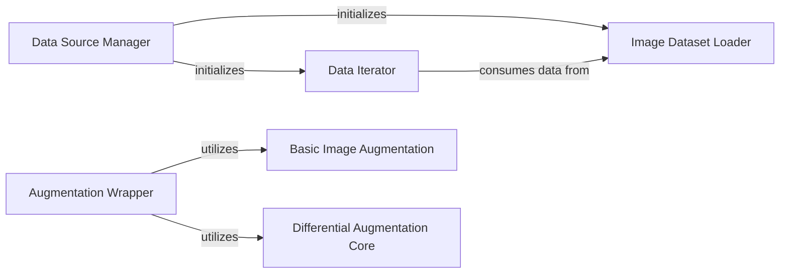

## Details

The Data Pipeline subsystem is responsible for the entire lifecycle of image data, from initial loading and basic preprocessing to advanced augmentation, ensuring a continuous and appropriately transformed data stream for the GAN training process.

### Image Dataset Loader
Loads raw image data from a specified folder, applies initial transformations (resizing, format conversion to RGB/RGBA/L), and includes basic augmentations like random resized crop and center crop. It serves as the primary source of pre-processed image data.

**Related Classes/Methods**:

- <a href="https://github.com/lucidrains/lightweight-gan/blob/main/lightweight_gan/lightweight_gan.py" target="_blank" rel="noopener noreferrer">`Image Dataset Loader`</a>

### Data Iterator
Creates an infinite iterator over the Image Dataset Loader, ensuring a continuous and cyclical supply of data batches for the training loop, which is crucial for long-running GAN training.

**Related Classes/Methods**:

- <a href="https://github.com/lucidrains/lightweight-gan/blob/main/lightweight_gan/lightweight_gan.py" target="_blank" rel="noopener noreferrer">`Data Iterator`</a>

### Data Source Manager
Orchestrates the setup of the entire data source. This involves initializing the Image Dataset Loader and wrapping it with the Data Iterator to prepare the data stream for consumption by the GAN training process.

**Related Classes/Methods**:

- <a href="https://github.com/lucidrains/lightweight-gan/blob/main/lightweight_gan/lightweight_gan.py" target="_blank" rel="noopener noreferrer">`Data Source Manager`</a>

### Augmentation Wrapper
Acts as a central point for applying a collection of advanced image augmentation techniques (e.g., horizontal flipping, differential augmentation) to images. This typically occurs just before the images are fed into the Discriminator during the GAN's forward pass. It also manages whether the augmentation operations are detached from the computation graph.

**Related Classes/Methods**:

- <a href="https://github.com/lucidrains/lightweight-gan/blob/main/lightweight_gan/lightweight_gan.py" target="_blank" rel="noopener noreferrer">`Augmentation Wrapper`</a>

### Basic Image Augmentation
Performs fundamental, simple image transformations, specifically random horizontal flipping. This is applied directly within the Augmentation Wrapper's processing flow.

**Related Classes/Methods**:

- <a href="https://github.com/lucidrains/lightweight-gan/blob/main/lightweight_gan/lightweight_gan.py" target="_blank" rel="noopener noreferrer">`Basic Image Augmentation`</a>

### Differential Augmentation Core
Implements and applies a suite of advanced differential augmentation techniques (e.g., color, translation, cutout) to images. These techniques are designed to improve GAN training stability and performance by introducing subtle, differentiable changes to the input.

**Related Classes/Methods**:

- <a href="https://github.com/lucidrains/lightweight-gan/blob/main/lightweight_gan/diff_augment.py" target="_blank" rel="noopener noreferrer">`Differential Augmentation Core`</a>

### [FAQ](https://github.com/CodeBoarding/GeneratedOnBoardings/tree/main?tab=readme-ov-file#faq)