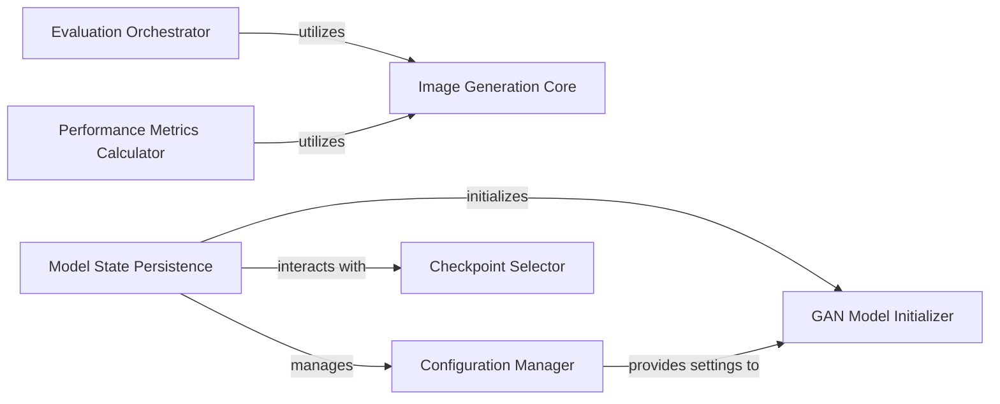

## Details

The lightweight-gan project's core functionality revolves around a training loop that orchestrates model training, evaluation, and performance monitoring. The GAN Model Initializer sets up the generative adversarial network based on configurations managed by the Configuration Manager. During training, the Model State Persistence component handles saving and loading model checkpoints, often interacting with the Checkpoint Selector to manage saved states. For evaluation, the Evaluation Orchestrator generates visual outputs, relying on the Image Generation Core. Concurrently, the Performance Metrics Calculator computes quantitative metrics like FID, also leveraging the Image Generation Core to produce images for analysis. Both evaluation and FID calculation are distinct processes within the main training loop, ensuring comprehensive model assessment.

### Evaluation Orchestrator
Coordinates the overall evaluation of the GAN model's performance, orchestrating the generation of images for visual inspection and tracking.

**Related Classes/Methods**:

- <a href="https://github.com/lucidrains/lightweight-gan/blob/main/lightweight_gan/lightweight_gan.py#L1385-L1448" target="_blank" rel="noopener noreferrer">`evaluate`:1385-1448</a>

### Image Generation Core
Encapsulates the fundamental logic for creating synthetic images, including basic generation and specialized tasks like interpolation. This component is central to producing outputs for evaluation and FID calculation.

**Related Classes/Methods**:

- <a href="https://github.com/lucidrains/lightweight-gan/blob/main/lightweight_gan/cli.py" target="_blank" rel="noopener noreferrer">`generate`</a>
- <a href="https://github.com/lucidrains/lightweight-gan/blob/main/lightweight_gan/lightweight_gan.py#L1557-L1560" target="_blank" rel="noopener noreferrer">`generate_`:1557-1560</a>
- <a href="https://github.com/lucidrains/lightweight-gan/blob/main/lightweight_gan/cli.py" target="_blank" rel="noopener noreferrer">`generate_interpolation`</a>

### Performance Metrics Calculator
Quantifies the quality and diversity of generated images by computing standard metrics such as the Fréchet Inception Distance (FID).

**Related Classes/Methods**:

- <a href="https://github.com/lucidrains/lightweight-gan/blob/main/lightweight_gan/lightweight_gan.py#L1514-L1555" target="_blank" rel="noopener noreferrer">`calculate_fid`:1514-1555</a>

### Model State Persistence
Manages the serialization and deserialization of the complete GAN model's state, including its weights and optimizer states, to and from storage.

**Related Classes/Methods**:

- <a href="https://github.com/lucidrains/lightweight-gan/blob/main/lightweight_gan/lightweight_gan.py#L1632-L1641" target="_blank" rel="noopener noreferrer">`save`:1632-1641</a>
- <a href="https://github.com/lucidrains/lightweight-gan/blob/main/lightweight_gan/lightweight_gan.py#L1643-L1673" target="_blank" rel="noopener noreferrer">`load`:1643-1673</a>

### Configuration Manager
Handles the saving and loading of model configuration details, ensuring that the model can be consistently recreated or evaluated.

**Related Classes/Methods**:

- <a href="https://github.com/lucidrains/lightweight-gan/blob/main/lightweight_gan/lightweight_gan.py#L1157-L1158" target="_blank" rel="noopener noreferrer">`write_config`:1157-1158</a>
- <a href="https://github.com/lucidrains/lightweight-gan/blob/main/lightweight_gan/lightweight_gan.py#L1160-L1172" target="_blank" rel="noopener noreferrer">`load_config`:1160-1172</a>

### Checkpoint Selector
Identifies, manages, and selects appropriate model checkpoints, facilitating the retrieval of specific saved model states for loading or evaluation.

**Related Classes/Methods**:

- <a href="https://github.com/lucidrains/lightweight-gan/blob/main/lightweight_gan/lightweight_gan.py#L1675-L1682" target="_blank" rel="noopener noreferrer">`get_checkpoints`:1675-1682</a>

### GAN Model Initializer
Responsible for initializing the GAN model structure based on loaded configurations or default parameters, preparing it for training, generation, or evaluation.

**Related Classes/Methods**:

- <a href="https://github.com/lucidrains/lightweight-gan/blob/main/lightweight_gan/lightweight_gan.py#L1111-L1155" target="_blank" rel="noopener noreferrer">`init_GAN`:1111-1155</a>

### [FAQ](https://github.com/CodeBoarding/GeneratedOnBoardings/tree/main?tab=readme-ov-file#faq)