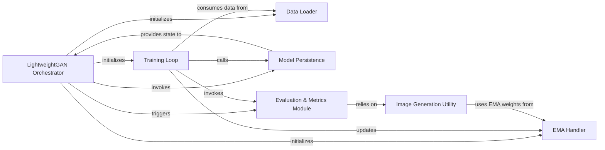

## Details

The `lightweight-gan` project is orchestrated by the `LightweightGAN Orchestrator`, which serves as the central control unit for the entire GAN lifecycle. It initializes core components such as the `Training Loop`, `Data Loader`, and `EMA Handler`. The `Training Loop` is responsible for the iterative optimization process, consuming data from the `Data Loader` and periodically interacting with the `Model Persistence` for saving/loading states and the `Evaluation & Metrics Module` for performance assessment. The `EMA Handler` maintains Exponential Moving Averages of the generator's weights, which are then utilized by the `Image Generation Utility` to produce high-quality images. The `Evaluation & Metrics Module` relies on this `Image Generation Utility` to generate samples for performance evaluation. This architecture ensures a clear separation of concerns, enabling efficient training, evaluation, and model management for GANs.

### LightweightGAN Orchestrator
The top-level component that encapsulates the entire GAN model (Generator, Discriminator), manages their initialization, training flow, and utility functions. It acts as the main interface for training and generation operations, orchestrating the overall GAN lifecycle.

**Related Classes/Methods**:

- <a href="https://github.com/lucidrains/lightweight-gan/blob/main/lightweight_gan/lightweight_gan.py#L873-L959" target="_blank" rel="noopener noreferrer">`lightweight_gan.lightweight_gan.LightweightGAN`:873-959</a>

### Training Loop
Implements the iterative optimization process for both the Generator and Discriminator. It handles data feeding, forward/backward passes, gradient accumulation, and periodic calls to evaluation and saving mechanisms. This is the core execution engine of the training process.

**Related Classes/Methods**:

- <a href="https://github.com/lucidrains/lightweight-gan/blob/main/lightweight_gan/lightweight_gan.py#L1199-L1383" target="_blank" rel="noopener noreferrer">`lightweight_gan.lightweight_gan.train`:1199-1383</a>

### Data Loader
Responsible for configuring and loading the dataset, preparing image data for consumption by the training loop. It abstracts the details of data source handling.

**Related Classes/Methods**:

- <a href="https://github.com/lucidrains/lightweight-gan/blob/main/lightweight_gan/lightweight_gan.py#L1186-L1197" target="_blank" rel="noopener noreferrer">`lightweight_gan.lightweight_gan.set_data_src`:1186-1197</a>

### Model Persistence
Handles the serialization and deserialization of the GAN model's state (weights, optimizer states, configuration) to and from disk, enabling checkpointing and training resumption.

**Related Classes/Methods**:

- <a href="https://github.com/lucidrains/lightweight-gan/blob/main/lightweight_gan/lightweight_gan.py#L1632-L1641" target="_blank" rel="noopener noreferrer">`lightweight_gan.lightweight_gan.save`:1632-1641</a>
- <a href="https://github.com/lucidrains/lightweight-gan/blob/main/lightweight_gan/lightweight_gan.py#L1643-L1673" target="_blank" rel="noopener noreferrer">`lightweight_gan.lightweight_gan.load`:1643-1673</a>

### Evaluation & Metrics Module
Manages the periodic assessment of the GAN's performance during or after training, including generating sample images and calculating quantitative metrics like FID.

**Related Classes/Methods**:

- <a href="https://github.com/lucidrains/lightweight-gan/blob/main/lightweight_gan/lightweight_gan.py#L1385-L1448" target="_blank" rel="noopener noreferrer">`lightweight_gan.lightweight_gan.evaluate`:1385-1448</a>
- <a href="https://github.com/lucidrains/lightweight-gan/blob/main/lightweight_gan/lightweight_gan.py#L1514-L1555" target="_blank" rel="noopener noreferrer">`lightweight_gan.lightweight_gan.calculate_fid`:1514-1555</a>

### Image Generation Utility
Provides the fundamental logic for generating images using the trained Generator model, often utilized by the Evaluation & Metrics Module.

**Related Classes/Methods**:

- <a href="https://github.com/lucidrains/lightweight-gan/blob/main/lightweight_gan/lightweight_gan.py#L1557-L1560" target="_blank" rel="noopener noreferrer">`lightweight_gan.lightweight_gan.generate_`:1557-1560</a>

### EMA Handler
Implements Exponential Moving Average (EMA) for the Generator's parameters, crucial for achieving stable and high-quality image generation in GANs by averaging model weights over training steps.

**Related Classes/Methods**:

- <a href="https://github.com/lucidrains/lightweight-gan/blob/main/lightweight_gan/lightweight_gan.py#L943-L953" target="_blank" rel="noopener noreferrer">`lightweight_gan.lightweight_gan.EMA`:943-953</a>

### [FAQ](https://github.com/CodeBoarding/GeneratedOnBoardings/tree/main?tab=readme-ov-file#faq)