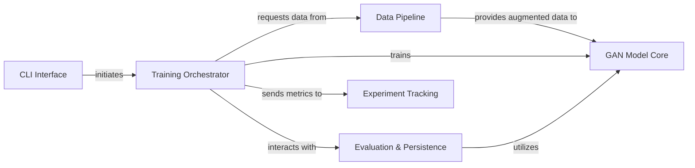

## Details

The `lightweight-gan` architecture is designed as a streamlined ML toolkit, centered around a `Training Orchestrator` that drives the entire GAN training and evaluation process. User interaction begins with the `CLI Interface`, which configures and launches the `Training Orchestrator`. Data flows through a `Data Pipeline` that handles loading and augmentation before being fed into the `GAN Model Core`, where the Generator and Discriminator models learn. The `Training Orchestrator` periodically leverages the `Evaluation & Persistence` component for performance assessment, synthetic image generation, and checkpoint management. All critical training metrics and progress are logged via the `Experiment Tracking` component, providing comprehensive insights into experiment runs. This modular design facilitates clear data and control flow, making it ideal for visual representation in a flow graph diagram.

### CLI Interface
Entry point for user interaction, parsing commands and configurations.

**Related Classes/Methods**:

- <a href="https://github.com/lucidrains/lightweight-gan/blob/main/lightweight_gan/cli.py" target="_blank" rel="noopener noreferrer">`lightweight_gan/cli.py`</a>

### Training Orchestrator [[Expand]](./Training_Orchestrator.md)
Manages the entire GAN training lifecycle, coordinating data flow and component interactions.

**Related Classes/Methods**:

- <a href="https://github.com/lucidrains/lightweight-gan/blob/main/lightweight_gan/lightweight_gan.py" target="_blank" rel="noopener noreferrer">`lightweight_gan/lightweight_gan.py`</a>

### Data Pipeline [[Expand]](./Data_Pipeline.md)
Handles loading, preprocessing, and augmenting image datasets for the GAN.

**Related Classes/Methods**:

- <a href="https://github.com/lucidrains/lightweight-gan/blob/main/lightweight_gan/lightweight_gan.py" target="_blank" rel="noopener noreferrer">`lightweight_gan/lightweight_gan.py`</a>
- <a href="https://github.com/lucidrains/lightweight-gan/blob/main/lightweight_gan/diff_augment.py" target="_blank" rel="noopener noreferrer">`lightweight_gan/diff_augment.py`</a>

### GAN Model Core
Encapsulates the Generator and Discriminator neural networks, responsible for image generation and discrimination.

**Related Classes/Methods**:

- <a href="https://github.com/lucidrains/lightweight-gan/blob/main/lightweight_gan/lightweight_gan.py" target="_blank" rel="noopener noreferrer">`lightweight_gan/lightweight_gan.py`</a>

### Evaluation & Persistence [[Expand]](./Evaluation_Persistence.md)
Manages model performance evaluation, synthetic image generation, and saving/loading model states.

**Related Classes/Methods**:

- <a href="https://github.com/lucidrains/lightweight-gan/blob/main/lightweight_gan/lightweight_gan.py" target="_blank" rel="noopener noreferrer">`lightweight_gan/lightweight_gan.py`</a>

### Experiment Tracking
Integrates with Aim for logging and monitoring training experiments.

**Related Classes/Methods**:

- <a href="https://github.com/lucidrains/lightweight-gan/blob/main/lightweight_gan/cli.py" target="_blank" rel="noopener noreferrer">`lightweight_gan/cli.py`</a>
- <a href="https://github.com/lucidrains/lightweight-gan/blob/main/lightweight_gan/lightweight_gan.py" target="_blank" rel="noopener noreferrer">`lightweight_gan/lightweight_gan.py`</a>

### [FAQ](https://github.com/CodeBoarding/GeneratedOnBoardings/tree/main?tab=readme-ov-file#faq)