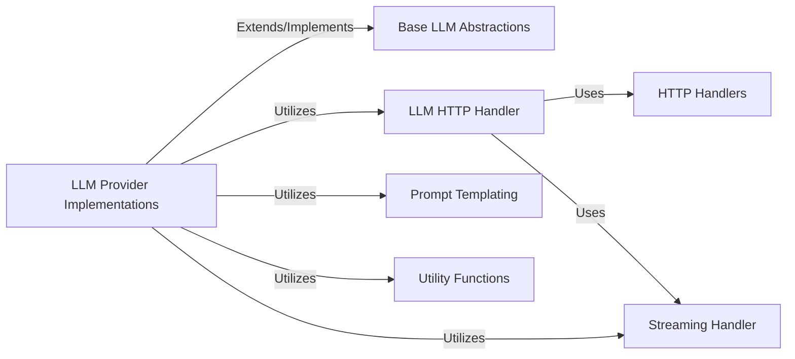

## Component Details

The `litellm.llms` package is the heart of LiteLLM's multi-provider LLM interaction capabilities. It's designed to abstract away the complexities and inconsistencies of various LLM APIs, presenting a unified interface to the rest of the LiteLLM library. The fundamental components within this subsystem are:

### LLM Provider Implementations
This is the most critical component, comprising a vast collection of modules, each dedicated to a specific LLM provider (e.g., OpenAI, Anthropic, Azure, Bedrock, Gemini). These modules contain the intricate logic for transforming LiteLLM's standardized requests into the unique API formats of their respective providers and, conversely, converting the provider's raw responses back into a common LiteLLM `ModelResponse`. This includes handling parameter mapping, message formatting, and provider-specific error structures. They also contain specific handlers for different types of LLM operations (chat, completion, embedding, image generation, etc.). This component is fundamental because it directly enables interoperability with diverse LLM APIs.

**Related Classes/Methods**:

- <a href="https://github.com/BerriAI/litellm/blob/master/litellm/llms/openai/chat/gpt_transformation.py#L0-L0" target="_blank" rel="noopener noreferrer">`litellm/llms/openai/chat/gpt_transformation.py` (0:0)</a>
- <a href="https://github.com/BerriAI/litellm/blob/master/litellm/llms/anthropic/chat/handler.py#L0-L0" target="_blank" rel="noopener noreferrer">`litellm/llms/anthropic/chat/handler.py` (0:0)</a>
- <a href="https://github.com/BerriAI/litellm/blob/master/litellm/llms/azure/image_generation/dall_e_3_transformation.py#L0-L0" target="_blank" rel="noopener noreferrer">`litellm/llms/azure/image_generation/dall_e_3_transformation.py` (0:0)</a>

### Base LLM Abstractions
This component defines the common interfaces, base classes, and abstract transformations for various LLM operations (chat, completion, embedding, image generation, etc.). It serves as a standardized foundation that individual `LLM Provider Implementations` extend or implement, promoting code reusability and consistency across different providers. It's fundamental as it enforces a consistent structure and behavior across all provider integrations.

**Related Classes/Methods**:

- <a href="https://github.com/BerriAI/litellm/blob/master/litellm/llms/base_llm/chat/transformation.py#L0-L0" target="_blank" rel="noopener noreferrer">`litellm/llms/base_llm/chat/transformation.py` (0:0)</a>
- <a href="https://github.com/BerriAI/litellm/blob/master/litellm/llms/base_llm/embedding/transformation.py#L0-L0" target="_blank" rel="noopener noreferrer">`litellm/llms/base_llm/embedding/transformation.py` (0:0)</a>
- <a href="https://github.com/BerriAI/litellm/blob/master/litellm/llms/base_llm/base_utils.py#L0-L0" target="_blank" rel="noopener noreferrer">`litellm/llms/base_llm/base_utils.py` (0:0)</a>

### LLM HTTP Handler
This component provides a specialized HTTP client tailored for LLM API interactions. It orchestrates calls using the underlying `HTTP Handlers` and integrates with streaming logic. It also incorporates common HTTP-level error handling, retry mechanisms, and timeout management before passing control to provider-specific transformation logic. This is fundamental for robust and reliable communication with external LLM services.

**Related Classes/Methods**:

- <a href="https://github.com/BerriAI/litellm/blob/master/litellm/llms/custom_httpx/llm_http_handler.py#L0-L0" target="_blank" rel="noopener noreferrer">`litellm/llms/custom_httpx/llm_http_handler.py` (0:0)</a>

### HTTP Handlers
These are the foundational components for network communication within `litellm.llms`. They provide the low-level capabilities for sending synchronous and asynchronous HTTP requests (POST, GET, etc.) and receiving raw HTTP responses. This includes managing connection pooling and basic timeout mechanisms. They are fundamental as they provide the basic network communication layer.

**Related Classes/Methods**:

- <a href="https://github.com/BerriAI/litellm/blob/master/litellm/llms/custom_httpx/http_handler.py#L0-L0" target="_blank" rel="noopener noreferrer">`litellm/llms/custom_httpx/http_handler.py` (0:0)</a>
- <a href="https://github.com/BerriAI/litellm/blob/master/litellm/llms/custom_httpx/aiohttp_handler.py#L0-L0" target="_blank" rel="noopener noreferrer">`litellm/llms/custom_httpx/aiohttp_handler.py` (0:0)</a>
- <a href="https://github.com/BerriAI/litellm/blob/master/litellm/llms/custom_httpx/httpx_handler.py#L0-L0" target="_blank" rel="noopener noreferrer">`litellm/llms/custom_httpx/httpx_handler.py` (0:0)</a>

### Prompt Templating
This utility component is responsible for converting a generic list of messages (e.g., user, assistant, system roles) into the specific prompt string or structured input format required by different LLM models. This is essential for models that do not natively support OpenAI-style message arrays, ensuring compatibility and correct input formatting. It's fundamental for ensuring broad model compatibility.

**Related Classes/Methods**:

- `litellm/litellm_core_utils/prompt_templates.py` (0:0)

### Streaming Handler
This utility is designed to process and wrap raw streaming responses received from LLM providers. It ensures that incremental data chunks are correctly parsed and delivered to the consumer in a usable format, abstracting the complexities of underlying streaming protocols (e.g., Server-Sent Events). It's fundamental for efficient handling of real-time LLM outputs.

**Related Classes/Methods**:

- <a href="https://github.com/BerriAI/litellm/blob/master/litellm/litellm_core_utils/streaming_handler.py#L0-L0" target="_blank" rel="noopener noreferrer">`litellm/litellm_core_utils/streaming_handler.py` (0:0)</a>

### Utility Functions
This broad category encompasses various helper functions that perform common tasks across the `litellm` library and specifically within LLM provider implementations. These functions handle tasks such as token counting, extracting model information, mapping finish reasons, and general data manipulation, supporting the core LLM interaction logic. These are fundamental for reducing code duplication and providing common helper functionalities.

**Related Classes/Methods**:

- <a href="https://github.com/BerriAI/litellm/blob/master/litellm/utils.py#L0-L0" target="_blank" rel="noopener noreferrer">`litellm/utils.py` (0:0)</a>
- <a href="https://github.com/BerriAI/litellm/blob/master/litellm/litellm_core_utils/core_helpers.py#L0-L0" target="_blank" rel="noopener noreferrer">`litellm/litellm_core_utils/core_helpers.py` (0:0)</a>
- <a href="https://github.com/BerriAI/litellm/blob/master/litellm/llms/anthropic/common_utils.py#L0-L0" target="_blank" rel="noopener noreferrer">`litellm/llms/anthropic/common_utils.py` (0:0)</a>
- <a href="https://github.com/BerriAI/litellm/blob/master/litellm/llms/azure/common_utils.py#L0-L0" target="_blank" rel="noopener noreferrer">`litellm/llms/azure/common_utils.py` (0:0)</a>
- <a href="https://github.com/BerriAI/litellm/blob/master/litellm/llms/openai/common_utils.py#L0-L0" target="_blank" rel="noopener noreferrer">`litellm/llms/openai/common_utils.py` (0:0)</a>

### [FAQ](https://github.com/CodeBoarding/GeneratedOnBoardings/tree/main?tab=readme-ov-file#faq)