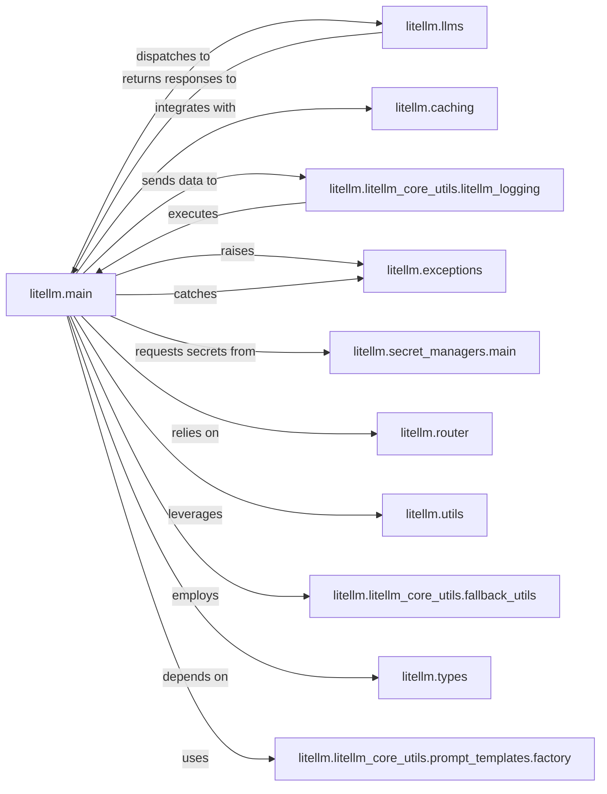

## Component Details

The central entry point for all LLM API interactions in LiteLLM. It acts as a facade, abstracting away the complexities of different LLM providers. It handles request pre-processing, provider dispatch, response post-processing, and integrates with core services like caching, logging, and error handling.

### litellm.main
The central entry point for all LLM API interactions in LiteLLM. It acts as a facade, abstracting away the complexities of different LLM providers. It handles request pre-processing, provider dispatch, response post-processing, and integrates with core services like caching, logging, and error handling.

**Related Classes/Methods**:

- <a href="https://github.com/BerriAI/litellm/blob/master/litellm/main.py#L1-L1" target="_blank" rel="noopener noreferrer">`litellm.main` (1:1)</a>

### litellm.llms
This package contains the concrete implementations for interacting with various LLM providers (e.g., OpenAI, Azure, Bedrock, Cohere). It abstracts away provider-specific API calls and response formats.

**Related Classes/Methods**:

- `litellm.llms` (1:1)

### litellm.caching
Manages the caching of LLM responses to improve performance, reduce latency, and minimize costs by reusing previous results.

**Related Classes/Methods**:

- `litellm.caching` (1:1)

### litellm.litellm_core_utils.litellm_logging
Provides a centralized mechanism for logging events, managing custom callback functions, and tracking metrics throughout the LLM request lifecycle.

**Related Classes/Methods**:

- <a href="https://github.com/BerriAI/litellm/blob/master/litellm/litellm_core_utils/litellm_logging.py#L1-L1" target="_blank" rel="noopener noreferrer">`litellm.litellm_core_utils.litellm_logging` (1:1)</a>

### litellm.exceptions
Defines a comprehensive set of custom exception classes specific to LiteLLM, enabling structured and informative error management across different LLM providers and internal processes.

**Related Classes/Methods**:

- <a href="https://github.com/BerriAI/litellm/blob/master/litellm/exceptions.py#L1-L1" target="_blank" rel="noopener noreferrer">`litellm.exceptions` (1:1)</a>

### litellm.secret_managers.main
Securely retrieves and manages API keys and other sensitive credentials required for authenticating with various LLM providers.

**Related Classes/Methods**:

- <a href="https://github.com/BerriAI/litellm/blob/master/litellm/secret_managers/main.py#L1-L1" target="_blank" rel="noopener noreferrer">`litellm.secret_managers.main` (1:1)</a>

### litellm.router
Directs incoming LLM requests to the most appropriate model or deployment based on configured routing strategies (e.g., load balancing, failover, cost optimization).

**Related Classes/Methods**:

- <a href="https://github.com/BerriAI/litellm/blob/master/litellm/router.py#L1-L1" target="_blank" rel="noopener noreferrer">`litellm.router` (1:1)</a>

### litellm.utils
A collection of essential helper functions used throughout the LiteLLM library for tasks such as token counting, parameter validation, response object conversion, and model information retrieval.

**Related Classes/Methods**:

- <a href="https://github.com/BerriAI/litellm/blob/master/litellm/utils.py#L1-L1" target="_blank" rel="noopener noreferrer">`litellm.utils` (1:1)</a>

### litellm.litellm_core_utils.fallback_utils
Implements the logic for retrying failed LLM requests with alternative models or providers, enhancing the system's resilience and reliability.

**Related Classes/Methods**:

- <a href="https://github.com/BerriAI/litellm/blob/master/litellm/litellm_core_utils/fallback_utils.py#L1-L1" target="_blank" rel="noopener noreferrer">`litellm.litellm_core_utils.fallback_utils` (1:1)</a>

### litellm.types
Defines the data structures, Pydantic models, and type hints used across the LiteLLM library, ensuring type safety, data validation, and clear API contracts.

**Related Classes/Methods**:

- `litellm.types` (1:1)

### litellm.litellm_core_utils.prompt_templates.factory
Provides utilities for dynamically generating and transforming prompts based on different models and use cases, including handling function calls and system messages.

**Related Classes/Methods**:

- <a href="https://github.com/BerriAI/litellm/blob/master/litellm/litellm_core_utils/prompt_templates/factory.py#L1-L1" target="_blank" rel="noopener noreferrer">`litellm.litellm_core_utils.prompt_templates.factory` (1:1)</a>

### [FAQ](https://github.com/CodeBoarding/GeneratedOnBoardings/tree/main?tab=readme-ov-file#faq)