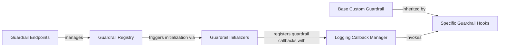

## Component Details

Overview of the litellm.proxy.guardrails module, focusing on its structure, flow, and purpose, with fundamental components and their relationships. These components collectively form a complete and extensible system for managing and applying guardrails. The Guardrail Endpoints provide the external interface, the Guardrail Registry maintains the state, the Guardrail Initializers bring guardrails to life, the Base Custom Guardrail and Specific Guardrail Hooks define and implement the actual guardrail logic, and the Logging Callback Manager orchestrates their execution within the LiteLLM proxy.

### Guardrail Endpoints
This module exposes the REST API endpoints for managing guardrails. It handles operations like listing, creating, retrieving, updating, and deleting guardrail configurations, acting as the primary interface for external systems to interact with the guardrail management system.

**Related Classes/Methods**:

- <a href="https://github.com/BerriAI/litellm/blob/master/litellm/proxy/guardrails/guardrail_endpoints.py#L0-L0" target="_blank" rel="noopener noreferrer">`litellm.proxy.guardrails.guardrail_endpoints` (0:0)</a>

### Guardrail Registry
This is the central repository for guardrail configurations and instances. It manages both database-persisted guardrails (`GuardrailRegistry`) and in-memory guardrails (`InMemoryGuardrailHandler`). It's responsible for adding, updating, deleting, and retrieving guardrail definitions, and for initializing guardrail instances based on their configuration.

**Related Classes/Methods**:

- <a href="https://github.com/BerriAI/litellm/blob/master/litellm/proxy/guardrails/guardrail_registry.py#L0-L0" target="_blank" rel="noopener noreferrer">`litellm.proxy.guardrails.guardrail_registry` (0:0)</a>

### Guardrail Initializers
This module contains functions responsible for initializing specific types of guardrails (e.g., Aporia, Bedrock, Lakera, Aim, Presidio). It also includes the main entry point for initializing all guardrails. Each initializer typically registers a guardrail instance as a callback with the `Logging Callback Manager`.

**Related Classes/Methods**:

- <a href="https://github.com/BerriAI/litellm/blob/master/litellm/proxy/guardrails/guardrail_initializers.py#L0-L0" target="_blank" rel="noopener noreferrer">`litellm.proxy.guardrails.guardrail_initializers` (0:0)</a>
- <a href="https://github.com/BerriAI/litellm/blob/master/litellm/proxy/guardrails/init_guardrails.py#L0-L0" target="_blank" rel="noopener noreferrer">`litellm.proxy.guardrails.init_guardrails` (0:0)</a>

### Base Custom Guardrail
This is an abstract base class that all specific guardrail implementations inherit from. It defines the common interface for guardrail hooks (e.g., `async_pre_call_hook`, `async_moderation_hook`, `async_post_call_success_hook`) and provides utility methods for common guardrail operations like checking if a guardrail should run or masking content.

**Related Classes/Methods**:

- <a href="https://github.com/BerriAI/litellm/blob/master/litellm/proxy/guardrails/guardrail_hooks/custom_guardrail.py#L0-L0" target="_blank" rel="noopener noreferrer">`litellm.proxy.guardrails.guardrail_hooks.custom_guardrail` (0:0)</a>

### Specific Guardrail Hooks
These are concrete implementations of the `Base Custom Guardrail`, each integrating with a specific external guardrail service or providing a specific internal policy enforcement (e.g., PII masking). They contain the logic for making API calls to external services, processing responses, and applying moderation or transformation rules.

**Related Classes/Methods**:

- <a href="https://github.com/BerriAI/litellm/blob/master/litellm/proxy/guardrails/guardrail_hooks/aim.py#L0-L0" target="_blank" rel="noopener noreferrer">`litellm.proxy.guardrails.guardrail_hooks.aim` (0:0)</a>
- <a href="https://github.com/BerriAI/litellm/blob/master/litellm/proxy/guardrails/guardrail_hooks/bedrock_guardrails.py#L0-L0" target="_blank" rel="noopener noreferrer">`litellm.proxy.guardrails.guardrail_hooks.bedrock_guardrails` (0:0)</a>
- <a href="https://github.com/BerriAI/litellm/blob/master/litellm/proxy/guardrails/guardrail_hooks/presidio.py#L0-L0" target="_blank" rel="noopener noreferrer">`litellm.proxy.guardrails.guardrail_hooks.presidio` (0:0)</a>

### Logging Callback Manager
A core utility within LiteLLM that manages and executes various callbacks registered within the system, including guardrail hooks. Guardrails are registered as callbacks to be executed at different stages of an LLM request (pre-call, post-call, etc.).

**Related Classes/Methods**:

- <a href="https://github.com/BerriAI/litellm/blob/master/litellm/litellm_core_utils/logging_callback_manager.py#L0-L0" target="_blank" rel="noopener noreferrer">`litellm.litellm_core_utils.logging_callback_manager` (0:0)</a>

### [FAQ](https://github.com/CodeBoarding/GeneratedOnBoardings/tree/main?tab=readme-ov-file#faq)