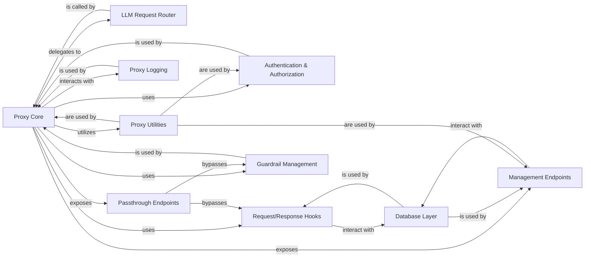

## Component Details

The `litellm.proxy.proxy_server` subsystem acts as a robust and extensible gateway for managing and routing LLM requests. It centralizes authentication, applies various guardrails and hooks, and provides administrative interfaces, all while efficiently routing requests to the appropriate LLM providers.

### Proxy Core
The central FastAPI application that serves as the entry point for all incoming HTTP requests to the LiteLLM proxy. It orchestrates the overall request flow, including initial parsing, authentication, guardrail application, and delegation to the LLM Request Router.

**Related Classes/Methods**:

- <a href="https://github.com/BerriAI/litellm/blob/master/litellm/proxy/proxy_server.py#L1-L1" target="_blank" rel="noopener noreferrer">`litellm/proxy/proxy_server.py` (1:1)</a>

### Authentication & Authorization
Manages all aspects of user authentication, API key validation, JWT handling, and access control checks. It ensures that only authorized users and requests can access specific models or routes within the proxy.

**Related Classes/Methods**:

- <a href="https://github.com/BerriAI/litellm/blob/master/litellm/proxy/auth/user_api_key_auth.py#L1-L1" target="_blank" rel="noopener noreferrer">`litellm/proxy/auth/user_api_key_auth.py` (1:1)</a>
- <a href="https://github.com/BerriAI/litellm/blob/master/litellm/proxy/auth/auth_checks.py#L1-L1" target="_blank" rel="noopener noreferrer">`litellm/proxy/auth/auth_checks.py` (1:1)</a>
- <a href="https://github.com/BerriAI/litellm/blob/master/litellm/proxy/auth/handle_jwt.py#L1-L1" target="_blank" rel="noopener noreferrer">`litellm/proxy/auth/handle_jwt.py` (1:1)</a>

### LLM Request Router
The core routing logic that determines which specific LLM provider and model an incoming request should be directed to. It considers configured routing rules, model aliases, and load balancing strategies.

**Related Classes/Methods**:

- <a href="https://github.com/BerriAI/litellm/blob/master/litellm/proxy/route_llm_request.py#L1-L1" target="_blank" rel="noopener noreferrer">`litellm/proxy/route_llm_request.py` (1:1)</a>

### Request/Response Hooks
Provides a flexible plugin system for injecting custom logic at different stages of the LLM request lifecycle. This includes functionalities like dynamic rate limiting, budget enforcement, prompt injection detection, and cost tracking.

**Related Classes/Methods**:

- <a href="https://github.com/BerriAI/litellm/blob/master/litellm/proxy/hooks/proxy_track_cost_callback.py#L1-L1" target="_blank" rel="noopener noreferrer">`litellm/proxy/hooks/proxy_track_cost_callback.py` (1:1)</a>
- <a href="https://github.com/BerriAI/litellm/blob/master/litellm/proxy/hooks/max_budget_limiter.py#L1-L1" target="_blank" rel="noopener noreferrer">`litellm/proxy/hooks/max_budget_limiter.py` (1:1)</a>

### Guardrail Management
Implements and applies various pre- and post-call guardrails to LLM requests and responses. This includes functionalities like content moderation, input/output filtering, and policy enforcement to ensure safe and compliant interactions.

**Related Classes/Methods**:

- <a href="https://github.com/BerriAI/litellm/blob/master/litellm/proxy/guardrails/guardrail_endpoints.py#L1-L1" target="_blank" rel="noopener noreferrer">`litellm/proxy/guardrails/guardrail_endpoints.py` (1:1)</a>
- <a href="https://github.com/BerriAI/litellm/blob/master/litellm/proxy/guardrails/init_guardrails.py#L1-L1" target="_blank" rel="noopener noreferrer">`litellm/proxy/guardrails/init_guardrails.py` (1:1)</a>

### Database Layer
Handles all persistent data storage and retrieval for the proxy. This includes logging operational events, tracking spend, managing user data, and storing configuration settings.

**Related Classes/Methods**:

- <a href="https://github.com/BerriAI/litellm/blob/master/litellm/proxy/db/prisma_client.py#L1-L1" target="_blank" rel="noopener noreferrer">`litellm/proxy/db/prisma_client.py` (1:1)</a>
- <a href="https://github.com/BerriAI/litellm/blob/master/litellm/proxy/db/dynamo_db.py#L1-L1" target="_blank" rel="noopener noreferrer">`litellm/proxy/db/dynamo_db.py` (1:1)</a>

### Management Endpoints
Exposes a set of API endpoints dedicated to administrative tasks for the proxy. This allows for managing API keys, models, users, organizations, and budgets, providing control over the proxy's operation.

**Related Classes/Methods**:

- <a href="https://github.com/BerriAI/litellm/blob/master/litellm/proxy/management_endpoints/key_management_endpoints.py#L1-L1" target="_blank" rel="noopener noreferrer">`litellm/proxy/management_endpoints/key_management_endpoints.py` (1:1)</a>
- <a href="https://github.com/BerriAI/litellm/blob/master/litellm/proxy/management_endpoints/model_management_endpoints.py#L1-L1" target="_blank" rel="noopener noreferrer">`litellm/proxy/management_endpoints/model_management_endpoints.py` (1:1)</a>

### Proxy Utilities
A collection of shared utility functions and helper classes that support various functionalities across the LiteLLM proxy. This includes configuration loading, proxy state management, and HTTP parsing helpers.

**Related Classes/Methods**:

- <a href="https://github.com/BerriAI/litellm/blob/master/litellm/proxy/common_utils/proxy_state.py#L1-L1" target="_blank" rel="noopener noreferrer">`litellm/proxy/common_utils/proxy_state.py` (1:1)</a>
- <a href="https://github.com/BerriAI/litellm/blob/master/litellm/proxy/common_utils/load_config_utils.py#L1-L1" target="_blank" rel="noopener noreferrer">`litellm/proxy/common_utils/load_config_utils.py` (1:1)</a>

### Proxy Logging
Provides a centralized and standardized logging mechanism specifically for the proxy server. It captures operational events, errors, and debugging information to aid in monitoring and troubleshooting.

**Related Classes/Methods**:

- <a href="https://github.com/BerriAI/litellm/blob/master/litellm/proxy/_logging.py#L1-L1" target="_blank" rel="noopener noreferrer">`litellm/proxy/_logging.py` (1:1)</a>

### Passthrough Endpoints
Manages the direct forwarding of requests to LLM providers, often used for non-standard or direct API calls that might bypass some of the higher-level LiteLLM abstractions. It includes specific provider handlers and streaming logic.

**Related Classes/Methods**:

- <a href="https://github.com/BerriAI/litellm/blob/master/litellm/proxy/pass_through_endpoints/llm_passthrough_endpoints.py#L1-L1" target="_blank" rel="noopener noreferrer">`litellm/proxy/pass_through_endpoints/llm_passthrough_endpoints.py` (1:1)</a>
- <a href="https://github.com/BerriAI/litellm/blob/master/litellm/proxy/pass_through_endpoints/llm_provider_handlers/base_passthrough_logging_handler.py#L1-L1" target="_blank" rel="noopener noreferrer">`litellm/proxy/pass_through_endpoints/llm_provider_handlers/base_passthrough_logging_handler.py` (1:1)</a>

### [FAQ](https://github.com/CodeBoarding/GeneratedOnBoardings/tree/main?tab=readme-ov-file#faq)