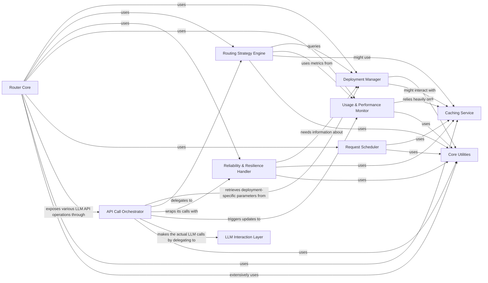

## Component Details

The `litellm.router.Router` component is a sophisticated system designed to intelligently manage and route LLM (Large Language Model) requests across various deployments. Its core purpose is to ensure high availability, optimal resource utilization, and reliable performance by implementing strategies for load balancing, failovers, and dynamic model selection.

### Router Core
The central orchestrator of the entire routing system. It initializes and coordinates all other sub-components, providing the public-facing API for various LLM operations (completion, embedding, image generation, etc.). It manages the overall flow of requests, from initial receipt to final response.

**Related Classes/Methods**:

- <a href="https://github.com/BerriAI/litellm/blob/master/litellm/router.py#L172-L6620" target="_blank" rel="noopener noreferrer">`litellm.router.Router` (172:6620)</a>

### Deployment Manager
Responsible for managing the configuration, lifecycle, and metadata of all available LLM deployments. This includes adding new deployments, updating existing ones, retrieving deployment details, handling model aliases, and initializing provider-specific API clients for efficient reuse. It ensures the router has an up-to-date and accessible list of all potential LLM endpoints.

**Related Classes/Methods**:

- <a href="https://github.com/BerriAI/litellm/blob/master/litellm/router.py#L4590-L4633" target="_blank" rel="noopener noreferrer">`litellm.router.Router:set_model_list` (4590:4633)</a>
- `_create_deployment` (4493:4775)
- `add_deployment` (4777:4843)
- `upsert_deployment` (4845:4912)
- `get_deployment` (1175:1202)
- `_handle_clientside_credential` (4709:4775)
- `_initialize_deployment_for_pass_through` (4709:4775)

### Routing Strategy Engine
Implements and applies various routing strategies (e.g., least-busy, usage-based, latency-based, cost-based, simple-shuffle) to determine the optimal LLM deployment for each incoming request. It also performs pre-call checks to filter out unsuitable deployments based on criteria like context window limits, region, and supported parameters.

**Related Classes/Methods**:

- <a href="https://github.com/BerriAI/litellm/blob/master/litellm/router.py#L656-L719" target="_blank" rel="noopener noreferrer">`litellm.router.Router:routing_strategy_init` (656:719)</a>
- `get_available_deployment` (6205:6467)
- `async_get_available_deployment` (6205:6467)
- `_pre_call_checks` (5837:6026)
- `async_callback_filter_deployments` (4398:4447)

### Reliability & Resilience Handler
Ensures the robustness of LLM interactions by implementing comprehensive retry mechanisms for transient errors and intelligent fallback strategies to alternative deployments or model groups when primary calls fail. It also manages the cooldown state of failing deployments to prevent repeated attempts to unhealthy endpoints.

**Related Classes/Methods**:

- <a href="https://github.com/BerriAI/litellm/blob/master/litellm/router.py#L3332-L3549" target="_blank" rel="noopener noreferrer">`litellm.router.Router:async_function_with_fallbacks` (3332:3549)</a>
- `function_with_fallbacks` (3860:3866)
- `async_function_with_retries` (3603:3742)
- `function_with_retries` (3860:3866)
- `deployment_callback_on_failure` (4061:4124)
- `async_deployment_callback_on_failure` (4126:4158)
- `should_retry_this_error` (3794:3858)
- `log_retry` (4160:4193)

### Usage & Performance Monitor
Tracks and manages real-time usage metrics (Tokens Per Minute - TPM, Requests Per Minute - RPM) for individual LLM deployments and aggregated model groups. It enforces configured rate limits and provides metrics essential for routing decisions and alerting.

**Related Classes/Methods**:

- <a href="https://github.com/BerriAI/litellm/blob/master/litellm/router.py#L3943-L4023" target="_blank" rel="noopener noreferrer">`litellm.router.Router:deployment_callback_on_success` (3943:4023)</a>
- `sync_deployment_callback_on_success` (4027:4060)
- `_update_usage` (4194:4219)
- `get_model_group_usage` (5321:5392)
- `get_remaining_model_group_usage` (5405:5435)
- `set_response_headers` (5437:5471)
- `routing_strategy_pre_call_checks` (4321:4336)
- `async_routing_strategy_pre_call_checks` (4338:4396)
- `_track_deployment_metrics` (6496:6512)

### Request Scheduler
Implements a priority-based queuing system for LLM requests. This allows the router to manage and process requests in a controlled manner, ensuring that high-priority tasks are handled promptly even under heavy load.

**Related Classes/Methods**:

- <a href="https://github.com/BerriAI/litellm/blob/master/litellm/router.py#L1551-L1554" target="_blank" rel="noopener noreferrer">`litellm.router.Router:schedule_acompletion` (1551:1554)</a>
- `_schedule_factory` (1627:1686)

### API Call Orchestrator
Provides a unified interface for various LLM API operations. It dynamically selects the appropriate underlying LiteLLM function and applies the router's core logic (routing, retries, fallbacks) before delegating the actual call to the LLM Interaction Layer.

**Related Classes/Methods**:

- <a href="https://github.com/BerriAI/litellm/blob/master/litellm/router.py#L836-L853" target="_blank" rel="noopener noreferrer">`litellm.router.Router:completion` (836:853)</a>
- `acompletion` (946:997)
- `image_generation` (1844:1854)
- `aimage_generation` (1844:1854)
- `atranscription` (1937:1977)
- `aspeech` (2049:2133)
- `arerank` (2135:2155)
- `text_completion` (2199:2234)
- `atext_completion` (2236:2271)
- `aadapter_completion` (2343:2370)
- `factory_function` (3187:3286)
- `initialize_assistants_endpoint` (722:731)
- `initialize_router_endpoints` (733:782)
- `_pass_through_moderation_endpoint_factory` (3166:3185)
- `_init_responses_api_endpoints` (3288:3308)
- `_pass_through_assistants_endpoint_factory` (3310:3328)

### Caching Service
A foundational service providing in-memory and Redis-backed caching capabilities. It stores critical operational data such as deployment health, usage statistics (TPM/RPM), and can cache LLM responses to improve performance and reduce API costs.

**Related Classes/Methods**:

- <a href="https://github.com/BerriAI/litellm/blob/master/litellm/router.py#L631-L640" target="_blank" rel="noopener noreferrer">`litellm.router.Router:_create_redis_cache` (631:640)</a>
- `_update_redis_cache` (632:641)
- `_update_redis_cache` (643:656)

### Core Utilities
A comprehensive collection of shared helper functions and modules used throughout the `Router` class. This includes utilities for token counting, model information retrieval, exception handling, data manipulation, and various common tasks that support the functionality of other components.

**Related Classes/Methods**:

- <a href="https://github.com/BerriAI/litellm/blob/master/litellm/router.py#L1137-L1151" target="_blank" rel="noopener noreferrer">`litellm.router.Router:_update_kwargs_before_fallbacks` (1137:1151)</a>
- `_update_kwargs_with_default_litellm_params` (1155:1174)
- `_update_kwargs_with_deployment` (1204:1245)
- `_get_async_openai_model_client` (1247:1271)
- `_get_stream_timeout` (1273:1284)
- `_get_non_stream_timeout` (1286:1302)
- `_get_timeout` (1304:1313)
- `_handle_mock_testing_fallbacks` (3552:3601)
- `_handle_mock_testing_rate_limit_error` (3759:3792)
- `_get_fallback_model_group_from_fallbacks` (3868:3891)
- `_time_to_sleep_before_retry` (3893:3940)
- `_update_usage` (4194:4219)
- `_has_default_fallbacks` (4221:4228)
- `_should_raise_content_policy_error` (4230:4266)
- `_get_healthy_deployments` (4268:4289)
- `_async_get_healthy_deployments` (4291:4319)
- `_generate_model_id` (4449:4549)
- `deployment_is_active_for_environment` (4551:4589)
- `get_model_ids` (5473:5487)
- `map_team_model` (5489:5507)
- `_get_all_deployments` (5509:5550)
- `get_model_names` (5552:5572)
- `_get_team_specific_model` (5574:5583)
- `_is_team_specific_model` (5585:5614)
- `get_model_list_from_model_alias` (5616:5647)
- `get_model_list` (5649:5677)
- `get_model_access_groups` (5679:5700)
- `_is_model_access_group_for_wildcard_route` (5702:5730)
- `get_settings` (5732:5781)
- `update_settings` (5783:5835)
- `_get_client` (5837:6026)
- `_pre_call_checks` (5837:6026)
- `_get_model_from_alias` (6028:6045)
- `_get_deployment_by_litellm_model` (6047:6051)
- `_common_checks_available_deployment` (6053:6129)
- `_filter_cooldown_deployments` (6469:6494)
- `_track_deployment_metrics` (6496:6512)
- `get_num_retries_from_retry_policy` (6514:6522)
- `get_allowed_fails_from_policy` (6524:6562)
- `_initialize_alerting` (6563:6585)
- `set_custom_routing_strategy` (6587:6609)
- `flush_cache` (6610:6613)
- `reset` (6615:6620)

### LLM Interaction Layer
Represents the direct interface with various LLM providers. This layer is responsible for translating LiteLLM's standardized requests into provider-specific formats, handling HTTP communication, and transforming raw provider responses back into a common `ModelResponse`. The Router delegates the final API calls to this layer.

**Related Classes/Methods**: _None_

### [FAQ](https://github.com/CodeBoarding/GeneratedOnBoardings/tree/main?tab=readme-ov-file#faq)