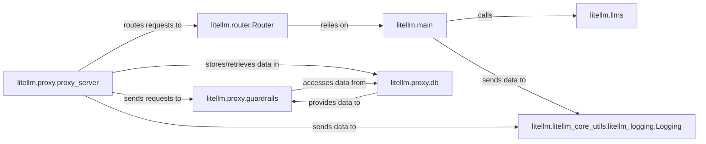

## Component Details

The chosen components represent the core functionalities and critical interaction pathways within the `litellm` project, balancing the direct LLM interaction capabilities with the advanced features provided by the LiteLLM Proxy. These seven components collectively form the backbone of the `litellm` architecture, covering core LLM interaction, intelligent routing, external API exposure, provider-specific integrations, observability, policy enforcement, and data persistence.

### litellm.main
The core orchestrator for all LLM API calls (completion, embedding, moderation, etc.). It handles request pre-processing, dispatches calls to provider-specific implementations, and integrates with logging and caching.

**Related Classes/Methods**:

- <a href="https://github.com/BerriAI/litellm/blob/master/litellm/main.py#L0-L0" target="_blank" rel="noopener noreferrer">`litellm.main` (0:0)</a>

### litellm.router.Router
Manages intelligent routing of LLM requests across multiple deployments, implementing strategies for load balancing, failovers, and dynamic model selection to ensure high availability and optimal resource utilization.

**Related Classes/Methods**:

- <a href="https://github.com/BerriAI/litellm/blob/master/litellm/router.py#L172-L6620" target="_blank" rel="noopener noreferrer">`litellm.router.Router` (172:6620)</a>

### litellm.proxy.proxy_server
The main FastAPI application exposing the LiteLLM proxy API. It handles incoming HTTP requests, performs authentication, and orchestrates the internal flow by routing requests, applying guardrails, and integrating with logging.

**Related Classes/Methods**:

- <a href="https://github.com/BerriAI/litellm/blob/master/litellm/proxy/proxy_server.py#L0-L0" target="_blank" rel="noopener noreferrer">`litellm.proxy.proxy_server` (0:0)</a>

### litellm.llms
This package contains the specific implementations and transformations for interacting with various LLM providers (e.g., OpenAI, Anthropic, Azure, Bedrock, Gemini). Each sub-module handles API calls, request/response format conversions, and error mapping for its respective provider.

**Related Classes/Methods**:

- `litellm.llms` (0:0)

### litellm.litellm_core_utils.litellm_logging.Logging
Provides a centralized logging and callback management system. It captures detailed information about LLM interactions (pre-call, post-call, success, failure), calculates costs, and dispatches data to various integrated logging and monitoring services.

**Related Classes/Methods**:

- <a href="https://github.com/BerriAI/litellm/blob/master/litellm/litellm_core_utils/litellm_logging.py#L232-L2696" target="_blank" rel="noopener noreferrer">`litellm.litellm_core_utils.litellm_logging.Logging` (232:2696)</a>

### litellm.proxy.guardrails
An extensible system for implementing pre-call and post-call logic to enforce various policies, including content moderation, PII detection, rate limiting, and budget enforcement, ensuring compliance and security for proxy requests.

**Related Classes/Methods**:

- `litellm.proxy.guardrails` (0:0)

### litellm.proxy.db
Manages interactions with the underlying database (likely via Prisma ORM) for the LiteLLM proxy. It handles CRUD operations related to user management, API key management, spend tracking, and audit logs, providing persistent storage for proxy configurations and operational data.

**Related Classes/Methods**:

- `litellm.proxy.db` (0:0)

### [FAQ](https://github.com/CodeBoarding/GeneratedOnBoardings/tree/main?tab=readme-ov-file#faq)