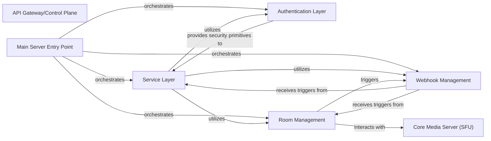

## Details

The LiveKit project's core functionality revolves around a central API Gateway/Control Plane that orchestrates various services to manage real-time communication rooms and participant interactions. The `cmd/server/main.go` file serves as the primary entry point, initializing and coordinating the `pkg/service`, `pkg/auth`, `pkg/room`, and `pkg/webhook` packages. The `pkg/service` layer handles incoming API requests, leveraging `pkg/auth` for secure access and `pkg/room` for managing room states and participants. `pkg/webhook` is responsible for dispatching event notifications, triggered by both the `pkg/service` and `pkg/room` components, enabling external integrations. The `pkg/room` component, in turn, interacts directly with the Core Media Server (SFU) to manage the actual media streams, forming the backbone of the real-time communication.

### API Gateway/Control Plane [[Expand]](./API_Gateway_Control_Plane.md)
Provides a unified API for all client and server interactions, managing authentication, authorization, room creation/management, and webhook delivery. It acts as the central control plane, orchestrating various services and ensuring secure access to the RTC functionalities.

**Related Classes/Methods**:

- `cmd/server/main.go`
- `pkg/service`
- `pkg/auth`
- `pkg/webhook`
- `pkg/room`

### Main Server Entry Point
The primary entry point responsible for initializing and running the API Gateway server, setting up the core services and their dependencies.

**Related Classes/Methods**:

- `cmd/server/main.go`

### Service Layer
Handles incoming API requests, routes them to appropriate handlers, and orchestrates the execution of business logic related to API operations.

**Related Classes/Methods**:

- `pkg/service`

### Authentication Layer
Manages user and server authentication and authorization, ensuring secure access to API endpoints and resources. It provides security primitives for validating requests.

**Related Classes/Methods**:

- `pkg/auth`

### Room Management
Manages the lifecycle and state of RTC rooms and participants, including creation, deletion, participant joining/leaving, and state synchronization.

**Related Classes/Methods**:

- `pkg/room`

### Webhook Management
Manages and dispatches event notifications to external services, enabling real-time updates and integrations based on platform events (e.g., room created, participant joined).

**Related Classes/Methods**:

- `pkg/webhook`

### Core Media Server (SFU) [[Expand]](./Core_Media_Server_SFU_.md)
Manages real-time media streams, including routing, mixing, and forwarding audio/video data between participants in a room. It acts as the central hub for media processing.

**Related Classes/Methods**: _None_

### [FAQ](https://github.com/CodeBoarding/GeneratedOnBoardings/tree/main?tab=readme-ov-file#faq)