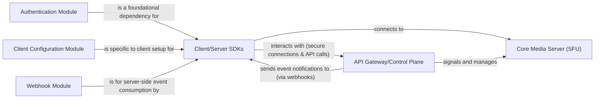

## Details

The LiveKit project is a robust WebRTC server designed for real-time communication, enabling seamless management of rooms, participants, and media streams. Its architecture is centered around a control plane that handles API interactions and authentication, and a media server (SFU) dedicated to efficient real-time media forwarding. Client and server SDKs interact with these core components to establish connections, manage sessions, and process events, abstracting the underlying complexities of WebRTC.

### Client/Server SDKs [[Expand]](./Client_Server_SDKs.md)
This component provides the necessary interfaces and abstractions for client applications (e.g., web, mobile, desktop) to connect to LiveKit rooms, manage media streams, and handle real-time events, abstracting the complexities of WebRTC. Concurrently, it offers server-side interfaces for administrative tasks, such as generating access tokens, managing rooms and participants via APIs, and processing platform webhooks.

**Related Classes/Methods**:

- `pkg/clientconfiguration/conf.go`
- `pkg/service/auth.go`
- `pkg/service/server.go`

### Client Configuration Module
Manages client-side settings and initial connection parameters, providing a structured way for client applications to configure their interaction with the LiveKit platform.

**Related Classes/Methods**:

- `pkg/clientconfiguration/conf.go`

### Authentication Module
Crucial for security, this module handles the generation and validation of access tokens (JWTs) for both client and server applications, ensuring secure and authorized access to LiveKit services.

**Related Classes/Methods**:

- `pkg/service/auth.go`

### Webhook Module
Facilitates server-side applications in securely receiving and processing asynchronous event notifications (webhooks) from the LiveKit platform, enabling real-time reactions to platform events.

**Related Classes/Methods**:

- `pkg/service/server.go`

### API Gateway/Control Plane [[Expand]](./API_Gateway_Control_Plane.md)
Handles API requests, manages authentication, and sends event notifications to other components. It acts as the central point for all client and server SDK interactions with the LiveKit backend for administrative and signaling purposes.

**Related Classes/Methods**:

- `cmd/server/main.go`
- `pkg/service/server.go`
- `pkg/service/twirp.go`
- `pkg/service/roomservice.go`
- `pkg/service/auth.go`

### Core Media Server (SFU) [[Expand]](./Core_Media_Server_SFU_.md)
Manages real-time media streaming (publishing and subscribing to audio/video tracks). It is responsible for efficiently forwarding media streams between participants in a room without mixing them, optimizing bandwidth and processing.

**Related Classes/Methods**:

- `pkg/sfu/sfu.go`
- `pkg/rtc/room.go`
- `pkg/rtc/mediatrack.go`

### [FAQ](https://github.com/CodeBoarding/GeneratedOnBoardings/tree/main?tab=readme-ov-file#faq)