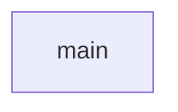

## Details

Attempting to correct source code references based on feedback.

### main
Entry point and server orchestration.

**Related Classes/Methods**:

- `main.main`

### [FAQ](https://github.com/CodeBoarding/GeneratedOnBoardings/tree/main?tab=readme-ov-file#faq)