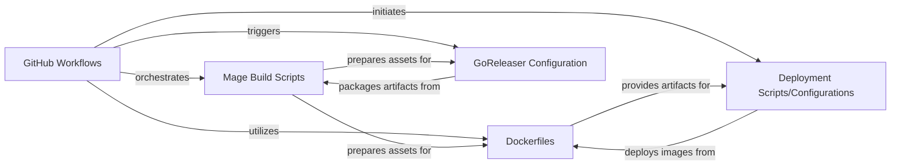

## Details

The LiveKit project utilizes a robust CI/CD pipeline orchestrated by GitHub Workflows, which automates the build, test, and deployment processes. This pipeline leverages Mage Build Scripts for Go-based build automation and GoReleaser for streamlined release management, including cross-compilation and artifact publishing. Dockerfiles are central to packaging LiveKit services into consistent container images, which are then deployed to target environments using dedicated Deployment Scripts/Configurations. This integrated approach ensures efficient development, consistent deployments, and automated releases of the LiveKit services.

### GitHub Workflows
Manages the Continuous Integration/Continuous Delivery (CI/CD) pipelines, orchestrating automated builds, tests, and deployments of LiveKit services. It acts as the central control plane for the entire software delivery lifecycle.

**Related Classes/Methods**:

- `.github/workflows/`

### Dockerfiles
Defines the container images for packaging LiveKit services. These files specify the base image, dependencies, application code, and runtime environment, ensuring consistent and isolated deployment units.

**Related Classes/Methods**:

- `Dockerfile`

### Deployment Scripts/Configurations
Encompasses the scripts and configuration files responsible for orchestrating the actual deployment of LiveKit services to target environments (e.g., Kubernetes clusters). This includes applying configurations, managing service lifecycles, and scaling.

**Related Classes/Methods**:

- `deploy/`

### GoReleaser Configuration
Automates the release process for LiveKit, including cross-compilation of binaries, packaging, and publishing artifacts (e.g., binaries, Docker images) to various distribution channels. It ensures consistent and repeatable releases.

**Related Classes/Methods**:

- `.goreleaser.yaml`

### Mage Build Scripts
Provides a Go-based build system for automating various development and deployment tasks, such as compiling source code, running tests, generating documentation, and preparing artifacts. It standardizes the build process across the project.

**Related Classes/Methods**:

- `magefile.go`

### [FAQ](https://github.com/CodeBoarding/GeneratedOnBoardings/tree/main?tab=readme-ov-file#faq)