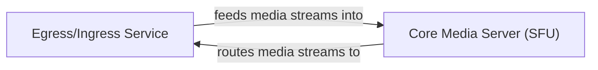

## Details

One paragraph explaining the functionality which is represented by this graph. What the main flow is and what is its purpose.

### Egress/Ingress Service [[Expand]](./Egress_Ingress_Service.md)
This component encompasses dedicated services for advanced media operations. The Egress functionality, primarily handled by pkg.service.EgressService, manages recording live streams and multi-streaming to various platforms, processing media streams originating from LiveKit rooms. The Ingress functionality, managed by pkg.service.IngressService, handles the ingestion of external media sources (e.g., RTMP, OBS) into LiveKit rooms, acting as a bridge for bringing external content into the LiveKit ecosystem.

**Related Classes/Methods**:

- `pkg.service.EgressService`
- `pkg.service.IngressService`

### Core Media Server (SFU) [[Expand]](./Core_Media_Server_SFU_.md)
The central hub for all media streams within LiveKit rooms, responsible for receiving, processing, and forwarding media. Key responsibilities include managing incoming media tracks via pkg.sfu.Receiver, handling outgoing media distribution to participants through pkg.sfu.DownTrack, and efficiently routing media packets using pkg.sfu.Forwarder. This component ensures real-time media flow and adaptation within the LiveKit environment.

**Related Classes/Methods**:

- `pkg.sfu.Receiver`
- `pkg.sfu.DownTrack`
- `pkg.sfu.Forwarder`

### [FAQ](https://github.com/CodeBoarding/GeneratedOnBoardings/tree/main?tab=readme-ov-file#faq)