```mermaid
graph LR
    Core_Media_Server_SFU_["Core Media Server (SFU)"]
    API_Gateway_Control_Plane["API Gateway/Control Plane"]
    Client_Server_SDKs["Client/Server SDKs"]
    Database_State_Management["Database/State Management"]
    Egress_Ingress_Service["Egress/Ingress Service"]
    Monitoring_Analytics_System["Monitoring & Analytics System"]
    Deployment_Operations_Infrastructure["Deployment & Operations Infrastructure"]
    Client_Server_SDKs -- "initiates connections and authenticates with" --> API_Gateway_Control_Plane
    Client_Server_SDKs -- "establishes direct WebRTC media connections with" --> Core_Media_Server_SFU_
    Client_Server_SDKs -- "interacts with" --> API_Gateway_Control_Plane
    Core_Media_Server_SFU_ -- "relies on" --> Database_State_Management
    API_Gateway_Control_Plane -- "relies on" --> Database_State_Management
    Core_Media_Server_SFU_ -- "forwards media streams to" --> Egress_Ingress_Service
    Core_Media_Server_SFU_ -- "receives external media from" --> Egress_Ingress_Service
    Core_Media_Server_SFU_ -- "emits metrics to" --> Monitoring_Analytics_System
    API_Gateway_Control_Plane -- "emits metrics to" --> Monitoring_Analytics_System
    Client_Server_SDKs -- "emits metrics to" --> Monitoring_Analytics_System
    Egress_Ingress_Service -- "emits metrics to" --> Monitoring_Analytics_System
    Database_State_Management -- "emits metrics to" --> Monitoring_Analytics_System
    Deployment_Operations_Infrastructure -- "manages" --> Core_Media_Server_SFU_
    Deployment_Operations_Infrastructure -- "manages" --> API_Gateway_Control_Plane
    Deployment_Operations_Infrastructure -- "manages" --> Client_Server_SDKs
    Deployment_Operations_Infrastructure -- "manages" --> Database_State_Management
    Deployment_Operations_Infrastructure -- "manages" --> Egress_Ingress_Service
    Deployment_Operations_Infrastructure -- "manages" --> Monitoring_Analytics_System
    click Core_Media_Server_SFU_ href "https://github.com/CodeBoarding/GeneratedOnBoardings/blob/main/livekit/Core_Media_Server_SFU_.md" "Details"
    click API_Gateway_Control_Plane href "https://github.com/CodeBoarding/GeneratedOnBoardings/blob/main/livekit/API_Gateway_Control_Plane.md" "Details"
    click Client_Server_SDKs href "https://github.com/CodeBoarding/GeneratedOnBoardings/blob/main/livekit/Client_Server_SDKs.md" "Details"
    click Egress_Ingress_Service href "https://github.com/CodeBoarding/GeneratedOnBoardings/blob/main/livekit/Egress_Ingress_Service.md" "Details"
    click Monitoring_Analytics_System href "https://github.com/CodeBoarding/GeneratedOnBoardings/blob/main/livekit/Monitoring_Analytics_System.md" "Details"
    click Deployment_Operations_Infrastructure href "https://github.com/CodeBoarding/GeneratedOnBoardings/blob/main/livekit/Deployment_Operations_Infrastructure.md" "Details"
```

## Details

LiveKit is a real-time communication platform designed to handle audio, video, and data streams for live applications. Its architecture is modular, separating concerns into distinct services for media processing, API management, data persistence, and operational tooling. The core media server (SFU) handles the real-time WebRTC connections and media routing, while an API Gateway/Control Plane manages client interactions, authentication, and room orchestration. Various SDKs provide interfaces for client and server-side applications. Persistent data is managed by a dedicated storage component, and specialized services handle advanced media operations like recording and streaming. The entire system is supported by robust monitoring and deployment infrastructure.

### Core Media Server (SFU) [[Expand]](./Core_Media_Server_SFU_.md)
The central component for real-time media processing, handling WebRTC signaling, media stream routing (audio, video, data), and participant management within a room.

**Related Classes/Methods**:

- `main`
- `sfu`
- `rtc`
- `room`

### API Gateway/Control Plane [[Expand]](./API_Gateway_Control_Plane.md)
Provides a unified API for all client and server interactions, managing authentication, authorization, room creation/management, and webhook delivery.

**Related Classes/Methods**:

- `main`
- `service`
- `auth`
- `webhook`
- `room`

### Client/Server SDKs [[Expand]](./Client_Server_SDKs.md)
A logical grouping representing the interfaces for client applications (abstracting WebRTC complexities) and server-side applications (for administrative APIs and webhooks) to interact with the LiveKit platform.

**Related Classes/Methods**:

- `clientconfiguration`
- `auth`
- `webhook`

### Database/State Management
Persists critical system state, including room metadata, participant information, user configurations, and other persistent data required for platform operation.

**Related Classes/Methods**:

- `store`

### Egress/Ingress Service [[Expand]](./Egress_Ingress_Service.md)
Dedicated services for advanced media operations such as recording live streams, multi-streaming to platforms, or ingesting external media sources (e.g., RTMP, OBS) into LiveKit rooms.

**Related Classes/Methods**:

- `egress`
- `ingress`

### Monitoring & Analytics System [[Expand]](./Monitoring_Analytics_System.md)
Collects, aggregates, and visualizes real-time metrics on server health, performance, media quality, and API usage, essential for operational insights and debugging.

**Related Classes/Methods**:

- `metric`
- `grafana`

### Deployment & Operations Infrastructure [[Expand]](./Deployment_Operations_Infrastructure.md)
Encompasses the tools and processes for packaging, deploying, scaling, and managing all LiveKit services, including containerization, orchestration, and CI/CD pipelines.

**Related Classes/Methods**:

- `workflows`
- `Dockerfile`
- `deploy`
- `.goreleaser.yaml`
- `magefile.go`

### [FAQ](https://github.com/CodeBoarding/GeneratedOnBoardings/tree/main?tab=readme-ov-file#faq)