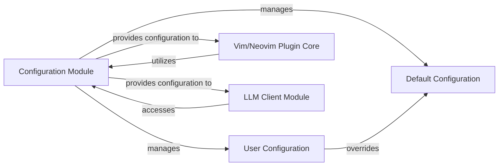

## Details

The `llama.vim` plugin's architecture is centered around a robust configuration management system that dictates its behavior and interaction with the external `llama.cpp` server. The **Configuration Module** acts as the central hub, consolidating **Default Configuration** with **User Configuration** to provide a unified set of settings. This consolidated configuration then drives the **Vim/Neovim Plugin Core**, which manages user interactions and plugin commands, and the **LLM Client Module**, responsible for all communication with the `llama.cpp` server. This design ensures flexibility and maintainability, allowing users to customize the plugin while maintaining a stable core functionality.

### Configuration Module
This module is responsible for loading the plugin's default settings, reading user-defined overrides, and merging these configurations. It ensures that user preferences take precedence, providing a consolidated configuration to other plugin components.

**Related Classes/Methods**:

- `llama_config assignment`:68-69

### Default Configuration
This component defines the built-in, baseline settings for the `llama.vim` plugin. These settings ensure the plugin operates with sensible defaults if no user-specific configurations are provided.

**Related Classes/Methods**:

- `s:default_config`:45-66

### User Configuration
This component represents the global, user-defined settings that allow users to customize the `llama.vim` plugin's behavior. These settings are typically defined in the user's Vim/Neovim configuration files and override the default settings.

**Related Classes/Methods**:

- `g:llama_config`

### Vim/Neovim Plugin Core [[Expand]](./Vim_Neovim_Plugin_Core.md)
This is the main operational component of the `llama.vim` plugin within the Vim/Neovim environment. It handles the registration of plugin commands, processes various Vim/Neovim events (like cursor movements and text changes), and orchestrates the overall plugin behavior based on the consolidated configuration.

**Related Classes/Methods**:

- `llama#init`
- `llama#setup_commands`
- `autocmd block`:195-219

### LLM Client Module
This module is dedicated to managing communication with the external `llama.cpp` server. It utilizes configuration settings such as the server endpoint and API key to send requests and receive responses for language model interactions.

**Related Classes/Methods**:

- `endpoint configuration`
- `curl executable check`

### [FAQ](https://github.com/CodeBoarding/GeneratedOnBoardings/tree/main?tab=readme-ov-file#faq)