```mermaid
graph LR
    Vim_Neovim_Plugin_Core["Vim/Neovim Plugin Core"]
    External_LLM_Server_llama_cpp_["External LLM Server (llama.cpp)"]
    Large_Language_Model_External_["Large Language Model (External)"]
    Vim_Neovim_Plugin_Core -- "sends requests to and receives responses from" --> External_LLM_Server_llama_cpp_
    External_LLM_Server_llama_cpp_ -- "loads and performs inference using" --> Large_Language_Model_External_
    click Vim_Neovim_Plugin_Core href "https://github.com/CodeBoarding/GeneratedOnBoardings/blob/main/llama.vim/Vim_Neovim_Plugin_Core.md" "Details"
    click External_LLM_Server_llama_cpp_ href "https://github.com/CodeBoarding/GeneratedOnBoardings/blob/main/llama.vim/External_LLM_Server_llama_cpp_.md" "Details"
```

## Details

The `llama.vim` plugin integrates a Large Language Model (LLM) into the Vim/Neovim environment to provide intelligent code suggestions and completions. The core of the system is the **Vim/Neovim Plugin Core**, which operates within the editor, managing user interactions, plugin configurations, and context aggregation from the active buffer. This core component communicates with an **External LLM Server (llama.cpp)**, an independent process responsible for running the LLM inference. The `llama.cpp` server, in turn, loads and utilizes a **Large Language Model (External)**, which is the pre-trained AI model that generates the actual code suggestions. This architecture separates the editor-specific logic from the computationally intensive LLM inference, allowing for a flexible and efficient integration.

### Vim/Neovim Plugin Core [[Expand]](./Vim_Neovim_Plugin_Core.md)
The central orchestrator of the `llama.vim` plugin, residing within the Vim/Neovim environment. It manages the plugin's lifecycle, dispatches user commands, handles configuration, aggregates textual context from the active buffer, and facilitates communication with the external LLM server.

**Related Classes/Methods**:

- `plugin/llama.vim`
- `autoload/llama.vim`

### External LLM Server (llama.cpp) [[Expand]](./External_LLM_Server_llama_cpp_.md)
An independent, external process running the `llama.cpp` inference engine. It receives inference requests from the `Vim/Neovim Plugin Core`, performs the actual LLM inference using the loaded `Large Language Model`, and returns the generated results back to the plugin.

**Related Classes/Methods**: _None_

### Large Language Model (External)
The pre-trained AI model (e.g., Qwen2.5-Coder) loaded and utilized by the `External LLM Server (llama.cpp)` to generate code suggestions and completions. It is a separate data artifact that the `llama.cpp` server interacts with.

**Related Classes/Methods**: _None_

### [FAQ](https://github.com/CodeBoarding/GeneratedOnBoardings/tree/main?tab=readme-ov-file#faq)