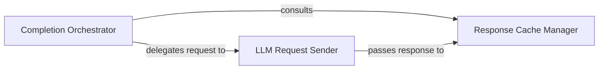

## Details

Manages interactions with the external `llama.cpp` server and optimizes performance through caching, acting as the interface between the Vim/Neovim environment and the external LLM service.

### Completion Orchestrator
This is the central component responsible for initiating and coordinating the LLM completion process. It acts as the primary entry point for completion requests within the Vim plugin, deciding whether to use cached data or send a new request to the LL LLM server.

**Related Classes/Methods**:

- <a href="https://github.com/ggml-org/llama.vim/blob/master/autoload/llama.vim" target="_blank" rel="noopener noreferrer">`llama.vim`</a>

### Response Cache Manager
Manages the in-memory cache for previously generated LLM completions. Its core responsibility is to improve performance by reducing redundant calls to the external `llama.cpp` server. It provides mechanisms for storing new completions and retrieving existing ones based on request parameters.

**Related Classes/Methods**:

- <a href="https://github.com/ggml-org/llama.vim/blob/master/autoload/llama.vim" target="_blank" rel="noopener noreferrer">`s:cache_insert`</a>
- <a href="https://github.com/ggml-org/llama.vim/blob/master/autoload/llama.vim" target="_blank" rel="noopener noreferrer">`s:cache_get`</a>
- <a href="https://github.com/ggml-org/llama.vim/blob/master/autoload/llama.vim" target="_blank" rel="noopener noreferrer">`g:llama_cache_data`</a>

### LLM Request Sender
This component is solely responsible for handling the direct communication with the external `llama.cpp` server. It encapsulates the logic for formatting the request payload, sending the HTTP request, and processing the raw response received from the LLM server. It serves as the direct interface to the external AI service.

**Related Classes/Methods**:

- <a href="https://github.com/ggml-org/llama.vim/blob/master/autoload/llama.vim" target="_blank" rel="noopener noreferrer">`llama#_send_request`</a>

### [FAQ](https://github.com/CodeBoarding/GeneratedOnBoardings/tree/main?tab=readme-ov-file#faq)