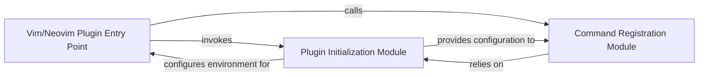

## Details

The `llama.vim` plugin's architecture is structured around a clear separation of concerns for its initialization and command exposure. The `Vim/Neovim Plugin Entry Point` serves as the central orchestrator, initiating the plugin's lifecycle. It first delegates to the `Plugin Initialization Module` to establish the foundational environment and load configurations. Following this, the entry point invokes the `Command Registration Module`, which is responsible for defining and registering all user-accessible commands with the Vim/Neovim runtime. The `Command Registration Module` is dependent on the `Plugin Initialization Module` for any configuration or environmental prerequisites, ensuring a cohesive and properly configured plugin operation. This design ensures a modular and maintainable structure for the plugin's core functionalities.

### Vim/Neovim Plugin Entry Point
This is the primary script (`plugin/llama.vim`) loaded by Vim/Neovim when the plugin is enabled. It serves as the initial orchestrator, initiating the entire plugin setup process by calling other core modules.

**Related Classes/Methods**:

- <a href="https://github.com/ggml-org/llama.vim/blob/master/plugin/llama.vim" target="_blank" rel="noopener noreferrer">`plugin/llama.vim`</a>

### Plugin Initialization Module
Encapsulates all one-time setup logic required for the plugin. This includes setting up global variables, loading default configurations, and performing any other prerequisites to prepare the plugin's operational environment.

**Related Classes/Methods**:

- <a href="https://github.com/ggml-org/llama.vim/blob/master/autoload/llama.vim" target="_blank" rel="noopener noreferrer">`llama#init`</a>

### Command Registration Module
Manages the definition and registration of all user-facing commands provided by the `llama.vim` plugin. It makes the plugin's functionalities accessible to the user through standard Vim/Neovim command-line interactions.

**Related Classes/Methods**:

- <a href="https://github.com/ggml-org/llama.vim/blob/master/autoload/llama.vim" target="_blank" rel="noopener noreferrer">`llama#setup_commands`</a>

### [FAQ](https://github.com/CodeBoarding/GeneratedOnBoardings/tree/main?tab=readme-ov-file#faq)