```mermaid
graph LR
    Vim_Neovim_Plugin_Core["Vim/Neovim Plugin Core"]
    Configuration_Manager["Configuration Manager"]
    Context_Aggregation_Ring_Buffer["Context Aggregation & Ring Buffer"]
    LLM_Client_Response_Cache["LLM Client & Response Cache"]
    Inference_Display_User_Interaction["Inference Display & User Interaction"]
    External_LLM_Server_llama_cpp_["External LLM Server (llama.cpp)"]
    Large_Language_Model_Qwen2_5_Coder_["Large Language Model (Qwen2.5-Coder)"]
    Vim_Neovim_Plugin_Core -- "configures" --> Configuration_Manager
    Configuration_Manager -- "provides settings to" --> Vim_Neovim_Plugin_Core
    Vim_Neovim_Plugin_Core -- "initiates context collection" --> Context_Aggregation_Ring_Buffer
    Context_Aggregation_Ring_Buffer -- "provides context to" --> LLM_Client_Response_Cache
    Vim_Neovim_Plugin_Core -- "requests inference from" --> LLM_Client_Response_Cache
    LLM_Client_Response_Cache -- "provides completion to" --> Vim_Neovim_Plugin_Core
    Vim_Neovim_Plugin_Core -- "manages display via" --> Inference_Display_User_Interaction
    Inference_Display_User_Interaction -- "receives display commands from" --> Vim_Neovim_Plugin_Core
    LLM_Client_Response_Cache -- "exchanges requests with" --> External_LLM_Server_llama_cpp_
    External_LLM_Server_llama_cpp_ -- "sends responses to" --> LLM_Client_Response_Cache
    External_LLM_Server_llama_cpp_ -- "utilizes" --> Large_Language_Model_Qwen2_5_Coder_
    Large_Language_Model_Qwen2_5_Coder_ -- "provides inference results to" --> External_LLM_Server_llama_cpp_
    click Vim_Neovim_Plugin_Core href "https://github.com/CodeBoarding/GeneratedOnBoardings/blob/main/llama.vim/Vim_Neovim_Plugin_Core.md" "Details"
    click Configuration_Manager href "https://github.com/CodeBoarding/GeneratedOnBoardings/blob/main/llama.vim/Configuration_Manager.md" "Details"
    click LLM_Client_Response_Cache href "https://github.com/CodeBoarding/GeneratedOnBoardings/blob/main/llama.vim/LLM_Client_Response_Cache.md" "Details"
    click External_LLM_Server_llama_cpp_ href "https://github.com/CodeBoarding/GeneratedOnBoardings/blob/main/llama.vim/External_LLM_Server_llama_cpp_.md" "Details"
```

## Details

The `llama.vim` plugin integrates an external Large Language Model (LLM) into Vim/Neovim for intelligent code completion. The Vim/Neovim Plugin Core acts as the central control, initializing the plugin, managing user commands, and orchestrating the overall flow. It relies on the Configuration Manager to load and apply user-defined settings. When a completion is triggered, the Plugin Core initiates the Context Aggregation & Ring Buffer to gather relevant code snippets from the current buffer and maintain a historical context. This aggregated context is then passed to the LLM Client & Response Cache, which is responsible for communicating with the External LLM Server (llama.cpp). The LLM Client sends inference requests and caches responses to optimize performance. The External LLM Server, an independent process, utilizes the Large Language Model (Qwen2.5-Coder) to generate code suggestions and sends responses to the LLM Client. Finally, the Inference Display & User Interaction component receives commands from the Plugin Core to visually present the LLM's suggestions within the editor, providing a seamless user experience.

### Vim/Neovim Plugin Core [[Expand]](./Vim_Neovim_Plugin_Core.md)
The main entry point and orchestrator of the plugin within the Vim/Neovim environment. It manages the plugin's lifecycle, user commands, and coordinates interactions between other internal modules.

**Related Classes/Methods**:

- <a href="https://github.com/ggml-org/llama.vim/blob/master/plugin/llama.vim" target="_blank" rel="noopener noreferrer">`llama.vim`</a>
- <a href="https://github.com/ggml-org/llama.vim/blob/master/autoload/llama.vim" target="_blank" rel="noopener noreferrer">`llama#init`</a>
- <a href="https://github.com/ggml-org/llama.vim/blob/master/autoload/llama.vim" target="_blank" rel="noopener noreferrer">`llama#setup_commands`</a>

### Configuration Manager [[Expand]](./Configuration_Manager.md)
Responsible for loading, merging, and providing access to all user-defined and default plugin settings.

**Related Classes/Methods**:

- <a href="https://github.com/ggml-org/llama.vim/blob/master/autoload/llama.vim" target="_blank" rel="noopener noreferrer">`s:default_config`</a>
- <a href="https://github.com/ggml-org/llama.vim/blob/master/autoload/llama.vim" target="_blank" rel="noopener noreferrer">`g:llama_config`</a>

### Context Aggregation & Ring Buffer
Extracts and manages relevant code and text context from the active buffer, maintaining a historical "ring buffer" for extended context to be sent to the LLM.

**Related Classes/Methods**:

- <a href="https://github.com/ggml-org/llama.vim/blob/master/autoload/llama.vim" target="_blank" rel="noopener noreferrer">`s:pick_chunk`</a>
- <a href="https://github.com/ggml-org/llama.vim/blob/master/autoload/llama.vim" target="_blank" rel="noopener noreferrer">`s:ring_chunks`</a>

### LLM Client & Response Cache [[Expand]](./LLM_Client_Response_Cache.md)
Handles communication with the external `llama.cpp` server, including sending inference requests, receiving responses, and caching previous completions to improve performance and reduce redundant requests.

**Related Classes/Methods**:

- <a href="https://github.com/ggml-org/llama.vim/blob/master/autoload/llama.vim" target="_blank" rel="noopener noreferrer">`s:cache_insert`</a>
- <a href="https://github.com/ggml-org/llama.vim/blob/master/autoload/llama.vim" target="_blank" rel="noopener noreferrer">`s:cache_get`</a>
- <a href="https://github.com/ggml-org/llama.vim/blob/master/autoload/llama.vim" target="_blank" rel="noopener noreferrer">`g:cache_data`</a>

### Inference Display & User Interaction
Manages the visual presentation of LLM suggestions within the editor (e.g., ghost text, inline hints) and handles user interactions related to accepting or dismissing suggestions.

**Related Classes/Methods**:

- <a href="https://github.com/ggml-org/llama.vim/blob/master/autoload/llama.vim" target="_blank" rel="noopener noreferrer">`s:hint_shown`</a>
- <a href="https://github.com/ggml-org/llama.vim/blob/master/autoload/llama.vim" target="_blank" rel="noopener noreferrer">`s:ghost_text_nvim`</a>
- <a href="https://github.com/ggml-org/llama.vim/blob/master/autoload/llama.vim" target="_blank" rel="noopener noreferrer">`llama#fim_inline`</a>

### External LLM Server (llama.cpp) [[Expand]](./External_LLM_Server_llama_cpp_.md)
An independent, external process running the `llama.cpp` inference engine. It receives requests from the plugin, performs the actual LLM inference, and returns the generated results.

**Related Classes/Methods**: _None_

### Large Language Model (Qwen2.5-Coder)
The specific AI model (e.g., Qwen2.5-Coder) loaded and utilized by the `llama.cpp` server for generating code suggestions. This is a conceptual component representing the AI model itself.

**Related Classes/Methods**: _None_

### [FAQ](https://github.com/CodeBoarding/GeneratedOnBoardings/tree/main?tab=readme-ov-file#faq)