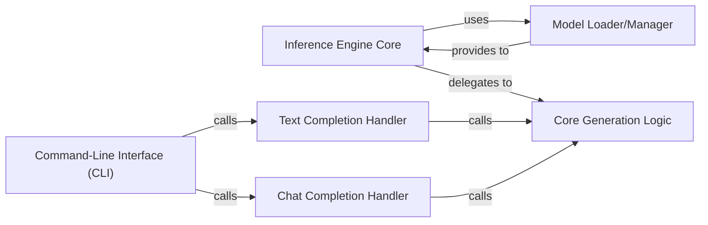

## Details

One paragraph explaining the functionality which is represented by this graph. What the main flow is and what is its purpose.

### Inference Engine Core
The central orchestrator (llama.generation.Llama) that manages the overall inference flow, holds the loaded model, and provides the high-level interfaces for various completion tasks. It acts as the primary entry point for inference operations.

**Related Classes/Methods**:

- <a href="https://github.com/meta-llama/llama/blob/main/llama/generation.py#L50-L394" target="_blank" rel="noopener noreferrer">`llama.generation.Llama` (50:394)</a>

### Model Loader/Manager
Responsible for loading the pre-trained model weights, tokenizer, and any associated configuration. It ensures the model is ready for inference by handling file paths, device placement, and initial setup.

**Related Classes/Methods**:

- <a href="https://github.com/meta-llama/llama/blob/main/llama/model.py#L19-L30" target="_blank" rel="noopener noreferrer">`llama.model.ModelArgs` (19:30)</a>
- <a href="https://github.com/meta-llama/llama/blob/main/llama/tokenizer.py#L13-L67" target="_blank" rel="noopener noreferrer">`llama.tokenizer.Tokenizer` (13:67)</a>

### Text Completion Handler
A specialized interface (llama.generation.Llama.text_completion) within the Inference Engine Core that handles requests specifically for text completion tasks. It prepares the input, invokes the core generation logic, and formats the output for text-based responses.

**Related Classes/Methods**:

- <a href="https://github.com/meta-llama/llama/blob/main/llama/generation.py#L232-L281" target="_blank" rel="noopener noreferrer">`llama.generation.Llama.text_completion` (232:281)</a>

### Chat Completion Handler
A specialized interface (llama.generation.Llama.chat_completion) within the Inference Engine Core designed to manage and process requests for conversational (chat) completion. It handles message history, role-based input formatting, and output generation tailored for chat interactions.

**Related Classes/Methods**:

- <a href="https://github.com/meta-llama/llama/blob/main/llama/generation.py#L283-L394" target="_blank" rel="noopener noreferrer">`llama.generation.Llama.chat_completion` (283:394)</a>

### Core Generation Logic
The fundamental method (llama.generation.Llama.generate) that performs the actual forward pass through the model and manages the token generation loop. It handles the low-level details of sampling, stopping conditions, and output token processing.

**Related Classes/Methods**:

- <a href="https://github.com/meta-llama/llama/blob/main/llama/generation.py#L129-L230" target="_blank" rel="noopener noreferrer">`llama.generation.Llama.generate` (129:230)</a>

### Command-Line Interface (CLI)
The user-facing component that provides a command-line interface for interacting with the Inference Engine. It parses user commands and arguments, then invokes the appropriate completion handler (text or chat) within the Inference Engine Core.

**Related Classes/Methods**:

- `llama.example.main`

### [FAQ](https://github.com/CodeBoarding/GeneratedOnBoardings/tree/main?tab=readme-ov-file#faq)