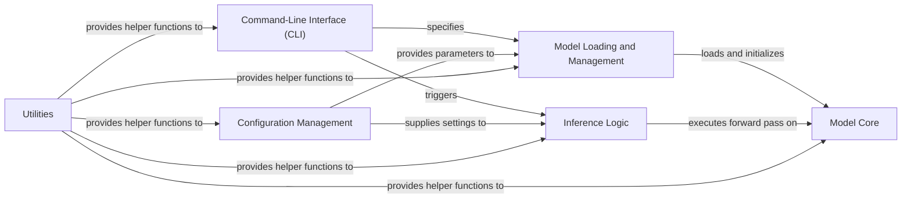

## Details

The Llama model inference application is structured around several key components, each with distinct responsibilities, designed to facilitate efficient model loading, execution, and user interaction.

### Final Component Overview

**1. Component: Model Core**
   - *Description*: Encapsulates the fundamental architectural building blocks of the Llama model, defining its various layers, normalization techniques (e.g., RMSNorm), and other core neural network structures. This component represents the actual trained model architecture.
   - *Related Classes/Methods*: `llama.model.Transformer`
   - *Justification*: This is the central and most critical component, as it embodies the machine learning model itself. Its architectural definition is fundamental for any inference task.

**2. Component: Model Loading and Management**
   - *Description*: Responsible for loading pre-trained model weights, tokenizers, and managing the model's state and configuration (e.g., `ModelArgs`). It ensures the `Model Core` is correctly initialized and ready for inference.
   - *Related Classes/Methods*: `llama.model.ModelArgs`, functions within `llama.model` or a dedicated loading script (e.g., `llama.utils.load_model`).
   - *Justification*: Essential for making the model usable. It bridges the gap between stored model artifacts and an executable `Model Core` instance in memory, handling the complexities of model initialization.

**3. Component: Inference Logic**
   - *Description*: Orchestrates the forward pass through the `Model Core`, handles input preprocessing (e.g., tokenization), output post-processing (e.g., decoding), and manages the overall inference flow for specific tasks (e.g., text completion, chat).
   - *Related Classes/Methods*: Functions that call `llama.model.Transformer`'s forward method, e.g., `example_text_completion.main` or `example_chat_completion.main`.
   - *Justification*: This component defines *how* the `Model Core` is used to generate predictions, translating raw inputs into model-understandable formats and model outputs into human-readable results. It's the operational core of the application.

**4. Component: Command-Line Interface (CLI)**
   - *Description*: Provides the primary user interface for interacting with the Llama model. It parses command-line arguments, invokes the `Inference Logic` with specified parameters, and presents results to the user.
   - *Related Classes/Methods*: Main scripts utilizing `fire`, such as `example_text_completion.py`, `example_chat_completion.py`.
   - *Justification*: For an inference application, a CLI is a common and crucial entry point for users to run the model without needing to write code, making the application accessible and usable.

**5. Component: Configuration Management**
   - *Description*: Centralizes and manages application-wide and model-specific settings, including hyperparameters, model paths, and other operational parameters. It ensures consistent behavior across different components.
   - *Related Classes/Methods*: `llama.model.ModelArgs` (as it defines model parameters), and potentially a dedicated configuration module or file.
   - *Justification*: Externalizing configuration is vital for flexibility, allowing users or developers to easily adjust model behavior or deployment settings without modifying the core application code.

**6. Component: Utilities**
   - *Description*: A collection of reusable helper functions and modules that provide common functionalities such as data manipulation, logging, file operations, or other general-purpose tasks that support multiple core components.
   - *Related Classes/Methods*: General utility modules, e.g., `llama.utils` or common functions within other modules.
   - *Justification*: Promotes code reusability and reduces redundancy by encapsulating common, non-core logic that supports the main application flow, improving maintainability.

### Component Interactions

*   **Model Loading and Management** -> **Model Core**: Loads and initializes the `Model Core` with pre-trained weights.
*   **Inference Logic** -> **Model Core**: Executes the forward pass on the `Model Core` to generate predictions.
*   **CLI** -> **Inference Logic**: Triggers specific inference tasks (e.g., text completion, chat) based on user commands.
*   **CLI** -> **Model Loading and Management**: Specifies which model to load and use for the inference task.
*   **Configuration Management** -> **Model Loading and Management**: Provides model parameters and paths required for loading.
*   **Configuration Management** -> **Inference Logic**: Supplies inference-specific settings and hyperparameters.
*   **Utilities** -> **All other components**: Provides common helper functions (e.g., for data processing, file I/O, logging) that support the operations of other components.

### Model Core [[Expand]](./Model_Core.md)
Encapsulates the fundamental architectural building blocks of the Llama model, defining its various layers, normalization techniques (e.g., RMSNorm), and other core neural network structures. This component represents the actual trained model architecture.

**Related Classes/Methods**:

- <a href="https://github.com/meta-llama/llama/blob/main/llama/model.py#L412-L494" target="_blank" rel="noopener noreferrer">`llama.model.Transformer` (412:494)</a>

### Model Loading and Management
Responsible for loading pre-trained model weights, tokenizers, and managing the model's state and configuration (e.g., ModelArgs). It ensures the Model Core is correctly initialized and ready for inference.

**Related Classes/Methods**:

- <a href="https://github.com/meta-llama/llama/blob/main/llama/model.py#L19-L30" target="_blank" rel="noopener noreferrer">`llama.model.ModelArgs` (19:30)</a>
- `llama.utils.load_model`

### Inference Logic
Orchestrates the forward pass through the Model Core, handles input preprocessing (e.g., tokenization), output post-processing (e.g., decoding), and manages the overall inference flow for specific tasks (e.g., text completion, chat).

**Related Classes/Methods**:

- <a href="https://github.com/meta-llama/llama/blob/main/llama/model.py#L456-L494" target="_blank" rel="noopener noreferrer">`llama.model.Transformer:forward` (456:494)</a>
- <a href="https://github.com/meta-llama/llama/blob/main/example_text_completion.py#L8-L64" target="_blank" rel="noopener noreferrer">`example_text_completion.main` (8:64)</a>
- <a href="https://github.com/meta-llama/llama/blob/main/example_chat_completion.py#L10-L99" target="_blank" rel="noopener noreferrer">`example_chat_completion.main` (10:99)</a>

### Command-Line Interface (CLI)
Provides the primary user interface for interacting with the Llama model. It parses command-line arguments, invokes the Inference Logic with specified parameters, and presents results to the user.

**Related Classes/Methods**:

- <a href="https://github.com/meta-llama/llama/blob/main/example_text_completion.py" target="_blank" rel="noopener noreferrer">`example_text_completion`</a>
- <a href="https://github.com/meta-llama/llama/blob/main/example_chat_completion.py" target="_blank" rel="noopener noreferrer">`example_chat_completion`</a>

### Configuration Management
Centralizes and manages application-wide and model-specific settings, including hyperparameters, model paths, and other operational parameters. It ensures consistent behavior across different components.

**Related Classes/Methods**:

- <a href="https://github.com/meta-llama/llama/blob/main/llama/model.py#L19-L30" target="_blank" rel="noopener noreferrer">`llama.model.ModelArgs` (19:30)</a>

### Utilities
A collection of reusable helper functions and modules that provide common functionalities such as data manipulation, logging, file operations, or other general-purpose tasks that support multiple core components.

**Related Classes/Methods**:

- `llama.utils`

### [FAQ](https://github.com/CodeBoarding/GeneratedOnBoardings/tree/main?tab=readme-ov-file#faq)