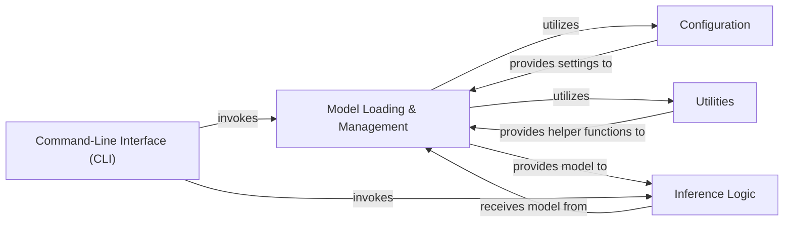

## Details

Abstract Components Overview

### Model Loading & Management [[Expand]](./Model_Loading_Management.md)
This central component is responsible for the complete lifecycle of model preparation. It handles the loading of pre-trained model weights and tokenizers, manages different model configurations, and ensures the model is correctly initialized and prepared for inference.

**Related Classes/Methods**:

- <a href="https://github.com/meta-llama/llama/blob/main/llama/generation.py#L52-L122" target="_blank" rel="noopener noreferrer">`llama.generation.Llama.build` (52:122)</a>
- `llama.Llama` (1:1)

### Inference Logic
This component encapsulates the core functionality of the application, performing the actual forward passes and inference operations using the loaded model. It handles input/output processing and may contain logic for different inference tasks (e.g., text completion, chat).

**Related Classes/Methods**:

- `llama.Llama.chat_completion` (87:87)
- `llama.Llama.text_completion` (56:56)

### Configuration
This component is dedicated to managing and retrieving all model-specific parameters, hyperparameters, and general application settings. It ensures that the application operates with the correct and externalized configurations.

**Related Classes/Methods**:

- <a href="https://github.com/meta-llama/llama/blob/main/example_chat_completion.py#L10-L99" target="_blank" rel="noopener noreferrer">`example_chat_completion.py:main` (10:99)</a>
- <a href="https://github.com/meta-llama/llama/blob/main/example_text_completion.py#L8-L64" target="_blank" rel="noopener noreferrer">`example_text_completion.py:main` (8:64)</a>

### Utilities
This component provides a collection of reusable helper functions for common tasks that support the main application flow. This includes functionalities such as checkpoint loading, distributed setup, and potentially model downloading or data preprocessing.

**Related Classes/Methods**:

- `llama` (1:1)
- `download.sh` (1:1)

### Command-Line Interface (CLI)
This component provides the user-facing interface for interacting with the application. It allows users to specify inputs, configurations, and trigger various inference tasks directly from the command line.

**Related Classes/Methods**:

- `fire.Fire` (104:104)
- `fire.Fire` (69:69)

### [FAQ](https://github.com/CodeBoarding/GeneratedOnBoardings/tree/main?tab=readme-ov-file#faq)