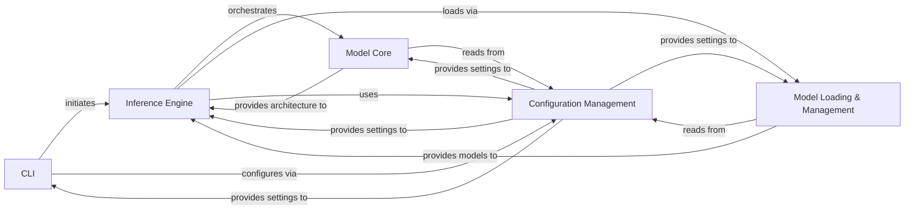

## Details

Abstract Components Overview

### CLI
This component serves as the primary user interface, parsing command-line arguments and initiating inference requests. It acts as the entry point for users to interact with the Llama model.

**Related Classes/Methods**:

- <a href="https://github.com/meta-llama/llama/blob/main/example_chat_completion.py#L10-L99" target="_blank" rel="noopener noreferrer">`example_chat_completion.py:main` (10:99)</a>
- <a href="https://github.com/meta-llama/llama/blob/main/example_text_completion.py#L8-L64" target="_blank" rel="noopener noreferrer">`example_text_completion.py:main` (8:64)</a>

### Inference Engine [[Expand]](./Inference_Engine.md)
The core orchestrator of the model's forward pass and token generation. It manages the input and output processing, coordinating the use of the model's core components and handling the overall inference flow.

**Related Classes/Methods**:

- <a href="https://github.com/meta-llama/llama/blob/main/llama/generation.py#L283-L394" target="_blank" rel="noopener noreferrer">`llama.generation.Llama.chat_completion` (283:394)</a>
- <a href="https://github.com/meta-llama/llama/blob/main/llama/generation.py#L232-L281" target="_blank" rel="noopener noreferrer">`llama.generation.Llama.text_completion` (232:281)</a>

### Model Loading & Management [[Expand]](./Model_Loading_Management.md)
Responsible for handling the loading of pre-trained model weights, tokenizers, and managing different model configurations. It ensures the model is correctly initialized and prepared for inference by the Inference Engine.

**Related Classes/Methods**:

- <a href="https://github.com/meta-llama/llama/blob/main/llama/generation.py#L52-L122" target="_blank" rel="noopener noreferrer">`llama.generation.Llama.build` (52:122)</a>

### Model Core [[Expand]](./Model_Core.md)
This component encapsulates the fundamental architectural building blocks of the Llama model, defining its various layers, normalization techniques (e.g., RMSNorm), and other core neural network structures.

**Related Classes/Methods**:

- <a href="https://github.com/meta-llama/llama/blob/main/llama/model.py#L412-L494" target="_blank" rel="noopener noreferrer">`llama.model.Transformer` (412:494)</a>

### Configuration Management
Manages application-wide settings, model hyperparameters, and other configurable parameters. It provides a centralized mechanism for externalizing and accessing various settings, influencing the behavior of other components.

**Related Classes/Methods**:

- <a href="https://github.com/meta-llama/llama/blob/main/llama/model.py#L19-L30" target="_blank" rel="noopener noreferrer">`llama.model.ModelArgs` (19:30)</a>
- <a href="https://github.com/meta-llama/llama/blob/main/example_chat_completion.py#L11-L100" target="_blank" rel="noopener noreferrer">`example_chat_completion.py:main:parameters` (11:100)</a>
- <a href="https://github.com/meta-llama/llama/blob/main/example_text_completion.py#L9-L65" target="_blank" rel="noopener noreferrer">`example_text_completion.py:main:parameters` (9:65)</a>

### [FAQ](https://github.com/CodeBoarding/GeneratedOnBoardings/tree/main?tab=readme-ov-file#faq)