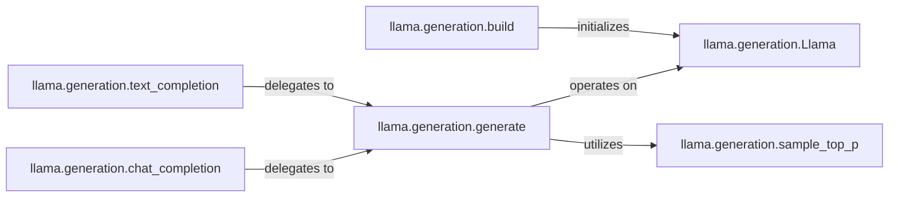

## Details

The `Inference Engine` subsystem is the core orchestrator for the text generation workflow within the `llama3` project. It is primarily responsible for initializing and managing the language model, controlling the iterative token generation process, and applying various sampling strategies to produce coherent and diverse outputs. Its boundaries are largely defined by the `llama/generation.py` module, which encapsulates the core logic for model loading, generation, and output formatting.

### llama.generation.Llama
Represents the loaded Large Language Model (LLM) instance. This component is the "Model Core" of the inference engine, responsible for executing the forward passes to compute logits based on input tokens. It is the fundamental computational unit for generating predictions.

**Related Classes/Methods**:

- <a href="https://github.com/meta-llama/llama3/blob/main/llama/generation.py#L35-L340" target="_blank" rel="noopener noreferrer">`llama.generation.Llama`:35-340</a>

### llama.generation.build
Handles the initialization and configuration of the `llama.generation.Llama` model instance, preparing it for subsequent inference operations. This includes loading model weights and setting up the necessary environment.

**Related Classes/Methods**:

- <a href="https://github.com/meta-llama/llama3/blob/main/llama/generation.py#L36-L113" target="_blank" rel="noopener noreferrer">`llama.generation.build`:36-113</a>

### llama.generation.generate
Manages the iterative token generation loop. It takes the `Llama` model and input tokens, repeatedly calls the model for predictions, and applies sampling strategies to select the next token until a stop condition is met. This is the central control flow for the generation process.

**Related Classes/Methods**:

- <a href="https://github.com/meta-llama/llama3/blob/main/llama/generation.py#L120-L227" target="_blank" rel="noopener noreferrer">`llama.generation.generate`:120-227</a>

### llama.generation.sample_top_p
Implements the top-p (nucleus) sampling algorithm. It processes the model's output logits to determine the next token, ensuring diverse and coherent generation by selecting from a dynamically sized set of most probable tokens.

**Related Classes/Methods**:

- <a href="https://github.com/meta-llama/llama3/blob/main/llama/generation.py#L343-L365" target="_blank" rel="noopener noreferrer">`llama.generation.sample_top_p`:343-365</a>

### llama.generation.text_completion
Provides a high-level, user-friendly interface for generating free-form text. It orchestrates the process by preparing the input, invoking `llama.generation.generate`, and formatting the final output for text completion tasks.

**Related Classes/Methods**:

- <a href="https://github.com/meta-llama/llama3/blob/main/llama/generation.py#L229-L278" target="_blank" rel="noopener noreferrer">`llama.generation.text_completion`:229-278</a>

### llama.generation.chat_completion
Offers a high-level interface specifically designed for generating conversational responses. It handles dialogue formatting, calls `llama.generation.generate` for token generation, and structures the output appropriately for chat applications.

**Related Classes/Methods**:

- <a href="https://github.com/meta-llama/llama3/blob/main/llama/generation.py#L280-L340" target="_blank" rel="noopener noreferrer">`llama.generation.chat_completion`:280-340</a>

### [FAQ](https://github.com/CodeBoarding/GeneratedOnBoardings/tree/main?tab=readme-ov-file#faq)