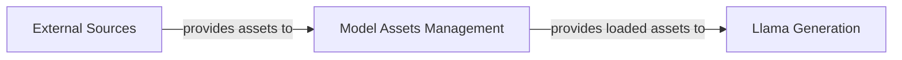

## Details

The Llama3 project's core architecture revolves around the Model Assets Management component, which serves as the central hub for handling all pre-trained Llama model weights and tokenizer files. This component is responsible for the initial acquisition of these critical assets from external sources, ensuring their integrity and availability. Once acquired, Model Assets Management prepares and loads these assets, making them accessible to the Llama Generation component. The Llama Generation component then utilizes these loaded model assets to perform the actual inference and text generation tasks, forming a clear pipeline from asset acquisition to model execution.

### Model Assets Management [[Expand]](./Model_Assets_Management.md)
Responsible for the acquisition, verification, and loading of pre-trained Llama model weights and tokenizer files, making them available for inference.

**Related Classes/Methods**: _None_

### Llama Generation
Performs actual inference and text generation tasks using loaded Llama model assets.

**Related Classes/Methods**: _None_

### External Sources
Provides pre-trained Llama model weights and tokenizer files to the system.

**Related Classes/Methods**: _None_

### [FAQ](https://github.com/CodeBoarding/GeneratedOnBoardings/tree/main?tab=readme-ov-file#faq)