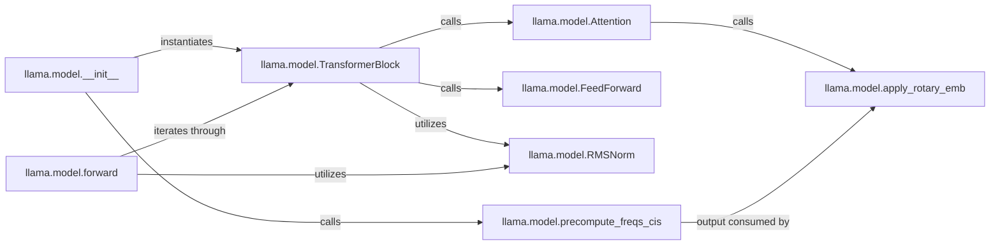

## Details

The Model Core subsystem is defined by the llama.model module, specifically the classes and methods contained within the /home/ubuntu/CodeBoarding/repo/llama3/llama/model.py file. This subsystem is responsible for the neural network architecture of the Llama model, performing core computational tasks on tokenized input to produce raw output scores (logits).

### llama.model.__init__
Initializes the Llama model's computational graph, setting up the overall architecture by instantiating the necessary transformer blocks and precomputing frequency components for positional embeddings.

**Related Classes/Methods**:

- <a href="https://github.com/meta-llama/llama3/blob/main/llama/model.py#L252-L275" target="_blank" rel="noopener noreferrer">`llama.model.__init__`:252-275</a>

### llama.model.TransformerBlock
Represents a single layer of the transformer model. It processes input sequences by applying self-attention and feed-forward mechanisms, along with normalization, to refine the token representations.

**Related Classes/Methods**:

- <a href="https://github.com/meta-llama/llama3/blob/main/llama/model.py#L222-L248" target="_blank" rel="noopener noreferrer">`llama.model.TransformerBlock`:222-248</a>

### llama.model.Attention
Computes self-attention scores to weigh the importance of different parts of the input sequence, allowing the model to focus on relevant information. It integrates positional embeddings to maintain sequence order.

**Related Classes/Methods**:

- <a href="https://github.com/meta-llama/llama3/blob/main/llama/model.py" target="_blank" rel="noopener noreferrer">`llama.model.Attention`</a>

### llama.model.FeedForward
Applies non-linear transformations to the output of the attention mechanism, enhancing the model's capacity to learn complex patterns and project features into a higher-dimensional space.

**Related Classes/Methods**:

- <a href="https://github.com/meta-llama/llama3/blob/main/llama/model.py#L193-L219" target="_blank" rel="noopener noreferrer">`llama.model.FeedForward`:193-219</a>

### llama.model.forward
Orchestrates the entire data flow through the various transformer blocks, applying final normalization and a linear projection to generate the raw output scores (logits) for token prediction.

**Related Classes/Methods**:

- <a href="https://github.com/meta-llama/llama3/blob/main/llama/model.py#L277-L302" target="_blank" rel="noopener noreferrer">`llama.model.forward`:277-302</a>

### llama.model.RMSNorm
Stabilizes the training process and improves performance by normalizing activations within the transformer blocks and at the final output layer, preventing exploding or vanishing gradients.

**Related Classes/Methods**:

- <a href="https://github.com/meta-llama/llama3/blob/main/llama/model.py#L35-L46" target="_blank" rel="noopener noreferrer">`llama.model.RMSNorm`:35-46</a>

### llama.model.precompute_freqs_cis
Prepares the frequency components required for rotary positional embeddings (RoPE), which efficiently encode the absolute and relative positions of tokens in the input sequence.

**Related Classes/Methods**:

- <a href="https://github.com/meta-llama/llama3/blob/main/llama/model.py#L49-L54" target="_blank" rel="noopener noreferrer">`llama.model.precompute_freqs_cis`:49-54</a>

### llama.model.apply_rotary_emb
Integrates the precomputed rotary positional information into the input embeddings of the attention mechanism, allowing it to understand token positions without explicit positional encodings.

**Related Classes/Methods**:

- <a href="https://github.com/meta-llama/llama3/blob/main/llama/model.py#L65-L75" target="_blank" rel="noopener noreferrer">`llama.model.apply_rotary_emb`:65-75</a>

### [FAQ](https://github.com/CodeBoarding/GeneratedOnBoardings/tree/main?tab=readme-ov-file#faq)