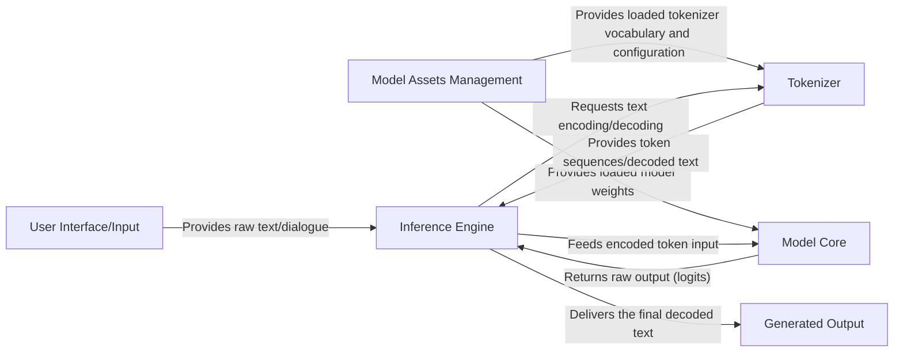

## Details

The Llama3 project implements a streamlined text generation pipeline, centered around an `Inference Engine` that orchestrates the entire process. User input, provided via a `User Interface/Input` component, is first processed by a `Tokenizer` to convert human-readable text into numerical token sequences. These tokens are then fed into the `Model Core`, which performs the core computational tasks of the Llama model to produce raw output scores (logits). The `Inference Engine` manages the iterative generation process, including sampling strategies, and utilizes the `Tokenizer` again to decode predicted token IDs back into human-readable text. Finally, the generated text is delivered to the `Generated Output` component. `Model Assets Management` plays a crucial role by ensuring that all necessary pre-trained model weights and tokenizer files are loaded and accessible to the respective components. This architecture emphasizes clear separation of concerns, with distinct components handling input/output, asset management, tokenization, core model computation, and overall inference orchestration.

### User Interface/Input
Represents the external source of raw text or dialogue prompts provided by the user.

**Related Classes/Methods**:

- <a href="https://github.com/meta-llama/llama3/blob/main/example_chat_completion.py" target="_blank" rel="noopener noreferrer">`/home/ubuntu/CodeBoarding/repo/llama3/example_chat_completion.py`</a>
- <a href="https://github.com/meta-llama/llama3/blob/main/example_text_completion.py" target="_blank" rel="noopener noreferrer">`/home/ubuntu/CodeBoarding/repo/llama3/example_text_completion.py`</a>

### Model Assets Management [[Expand]](./Model_Assets_Management.md)
Responsible for the acquisition, verification, and loading of pre-trained Llama model weights and tokenizer files, ensuring all necessary assets are accessible.

**Related Classes/Methods**:

- <a href="https://github.com/meta-llama/llama3/blob/main/download.sh" target="_blank" rel="noopener noreferrer">`download.sh`</a>
- <a href="https://github.com/meta-llama/llama3/blob/main/llama/generation.py" target="_blank" rel="noopener noreferrer">`generation.py`</a>

### Tokenizer
Manages the conversion of human-readable text into numerical token sequences (encoding) and the reverse process (decoding), including prompt formatting.

**Related Classes/Methods**:

- <a href="https://github.com/meta-llama/llama3/blob/main/llama/tokenizer.py" target="_blank" rel="noopener noreferrer">`tokenizer.py`</a>

### Model Core [[Expand]](./Model_Core.md)
Encapsulates the neural network architecture of the Llama model, performing core computational tasks on tokenized input to produce raw output scores (logits).

**Related Classes/Methods**:

- <a href="https://github.com/meta-llama/llama3/blob/main/llama/model.py" target="_blank" rel="noopener noreferrer">`model.py`</a>

### Inference Engine [[Expand]](./Inference_Engine.md)
Orchestrates the entire text generation workflow, initializing and managing the Model Core and Tokenizer, controlling the token generation loop, and applying sampling strategies.

**Related Classes/Methods**:

- <a href="https://github.com/meta-llama/llama3/blob/main/llama/generation.py" target="_blank" rel="noopener noreferrer">`generation.py`</a>
- <a href="https://github.com/meta-llama/llama3/blob/main/example_chat_completion.py" target="_blank" rel="noopener noreferrer">`example_chat_completion.py`</a>
- <a href="https://github.com/meta-llama/llama3/blob/main/example_text_completion.py" target="_blank" rel="noopener noreferrer">`example_text_completion.py`</a>

### Generated Output
Represents the final human-readable text produced by the inference process, delivered back to the user.

**Related Classes/Methods**:

- <a href="https://github.com/meta-llama/llama3/blob/main/example_chat_completion.py" target="_blank" rel="noopener noreferrer">`/home/ubuntu/CodeBoarding/repo/llama3/example_chat_completion.py`</a>
- <a href="https://github.com/meta-llama/llama3/blob/main/example_text_completion.py" target="_blank" rel="noopener noreferrer">`/home/ubuntu/CodeBoarding/repo/llama3/example_text_completion.py`</a>

### [FAQ](https://github.com/CodeBoarding/GeneratedOnBoardings/tree/main?tab=readme-ov-file#faq)