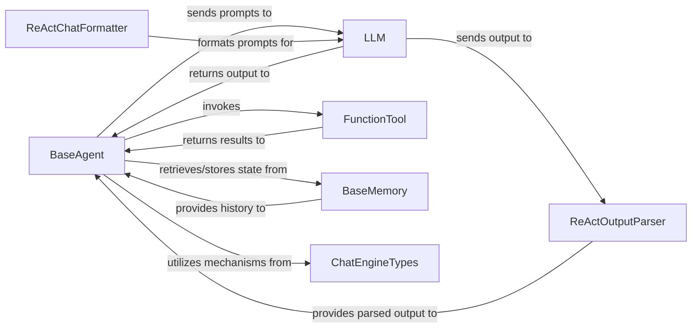

## Details

The core of the system revolves around the `BaseAgent`, which orchestrates the agentic reasoning loop. It interacts with the `LLM` for natural language processing and decision-making, utilizing `FunctionTool` to extend its capabilities by invoking external functions. `BaseMemory` provides conversational context, enabling stateful interactions. The `ReActChatFormatter` and `ReActOutputParser` specifically facilitate the ReAct pattern, preparing prompts for the `LLM` and parsing its structured responses. `ChatEngineTypes` underpins the conversational framework, defining essential chat functionalities. This modular design allows for flexible agent behavior, tool integration, and robust conversational management.

### BaseAgent
The foundational orchestrator of the agentic loop. It manages the overall flow of reasoning, planning, and execution of multi-step tasks, defining the core interaction pattern for agents.

**Related Classes/Methods**:

- <a href="https://github.com/run-llama/llama_index/blob/main/llama-index-core/llama_index/core/agent/react/formatter.py#L36-L48" target="_blank" rel="noopener noreferrer">`BaseAgent`:36-48</a>

### LLM
Provides the core intelligence for the agent, handling natural language understanding, reasoning, and generation of responses and actions. It abstracts various LLM providers.

**Related Classes/Methods**:

- <a href="https://github.com/run-llama/llama_index/blob/main/llama-datasets/10k/uber_2021/llamaindex_baseline.py" target="_blank" rel="noopener noreferrer">`LLM`</a>

### FunctionTool
Acts as an adapter to expose any Python function or external capability as a callable tool for agents, complete with input/output schemas. This is crucial for extending agent capabilities.

**Related Classes/Methods**:

- <a href="https://github.com/run-llama/llama_index/blob/main/llama-index-core/llama_index/core/tools/function_tool.py#L67-L456" target="_blank" rel="noopener noreferrer">`FunctionTool`:67-456</a>

### BaseMemory
Manages and persists conversational history and state, enabling agents to maintain context across interactions and multi-turn conversations.

**Related Classes/Methods**:

- <a href="https://github.com/run-llama/llama_index/blob/main/llama-index-core/llama_index/core/memory/types.py#L14-L79" target="_blank" rel="noopener noreferrer">`BaseMemory`:14-79</a>

### ReActChatFormatter
Structures prompts for the `LLM` following the ReAct (Reasoning and Acting) pattern, embedding tool descriptions and thought processes to guide the LLM's decision-making.

**Related Classes/Methods**:

- <a href="https://github.com/run-llama/llama_index/blob/main/llama-index-core/llama_index/core/agent/react/formatter.py#L51-L140" target="_blank" rel="noopener noreferrer">`ReActChatFormatter`:51-140</a>

### ReActOutputParser
Parses the `LLM`'s output (when using ReAct) to extract actionable commands (tool calls) and the final generated response, closing the ReAct loop.

**Related Classes/Methods**:

- <a href="https://github.com/run-llama/llama_index/blob/main/llama-index-core/llama_index/core/agent/react/output_parser.py#L69-L112" target="_blank" rel="noopener noreferrer">`ReActOutputParser`:69-112</a>

### ChatEngineTypes
Defines the foundational data structures and operations for managing chat conversations, including message handling, streaming, and different chat modes, providing the underlying framework for agent-driven conversations.

**Related Classes/Methods**:

- <a href="https://github.com/run-llama/llama_index/blob/main/llama-index-core/llama_index/core/chat_engine/types.py" target="_blank" rel="noopener noreferrer">`ChatEngineTypes`</a>

### [FAQ](https://github.com/CodeBoarding/GeneratedOnBoardings/tree/main?tab=readme-ov-file#faq)