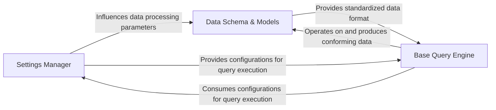

## Details

The `llama_index.core` subsystem is structured around a clear separation of concerns, with the `Settings Manager` serving as the central hub for global configurations. This manager dictates parameters for data processing, influencing the behavior of components interacting with the `Data Schema & Models`, which defines the canonical data structures like `Document` and `Node`. The `Base Query Engine`, an abstract interface for all query operations, consumes these configurations from the `Settings Manager` to guide its execution. Furthermore, the `Base Query Engine` relies heavily on the `Data Schema & Models` to ensure it operates on and produces data in a standardized, consistent format, thereby maintaining data integrity throughout the query and retrieval processes.

### Settings Manager
Manages global configurations and parameters for the entire framework. It acts as a central registry for settings like LLM instances, node parsing parameters (chunk size, overlap), and prompt helper configurations, ensuring consistent behavior across components. This aligns with the "ML Toolkit / Data Framework" pattern of a centralized configuration system, providing a single source of truth for operational parameters.

**Related Classes/Methods**:

- <a href="https://github.com/run-llama/llama_index/blob/main/llama-index-core/llama_index/core/settings.py" target="_blank" rel="noopener noreferrer">`llama_index.core.settings`</a>

### Data Schema & Models
Defines the canonical data structures and models (e.g., `Document`, `Node`) used throughout LlamaIndex. It provides abstractions for data exchange, serialization, and conversion to/from external formats, ensuring data consistency and interoperability. This is crucial for an "ML Toolkit / Data Framework" to maintain data integrity and facilitate seamless data flow across different modules and integrations.

**Related Classes/Methods**:

- <a href="https://github.com/run-llama/llama_index/blob/main/llama-index-core/llama_index/core/schema.py" target="_blank" rel="noopener noreferrer">`llama_index.core.schema`</a>

### Base Query Engine
Defines the abstract interface for any query engine within the framework. It establishes the fundamental methods (`query`, `aquery`) for synchronous and asynchronous querying, serving as a contract for how data retrieval and synthesis operations are initiated. This aligns with the "ML Toolkit / Data Framework" pattern of providing extensible interfaces for core functionalities, allowing various query strategies to be implemented consistently.

**Related Classes/Methods**:

- <a href="https://github.com/run-llama/llama_index/blob/main/llama-index-core/llama_index/core/base/base_query_engine.py#L22-L93" target="_blank" rel="noopener noreferrer">`llama_index.core.base.base_query_engine.BaseQueryEngine`:22-93</a>

### [FAQ](https://github.com/CodeBoarding/GeneratedOnBoardings/tree/main?tab=readme-ov-file#faq)