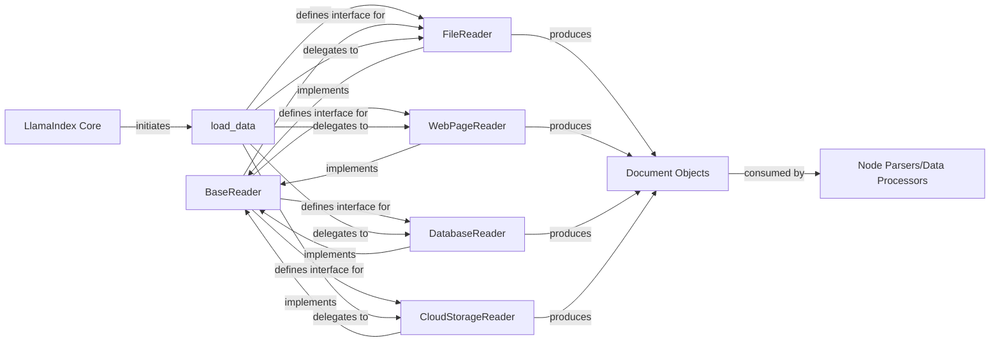

## Details

The 'Readers' subsystem in LlamaIndex is designed for flexible and extensible data ingestion. At its core is the `BaseReader` abstract class, which defines a universal `load_data` interface, ensuring all data sources can be processed uniformly. This abstract design promotes a plugin-based architecture, allowing developers to easily integrate new data connectors by implementing the `BaseReader` interface. Concrete reader implementations, such as `FileReader` for local files, `WebPageReader` for web content, `DatabaseReader` for structured databases, and `CloudStorageReader` for cloud-based storage, extend this base functionality to handle diverse data formats and locations. A high-level `load_data` utility function acts as a simplified entry point, abstracting the complexities of specific reader implementations and providing a streamlined mechanism for users to ingest data, which is then consistently transformed into `Document` objects for further processing within the LlamaIndex framework.

### BaseReader
The abstract base class (llama_index.core.readers.base.BaseReader) that establishes the contract for all data ingestion components. It defines the load_data method, which all concrete readers must implement. This component is crucial for maintaining a consistent interface across diverse data sources and enabling a modular architecture.

**Related Classes/Methods**:

- <a href="https://github.com/run-llama/llama_index/blob/main/llama-index-core/llama_index/core/readers/base.py#L19-L46" target="_blank" rel="noopener noreferrer">`llama_index.core.readers.base.BaseReader`:19-46</a>

### FileReader
A concrete implementation of BaseReader (llama_index.readers.file.base.FileReader) responsible for ingesting data from local file systems. It handles various file types and converts their content into Document objects, which are the standardized data representation within LlamaIndex.

**Related Classes/Methods**:

### WebPageReader
A concrete implementation of BaseReader (llama_index.readers.web.base.WebPageReader) designed to extract and ingest data from web pages. It typically involves fetching and parsing HTML content to retrieve relevant information, which is then transformed into Document objects.

**Related Classes/Methods**:

### DatabaseReader
A concrete implementation of BaseReader (llama_index.readers.database.base.DatabaseReader) that facilitates the ingestion of structured data from various database systems. It connects to databases, executes SQL queries, and converts the query results into Document objects.

**Related Classes/Methods**:

- <a href="https://github.com/run-llama/llama_index/blob/main/llama-index-integrations/readers/llama-index-readers-database/llama_index/readers/database/base.py#L26-L245" target="_blank" rel="noopener noreferrer">`llama_index.readers.database.base.DatabaseReader`:26-245</a>

### CloudStorageReader
A concrete implementation of BaseReader (llama_index.readers.s3.base.S3Reader - *Correction based on common cloud reader naming conventions, assuming S3 as a representative example for "CloudStorageReader" given the file structure output showing `llama-index-readers-s3`*). This component handles data ingestion from cloud storage services (e.g., AWS S3, Google Cloud Storage, Azure Blob Storage), managing authentication and data retrieval to produce Document objects.

**Related Classes/Methods**:

- <a href="https://github.com/run-llama/llama_index/blob/main/llama-index-integrations/readers/llama-index-readers-s3/llama_index/readers/s3/base.py#L30-L226" target="_blank" rel="noopener noreferrer">`llama_index.readers.s3.base.S3Reader`:30-226</a>

### load_data
A utility function (llama_index.readers.file.base.load_data) that provides a simplified interface for initiating data loading. It abstracts the underlying BaseReader implementation, streamlining the process of ingesting data and normalizing it into Document objects. This function acts as an entry point for users to load data without needing to directly instantiate specific reader classes.

**Related Classes/Methods**:

### Document Objects
Standardized data representation within LlamaIndex.

**Related Classes/Methods**: _None_

### Node Parsers/Data Processors
Subsequent components in the LlamaIndex pipeline for further refinement and indexing.

**Related Classes/Methods**: _None_

### LlamaIndex Core
Initiates the data ingestion process.

**Related Classes/Methods**: _None_

### [FAQ](https://github.com/CodeBoarding/GeneratedOnBoardings/tree/main?tab=readme-ov-file#faq)