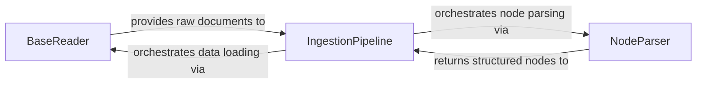

## Details

The `IngestionPipeline` serves as the central orchestrator for the data ingestion subsystem. It initiates the process by leveraging `BaseReader` components to efficiently load raw documents from diverse external sources. Once the raw data is acquired, the `IngestionPipeline` then orchestrates the `NodeParser` to transform these unstructured documents into semantically meaningful, structured `Nodes`. These processed nodes are subsequently returned to the `IngestionPipeline` for further management, including deduplication and upsertion, ensuring a robust and configurable data preparation workflow for downstream applications.

### BaseReader
This component defines the fundamental interface for loading raw data from various external sources (e.g., files, databases, APIs). It embodies the "Data Connectors/Loaders" pattern, providing a pluggable mechanism for data acquisition. Its importance lies in abstracting away the complexities of source-specific data retrieval, making the system extensible to new data types and locations.

**Related Classes/Methods**:

- <a href="https://github.com/run-llama/llama_index/blob/main/llama-index-core/llama_index/core/readers/base.py#L19-L46" target="_blank" rel="noopener noreferrer">`llama_index.core.readers.base.BaseReader`:19-46</a>

### NodeParser
This component is responsible for transforming raw documents into structured `Nodes`. This involves critical steps like text splitting (chunking) to manage context window limitations and extracting relevant metadata to enrich the nodes. It represents the "Data Indexing/Structuring Modules" pattern, crucial for preparing data for efficient retrieval and context augmentation in RAG applications. Its role is fundamental in converting unstructured data into a machine-readable and semantically meaningful format.

**Related Classes/Methods**:

- <a href="https://github.com/run-llama/llama_index/blob/main/llama-index-core/llama_index/core/node_parser/interface.py#L50-L196" target="_blank" rel="noopener noreferrer">`llama_index.core.node_parser.interface.NodeParser`:50-196</a>

### IngestionPipeline
This component orchestrates the entire data ingestion process, coordinating data loading, applying a series of transformations (including node parsing), and handling subsequent steps like deduplication and upserting processed nodes. It exemplifies the "Pipeline/Chain of Responsibility" and "Facade" patterns, providing a unified entry point for initiating the ingestion flow. Its central importance lies in managing the sequence and application of various data processing steps, ensuring a robust and configurable ingestion workflow.

**Related Classes/Methods**:

- <a href="https://github.com/run-llama/llama_index/blob/main/llama-index-core/llama_index/core/ingestion/pipeline.py#L191-L755" target="_blank" rel="noopener noreferrer">`llama_index.core.ingestion.pipeline.IngestionPipeline`:191-755</a>

### [FAQ](https://github.com/CodeBoarding/GeneratedOnBoardings/tree/main?tab=readme-ov-file#faq)