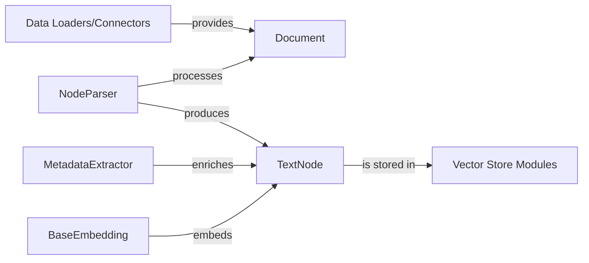

## Details

This subsystem is responsible for the end-to-end processing of raw, unstructured data into a format suitable for efficient retrieval and semantic search. The process begins with Data Loaders/Connectors ingesting raw data and converting it into Document objects. The NodeParser then takes these Document objects, splits them into semantically meaningful chunks, and transforms them into TextNode objects. Subsequently, the MetadataExtractor enriches these TextNode objects with additional contextual metadata. The BaseEmbedding component then generates high-dimensional vector embeddings from the TextNode content, which are finally stored by the Vector Store Modules for persistent storage and later retrieval. This structured flow ensures that raw data is transformed, enriched, and indexed for effective use in downstream applications.

### Data Loaders/Connectors
External components that serve as the entry point for raw, unstructured data into the system, providing Document objects.

**Related Classes/Methods**:

- <a href="https://github.com/run-llama/llama_index/blob/main/llama-index-core/llama_index/core/readers/base.py#L19-L46" target="_blank" rel="noopener noreferrer">`llama_index.core.readers.base.BaseReader`:19-46</a>

### Document
The fundamental raw, unstructured data object ingested into the system before any processing.

**Related Classes/Methods**:

- <a href="https://github.com/run-llama/llama_index/blob/main/llama-index-core/llama_index/core/schema.py#L1012-L1221" target="_blank" rel="noopener noreferrer">`llama_index.core.schema.Document`:1012-1221</a>

### NodeParser
Orchestrates the transformation of raw Document objects into structured TextNode objects, handling text splitting and adherence to size constraints.

**Related Classes/Methods**:

- <a href="https://github.com/run-llama/llama_index/blob/main/llama-index-core/llama_index/core/node_parser/interface.py#L50-L196" target="_blank" rel="noopener noreferrer">`llama_index.core.node_parser.interface.NodeParser`:50-196</a>
- <a href="https://github.com/run-llama/llama_index/blob/main/llama-index-core/llama_index/core/node_parser/text/sentence.py#L34-L325" target="_blank" rel="noopener noreferrer">`llama_index.core.node_parser.text.sentence.SentenceSplitter`:34-325</a>
- <a href="https://github.com/run-llama/llama_index/blob/main/llama-index-core/llama_index/core/node_parser/text/sentence.py#L176-L177" target="_blank" rel="noopener noreferrer">`llama_index.core.node_parser.text.sentence.split_text`:176-177</a>

### TextNode
The fundamental data structure representing a processed, semantically meaningful chunk of information, encapsulating textual content, metadata, and vector embedding. It is the primary output of the parsing stage.

**Related Classes/Methods**:

- <a href="https://github.com/run-llama/llama_index/blob/main/llama-index-core/llama_index/core/schema.py#L691-L796" target="_blank" rel="noopener noreferrer">`llama_index.core.schema.TextNode`:691-796</a>

### MetadataExtractor
Enriches TextNode objects with additional, derived metadata (e.g., title, author, creation date) to enhance context and improve retrievability.

**Related Classes/Methods**: _None_

### BaseEmbedding
Defines the interface and provides implementations for generating high-dimensional numerical vector embeddings from TextNode content, enabling semantic search and similarity comparisons.

**Related Classes/Methods**:

- <a href="https://github.com/run-llama/llama_index/blob/main/llama-index-core/llama_index/core/base/embeddings/base.py#L69-L612" target="_blank" rel="noopener noreferrer">`llama_index.core.base.embeddings.base.BaseEmbedding`:69-612</a>

### Vector Store Modules
Downstream components responsible for persistently storing the vector embeddings of TextNode objects, typically in a specialized vector database.

**Related Classes/Methods**:

- <a href="https://github.com/run-llama/llama_index/blob/main/llama-index-core/llama_index/core/vector_stores/types.py#L268-L330" target="_blank" rel="noopener noreferrer">`llama_index.core.vector_stores.types.VectorStore`:268-330</a>

### [FAQ](https://github.com/CodeBoarding/GeneratedOnBoardings/tree/main?tab=readme-ov-file#faq)