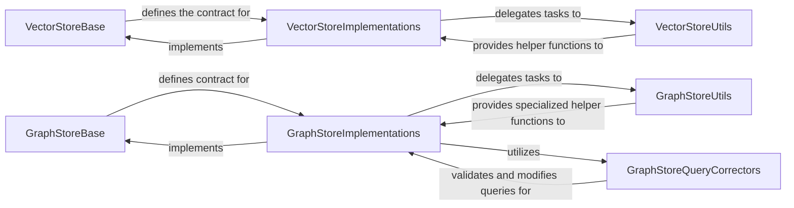

## Details

The `llama_index.integrations` subsystem provides a pluggable architecture for integrating with various external data stores, specifically focusing on Vector Stores and Graph Stores. The core design pattern involves abstract base classes (`VectorStoreBase`, `GraphStoreBase`) that define common interfaces, and concrete implementations (`VectorStoreImplementations`, `GraphStoreImplementations`) that handle the specifics of interacting with different database technologies (e.g., Pinecone for vector stores, Neo4j for graph stores). Utility components (`VectorStoreUtils`, `GraphStoreUtils`) support these implementations by providing helper functions for data conversion, query generation, and client setup. Additionally, `GraphStoreQueryCorrectors` ensure the validity of graph queries. This modular design allows for easy extension and interchangeability of data storage backends.

### VectorStoreBase
This component establishes the foundational contract for all vector store integrations. It defines the common API for managing vector embeddings, including operations like adding, querying, and deleting vectors and their associated metadata, abstracting away the specifics of underlying databases. Its architectural importance lies in enabling a pluggable and interchangeable design for various vector database backends.

**Related Classes/Methods**:

- <a href="https://github.com/run-llama/llama_index/blob/main/" target="_blank" rel="noopener noreferrer">`llama_index.integrations.vector_stores.base.VectorStoreBase`</a>

### VectorStoreImplementations
This component provides concrete implementations of the `VectorStoreBase` interface for specific external vector databases (e.g., Pinecone, Qdrant, Chroma). Each implementation handles the unique client connections, data transformations, and API calls required to interact with its respective database. It is central because it provides the actual connectivity and data persistence capabilities for vector embeddings.

**Related Classes/Methods**:

- <a href="https://github.com/run-llama/llama_index/blob/main/" target="_blank" rel="noopener noreferrer">`llama_index.integrations.vector_stores.pinecone.base.PineconeVectorStore`</a>
- <a href="https://github.com/run-llama/llama_index/blob/main/" target="_blank" rel="noopener noreferrer">`llama_index.integrations.vector_stores.pinecone.base.query`</a>

### VectorStoreUtils
This component comprises helper functions and utilities tailored to specific vector store implementations. These utilities assist with tasks such as data format conversion, filter translation, and client setup, ensuring efficient and compatible interaction with the external vector databases. It is important for streamlining the integration process and handling database-specific nuances.

**Related Classes/Methods**:

- <a href="https://github.com/run-llama/llama_index/blob/main/" target="_blank" rel="noopener noreferrer">`llama_index.integrations.vector_stores.pinecone.utils`</a>

### GraphStoreBase
Similar to `VectorStoreBase`, this component defines the common API and contract for managing structured knowledge in graph formats. It specifies methods for upserting, querying, and deleting triplets, nodes, and relationships, providing a unified interface for various graph database interactions. Its architectural significance lies in standardizing graph data access, promoting modularity.

**Related Classes/Methods**:

- <a href="https://github.com/run-llama/llama_index/blob/main/" target="_blank" rel="noopener noreferrer">`llama_index.integrations.graph_stores.base.GraphStoreBase`</a>

### GraphStoreImplementations
This component offers concrete implementations of the `GraphStoreBase` interface for specific graph databases (e.g., Neo4j, Memgraph, Kuzu). Each implementation manages connections, executes graph-specific queries (e.g., Cypher), and handles schema management. It is crucial for enabling the system to store and retrieve knowledge in a graph structure from diverse graph database backends.

**Related Classes/Methods**:

- <a href="https://github.com/run-llama/llama_index/blob/main/" target="_blank" rel="noopener noreferrer">`llama_index.integrations.graph_stores.neo4j.base.Neo4jGraphStore`</a>
- <a href="https://github.com/run-llama/llama_index/blob/main/" target="_blank" rel="noopener noreferrer">`llama_index.integrations.graph_stores.neo4j.base.query`</a>

### GraphStoreUtils
This component contains utility functions that support the `GraphStoreImplementations`. These modules assist in tasks like graph query generation, schema definition, and data manipulation specific to the particular graph database. It plays a vital role in facilitating efficient and correct interactions with graph databases.

**Related Classes/Methods**:

- <a href="https://github.com/run-llama/llama_index/blob/main/" target="_blank" rel="noopener noreferrer">`llama_index.integrations.graph_stores.nebula.utils`</a>

### GraphStoreQueryCorrectors
This component provides specialized functionality for validating and correcting graph queries (e.g., Cypher queries) against the graph database schema. Its purpose is to ensure query correctness and prevent errors, which is critical for maintaining data integrity and reliable retrieval from graph stores.

**Related Classes/Methods**:

- <a href="https://github.com/run-llama/llama_index/blob/main/" target="_blank" rel="noopener noreferrer">`llama_index.integrations.graph_stores.neo4j.cypher_corrector`</a>

### [FAQ](https://github.com/CodeBoarding/GeneratedOnBoardings/tree/main?tab=readme-ov-file#faq)