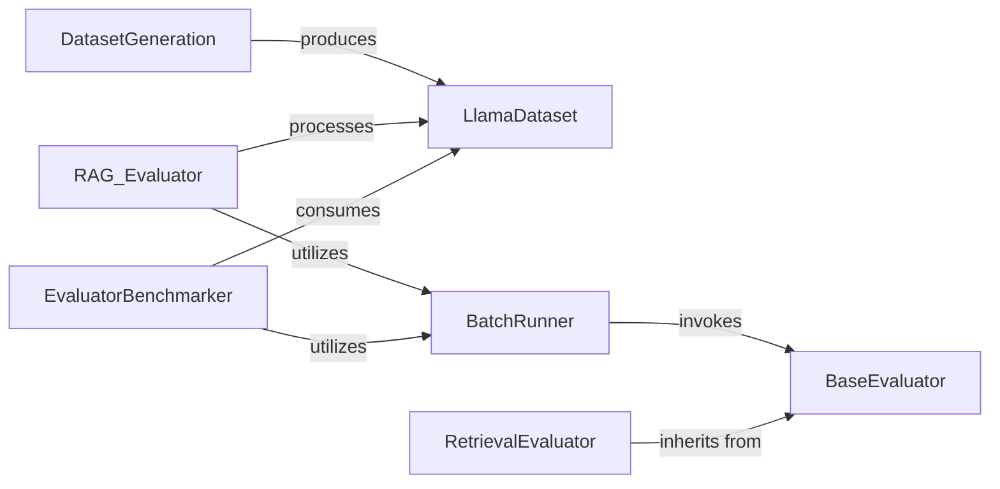

## Details

The `llama_index` evaluation subsystem is designed to facilitate robust assessment of RAG (Retrieval Augmented Generation) pipelines and other language model applications. At its core, the system leverages `LlamaDataset` as a standardized data model for evaluation examples. `DatasetGeneration` is responsible for creating these datasets, which are then consumed by various `BaseEvaluator` implementations, such as `RetrievalEvaluator` and `RAG_Evaluator`, to perform specific evaluations. The `BatchRunner` orchestrates the efficient execution of these evaluations, handling parallel processing and result aggregation. Finally, the `EvaluatorBenchmarker` provides a high-level interface for managing and analyzing comprehensive benchmarking campaigns, utilizing the `BatchRunner` to execute evaluations across different datasets and evaluators. This architecture promotes modularity, reusability, and extensibility, allowing for diverse evaluation scenarios.

### BaseEvaluator
Defines the abstract interface for all evaluators, providing `evaluate` and `aevaluate` methods. It establishes the contract for how any evaluation logic should be implemented, promoting extensibility (Plugin/Extension Architecture).

**Related Classes/Methods**:

- <a href="https://github.com/run-llama/llama_index/blob/main/llama-index-core/llama_index/core/evaluation/base.py#L46-L135" target="_blank" rel="noopener noreferrer">`llama_index.core.evaluation.base.BaseEvaluator`:46-135</a>

### LlamaDataset
Provides the foundational structure and utilities for datasets used across evaluation and prediction tasks. It serves as the core data model for evaluation examples, embodying the "Data Framework" aspect.

**Related Classes/Methods**:

- <a href="https://github.com/run-llama/llama_index/blob/main/llama-index-core/llama_index/core/llama_dataset/base.py#L130-L356" target="_blank" rel="noopener noreferrer">`llama_index.core.llama_dataset.base.LlamaDataset`:130-356</a>

### DatasetGeneration
Focuses on creating synthetic questions and query-response datasets from existing nodes. These datasets are crucial for setting up controlled evaluation benchmarks, acting as a data preparation utility within the framework.

**Related Classes/Methods**:

- <a href="https://github.com/run-llama/llama_index/blob/main/llama-index-core/llama_index/core/llama_dataset/generator.py#L48-L261" target="_blank" rel="noopener noreferrer">`llama_index.core.llama_dataset.generator.RagDatasetGenerator`:48-261</a>

### BatchRunner
Orchestrates the execution of evaluations in a batched manner. It manages input validation, retrieves evaluation arguments, runs evaluation workers, and formats results, acting as a central execution engine for various evaluators.

**Related Classes/Methods**:

- <a href="https://github.com/run-llama/llama_index/blob/main/llama-index-core/llama_index/core/evaluation/batch_runner.py#L75-L443" target="_blank" rel="noopener noreferrer">`llama_index.core.evaluation.batch_runner.BatchEvalRunner`:75-443</a>

### RetrievalEvaluator
Specializes in assessing the performance of the retrieval phase within RAG pipelines, calculating retrieval-specific metrics (e.g., precision, recall) based on retrieved nodes and ground truth. It's a concrete implementation of `BaseEvaluator` for a critical RAG component.

**Related Classes/Methods**:

- <a href="https://github.com/run-llama/llama_index/blob/main/llama-index-core/llama_index/core/evaluation/retrieval/base.py#L77-L200" target="_blank" rel="noopener noreferrer">`llama_index.core.evaluation.retrieval.base.RetrievalEvaluator`:77-200</a>

### EvaluatorBenchmarker
A high-level component for orchestrating comprehensive benchmarking runs. It prepares and saves benchmark results and accommodates different grading methodologies, serving as the primary interface for end-to-end evaluation campaigns.

**Related Classes/Methods**:

- <a href="https://github.com/run-llama/llama_index/blob/main/llama-index-core/llama_index/core/evaluation/benchmarks/base.py#L20-L100" target="_blank" rel="noopener noreferrer">`llama_index.core.evaluation.benchmarks.base.EvaluationBenchmarker`:20-100</a>

### RAG_Evaluator
A pack-specific evaluator designed for RAG systems, managing the prediction and evaluation process for RAG, including preparing judges and saving evaluation results. It provides a ready-to-use solution for RAG evaluation.

**Related Classes/Methods**:

- <a href="https://github.com/run-llama/llama_index/blob/main/llama-index-packs/llama-index-packs-rag-evaluator/llama_index/packs/rag_evaluator/base.py#L33-L461" target="_blank" rel="noopener noreferrer">`llama_index.packs.rag_evaluator.base.RagEvaluatorPack`:33-461</a>

### [FAQ](https://github.com/CodeBoarding/GeneratedOnBoardings/tree/main?tab=readme-ov-file#faq)