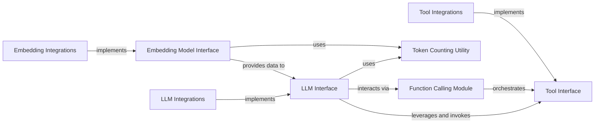

## Details

The analysis has been refined to address the feedback regarding missing and incorrect source code references, ensuring that each key component is accurately linked to its implementation within the `llama_index` project. This precision is crucial for both comprehensive documentation and accurate diagram generation, allowing for a clear visualization of the system's architecture and component interactions.

The `Embedding Model Interface` reference has been corrected to `llama_index.core.base.embeddings.base.BaseEmbedding`, which is the foundational abstract class for all embedding models within the framework. For `LLM Integrations`, `Embedding Integrations`, and `Tool Integrations`, specific examples of concrete implementations have been identified, demonstrating how the abstract interfaces are realized by various providers. The `Function Calling Module` is now linked to `llama_index.core.llms.function_calling`, highlighting its role in orchestrating tool interactions. Finally, the `Token Counting Utility` is associated with `llama_index.core.callbacks.token_counting`, reflecting its cross-cutting utility in managing token usage.

This revised structure provides a robust foundation for understanding the core functionalities of the `llama_index` subsystem, detailing how abstract interfaces enable extensibility and how concrete implementations provide specific capabilities. The relationships between components are clearly defined, illustrating the flow of data and control within the system.

### LLM Interface
Provides a high-level, unified API for interacting with various LLMs, abstracting away provider-specific details for text completion, chat, and structured predictions. It serves as the primary facade for all LLM-related operations within the framework.

**Related Classes/Methods**:

- <a href="https://github.com/run-llama/llama_index/blob/main/llama-index-core/llama_index/core/llms/llm.py#L163-L930" target="_blank" rel="noopener noreferrer">`llama_index.core.llms.llm.LLM`:163-930</a>

### Embedding Model Interface
Offers a standardized API for generating vector embeddings from text and queries, and for calculating similarity, regardless of the underlying embedding model. This component ensures consistent interaction with diverse embedding services.

**Related Classes/Methods**:

- <a href="https://github.com/run-llama/llama_index/blob/main/llama-index-core/llama_index/core/base/embeddings/base.py#L69-L612" target="_blank" rel="noopener noreferrer">`llama_index.core.base.embeddings.base.BaseEmbedding`:69-612</a>

### Tool Interface
Establishes a common interface for defining, describing, executing, and handling outputs of external tools, enabling extensibility and allowing LLMs to interact with external functionalities.

**Related Classes/Methods**:

- <a href="https://github.com/run-llama/llama_index/blob/main/llama-index-core/llama_index/core/tools/types.py#L145-L203" target="_blank" rel="noopener noreferrer">`llama_index.core.tools.types.BaseTool`:145-203</a>

### LLM Integrations
Provide concrete implementations for specific LLM providers (e.g., OpenAI, HuggingFace), adhering to the `LLM Interface`. These components encapsulate the provider-specific API calls and data handling.

**Related Classes/Methods**:

- <a href="https://github.com/run-llama/llama_index/blob/main/llama-index-integrations/llms/llama-index-llms-openai/llama_index/llms/openai/base.py#L129-L1160" target="_blank" rel="noopener noreferrer">`llama_index.llms.openai.base.OpenAI`:129-1160</a>

### Embedding Integrations
Provide concrete implementations for various embedding service providers, adhering to the `Embedding Model Interface`. They handle the specifics of interacting with different embedding APIs.

**Related Classes/Methods**:

- <a href="https://github.com/run-llama/llama_index/blob/main/llama-index-integrations/embeddings/llama-index-embeddings-openai/llama_index/embeddings/openai/base.py#L214-L488" target="_blank" rel="noopener noreferrer">`llama_index.embeddings.openai.base.OpenAIEmbedding`:214-488</a>

### Tool Integrations
Provide specific implementations of external tool functionalities, extending the `Tool Interface`. These are the actual callable functions or services that LLMs can invoke.

**Related Classes/Methods**:

- <a href="https://github.com/run-llama/llama_index/blob/main/llama-index-integrations/tools/llama-index-tools-tavily-research/llama_index/tools/tavily_research/base.py#L9-L42" target="_blank" rel="noopener noreferrer">`llama_index.tools.tavily_research.base.TavilyTool`:9-42</a>

### Function Calling Module
Manages the logic within LLMs for invoking and interacting with external tools based on their definitions. It acts as an orchestrator, translating LLM requests into tool calls.

**Related Classes/Methods**:

- <a href="https://github.com/run-llama/llama_index/blob/main/llama-index-core/llama_index/core/llms/function_calling.py#L24-L334" target="_blank" rel="noopener noreferrer">`llama_index.core.llms.function_calling.FunctionCallingLLM`:24-334</a>

### Token Counting Utility
A shared utility used by both `LLM Interface` and `Embedding Model Interface` for common tasks like token estimation, crucial for managing costs and model constraints.

**Related Classes/Methods**:

- <a href="https://github.com/run-llama/llama_index/blob/main/llama-index-core/llama_index/core/callbacks/token_counting.py#L143-L269" target="_blank" rel="noopener noreferrer">`llama_index.core.callbacks.token_counting.TokenCountingHandler`:143-269</a>

### [FAQ](https://github.com/CodeBoarding/GeneratedOnBoardings/tree/main?tab=readme-ov-file#faq)