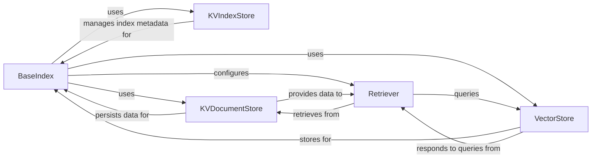

## Details

The core of the llama_index indexing subsystem revolves around the BaseIndex, which serves as the central orchestrator for managing various index types. It interacts with specialized storage components: KVIndexStore for persisting and retrieving index metadata, KVDocumentStore for managing raw document content and processed nodes, and VectorStore for handling vector embeddings. When a query is initiated, the BaseIndex configures a Retriever component. The Retriever then interacts with both the VectorStore to perform similarity searches on embeddings and the KVDocumentStore to retrieve the full document content or nodes based on the search results, ultimately providing relevant information back to the query engine. This modular design ensures efficient data management and flexible integration with different storage backends.

### BaseIndex
Acts as the foundational interface and orchestrator for all index types. It manages the entire lifecycle of an index, including building, inserting, updating, and deleting nodes/documents. It serves as the primary entry point for high-level index operations, abstracting the complexities of underlying storage and retrieval mechanisms.

**Related Classes/Methods**: _None_

### VectorStore
Defines the abstract interface for storing, retrieving, and managing vector embeddings. It provides a crucial abstraction layer, allowing the system to integrate seamlessly with various underlying vector database backends (e.g., Chroma, Pinecone, Qdrant) without changing the core indexing logic.

**Related Classes/Methods**: _None_

### KVIndexStore
Manages the persistence and retrieval of the index's structural metadata (e.g., node relationships, index type, configuration) using a key-value storage mechanism. This component is vital for ensuring the index's state can be saved, loaded, and reconstructed across sessions.

**Related Classes/Methods**: _None_

### KVDocumentStore
Manages the persistence and retrieval of the actual raw document content and processed node objects using a key-value storage mechanism. This component ensures that the original data referenced by the index is available and can be efficiently retrieved when needed for context or synthesis.

**Related Classes/Methods**: _None_

### Retriever
Provides query-specific interfaces to interact with the underlying index structures, VectorStore, and KVDocumentStore. It translates user queries into specific operations to retrieve the most relevant nodes or documents, acting as the bridge between the query engine and the indexed data.

**Related Classes/Methods**: _None_

### [FAQ](https://github.com/CodeBoarding/GeneratedOnBoardings/tree/main?tab=readme-ov-file#faq)