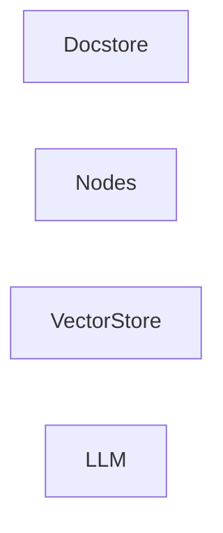

## Details

Analysis of core components in llama_index/core with corrected source references.

### Docstore
Defines types related to the docstore.

**Related Classes/Methods**:

### Nodes
The fundamental data object.

**Related Classes/Methods**:

- <a href="https://github.com/run-llama/llama_index/blob/main/llama-index-core/llama_index/core/schema.py" target="_blank" rel="noopener noreferrer">`llama_index.core.schema.Node`</a>

### VectorStore
Defines types for vector stores.

**Related Classes/Methods**:

- <a href="https://github.com/run-llama/llama_index/blob/main/llama-index-core/llama_index/core/vector_stores/types.py#L268-L330" target="_blank" rel="noopener noreferrer">`llama_index.core.vector_stores.types.VectorStore`:268-330</a>

### LLM
A core component for language model operations.

**Related Classes/Methods**:

- <a href="https://github.com/run-llama/llama_index/blob/main/llama-index-core/llama_index/core/llms/llm.py#L163-L930" target="_blank" rel="noopener noreferrer">`llama_index.core.llms.llm.LLM`:163-930</a>

### [FAQ](https://github.com/CodeBoarding/GeneratedOnBoardings/tree/main?tab=readme-ov-file#faq)