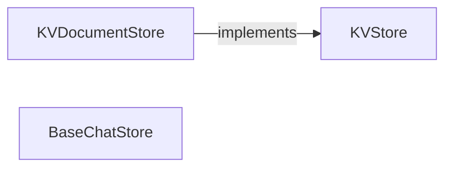

## Details

The core storage subsystem of `llama_index` is built upon a set of abstract interfaces designed to provide flexible and extensible persistence mechanisms. At its foundation, the `KVStore` defines a generic key-value storage contract, enabling various higher-level storage components to operate independently of the underlying storage technology. Specialized components like `KVDocumentStore` and `BaseChatStore` extend this foundation, offering tailored interfaces for managing specific data types crucial to the framework, such as `Document` objects and conversational chat histories. This layered abstraction ensures modularity, allowing different storage backends to be plugged in without impacting the core logic of data indexing and retrieval.

### KVStore
This component defines the foundational abstract interface for a generic key-value store. It provides a low-level, flexible abstraction for persistent storage, allowing higher-level components to store and retrieve arbitrary key-value data without needing to know the underlying storage mechanism (e.g., in-memory, file-system, database). It serves as the base contract for all key-value based persistence within the system.

**Related Classes/Methods**:

- <a href="https://github.com/run-llama/llama_index/blob/main/llama-index-core/llama_index/core/storage/docstore/simple_docstore.py" target="_blank" rel="noopener noreferrer">`KVStore`</a>

### KVDocumentStore
A specialized repository designed for the efficient storage and retrieval of `Document` objects and their associated metadata. It provides a key-value interface specifically tailored for the core data units of the framework, which are fundamental for indexing and retrieval operations in a RAG system. It abstracts the complexities of document serialization and deserialization.

**Related Classes/Methods**:

- <a href="https://github.com/run-llama/llama_index/blob/main/llama-index-core/llama_index/core/storage/docstore/keyval_docstore.py#L24-L660" target="_blank" rel="noopener noreferrer">`KVDocumentStore`:24-660</a>

### BaseChatStore
This abstract component defines the contract for storing and retrieving chat message history. In an ML Toolkit dealing with conversational AI, managing and persisting chat state is critical for maintaining context across interactions and enabling multi-turn conversations. Concrete implementations would handle the actual storage mechanism.

**Related Classes/Methods**:

- <a href="https://github.com/run-llama/llama_index/blob/main/llama-index-core/llama_index/core/storage/chat_store/base.py#L11-L78" target="_blank" rel="noopener noreferrer">`BaseChatStore`:11-78</a>

### [FAQ](https://github.com/CodeBoarding/GeneratedOnBoardings/tree/main?tab=readme-ov-file#faq)