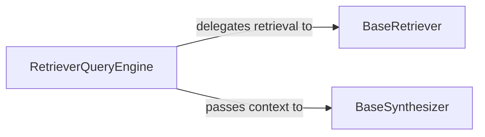

## Details

The core of the LlamaIndex query processing subsystem revolves around the RetrieverQueryEngine. This component acts as a central orchestrator, taking a user query and coordinating two primary abstract components: BaseRetriever and BaseSynthesizer. The RetrieverQueryEngine first delegates the task of information retrieval to a concrete implementation of BaseRetriever, which is responsible for fetching relevant data. Once the data is retrieved, the RetrieverQueryEngine passes this context to a BaseSynthesizer implementation. The BaseSynthesizer then takes the retrieved information and the original query to generate a coherent and human-readable response, often leveraging large language models. This design promotes a clear separation of concerns, allowing for flexible and extensible implementations of both retrieval and response synthesis mechanisms.

### RetrieverQueryEngine
This component acts as the primary orchestrator and Facade for the entire query and response generation process. It receives a user query, coordinates the retrieval of relevant information by delegating to a BaseRetriever implementation, and then passes the retrieved context to a BaseSynthesizer to formulate the final answer. It manages the flow and integration between the retrieval and synthesis stages.

**Related Classes/Methods**:

- <a href="https://github.com/run-llama/llama_index/blob/main/llama-index-core/llama_index/core/query_engine/retriever_query_engine.py#L25-L222" target="_blank" rel="noopener noreferrer">`llama_index.core.query_engine.retriever_query_engine.RetrieverQueryEngine`:25-222</a>

### BaseRetriever
This is an abstract base class that defines the interface for all information retrieval mechanisms within the LlamaIndex framework. It embodies the Plugin/Extension Architecture, allowing various concrete implementations (e.g., vector store retrievers, keyword-based retrievers, graph retrievers) to be plugged in. Its responsibility is to fetch the most relevant data chunks or documents from an index based on a given query.

**Related Classes/Methods**:

### BaseSynthesizer
This is an abstract base class that defines the interface for synthesizing a coherent, human-readable response from a set of retrieved information, typically by leveraging LLMs. Like BaseRetriever, it supports the Plugin/Extension Architecture, enabling different strategies for generating responses (e.g., summarization, question answering, conversational turn generation).

**Related Classes/Methods**:

- <a href="https://github.com/run-llama/llama_index/blob/main/llama-index-core/llama_index/core/response_synthesizers/base.py#L61-L321" target="_blank" rel="noopener noreferrer">`llama_index.core.response_synthesizers.base.BaseSynthesizer`:61-321</a>

### [FAQ](https://github.com/CodeBoarding/GeneratedOnBoardings/tree/main?tab=readme-ov-file#faq)