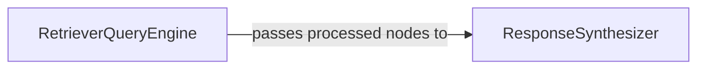

## Details

The `llama_index` query processing subsystem is primarily driven by two high-level components: `RetrieverQueryEngine` and `ResponseSynthesizer`. The `RetrieverQueryEngine` serves as the initial entry point for user queries, orchestrating the retrieval of relevant information from various data sources and performing initial post-processing to refine the retrieved data. Once the `RetrieverQueryEngine` has prepared the relevant information, it passes these processed nodes to the `ResponseSynthesizer`. The `ResponseSynthesizer` then takes on the crucial role of transforming this raw or semi-processed data into a coherent and human-readable response, often leveraging Large Language Models (LLMs). This clear separation of concerns—retrieval and initial processing by `RetrieverQueryEngine`, followed by synthesis by `ResponseSynthesizer`—forms the core interaction pathway of this subsystem, enabling efficient and structured query resolution.

### RetrieverQueryEngine
This component acts as the initial orchestrator for handling user queries. Its core responsibility is to retrieve relevant information from various data sources (e.g., indexes, vector stores) based on the input query. It also manages the initial processing of the retrieved data, such as applying node post-processors (e.g., filtering, re-ranking) to refine the information before synthesis.

**Related Classes/Methods**:

- <a href="https://github.com/run-llama/llama_index/blob/main/llama-index-core/llama_index/core/query_engine/retriever_query_engine.py#L25-L222" target="_blank" rel="noopener noreferrer">`llama_index.core.query_engine.retriever_query_engine.RetrieverQueryEngine`:25-222</a>

### ResponseSynthesizer
This component is responsible for taking the retrieved and potentially refined information (nodes) and synthesizing a coherent, human-readable response to the original query. It focuses on the generation aspect, transforming raw or semi-processed data into a final, well-structured answer, typically by interacting with Large Language Models (LLMs).

**Related Classes/Methods**:

### [FAQ](https://github.com/CodeBoarding/GeneratedOnBoardings/tree/main?tab=readme-ov-file#faq)