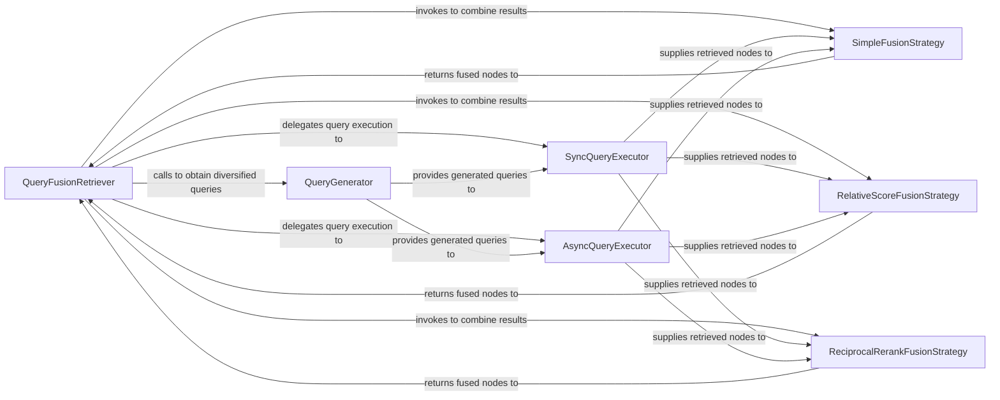

## Details

The feedback indicates an incorrect source reference for `FusionRetriever`. Upon re-evaluation, the correct class name is `QueryFusionRetriever` located in `llama_index.core.retrievers.fusion_retriever.py`. The previous analysis incorrectly referred to it as `FusionRetriever`. This correction is crucial for accurate documentation and diagram generation, as it directly impacts the identification of the central component.

### QueryFusionRetriever
The central orchestrator of the multi-source retrieval process. It initializes and manages multiple underlying retrievers, coordinates query execution, and applies various fusion algorithms to their results. It serves as the primary entry point for retrieval requests within this subsystem.

**Related Classes/Methods**:

- <a href="https://github.com/run-llama/llama_index/blob/main/llama-index-core/llama_index/core/retrievers/fusion_retriever.py#L33-L304" target="_blank" rel="noopener noreferrer">`llama_index.core.retrievers.fusion_retriever.QueryFusionRetriever`:33-304</a>

### QueryGenerator
Responsible for generating multiple variations or expansions of the initial query. This component is crucial for enabling diversified retrieval across different data sources or for improving recall by exploring various query perspectives.

**Related Classes/Methods**:

- <a href="https://github.com/run-llama/llama_index/blob/main/llama-index-core/llama_index/core/retrievers/fusion_retriever.py#L83-L98" target="_blank" rel="noopener noreferrer">`llama_index.core.retrievers.fusion_retriever._get_queries`:83-98</a>

### SyncQueryExecutor
Executes the generated queries synchronously against the configured data sources (e.g., vector stores, indexes). This component handles sequential retrieval operations.

**Related Classes/Methods**:

- <a href="https://github.com/run-llama/llama_index/blob/main/llama-index-core/llama_index/core/retrievers/fusion_retriever.py#L253-L261" target="_blank" rel="noopener noreferrer">`llama_index.core.retrievers.fusion_retriever._run_sync_queries`:253-261</a>

### AsyncQueryExecutor
Manages the asynchronous execution of queries, enabling parallel retrieval requests. This is vital for improving performance, especially when dealing with multiple or potentially slow data sources.

**Related Classes/Methods**:

- <a href="https://github.com/run-llama/llama_index/blob/main/llama-index-core/llama_index/core/retrievers/fusion_retriever.py#L219-L234" target="_blank" rel="noopener noreferrer">`llama_index.core.retrievers.fusion_retriever._run_nested_async_queries`:219-234</a>

### SimpleFusionStrategy
Implements a basic strategy for combining retrieved results, typically involving simple concatenation, deduplication, or basic ranking.

**Related Classes/Methods**:

- <a href="https://github.com/run-llama/llama_index/blob/main/llama-index-core/llama_index/core/retrievers/fusion_retriever.py#L200-L217" target="_blank" rel="noopener noreferrer">`llama_index.core.retrievers.fusion_retriever._simple_fusion`:200-217</a>

### RelativeScoreFusionStrategy
Combines retrieval results based on their relative scores from different retrievers, providing a more nuanced aggregation that considers the confidence or relevance assigned by individual sources.

**Related Classes/Methods**:

- <a href="https://github.com/run-llama/llama_index/blob/main/llama-index-core/llama_index/core/retrievers/fusion_retriever.py#L137-L198" target="_blank" rel="noopener noreferrer">`llama_index.core.retrievers.fusion_retriever._relative_score_fusion`:137-198</a>

### ReciprocalRerankFusionStrategy
Re-ranks combined results using the Reciprocal Rank Fusion (RRF) algorithm. This advanced strategy improves result quality by prioritizing items that are consistently highly ranked across multiple independent retrievers.

**Related Classes/Methods**:

- <a href="https://github.com/run-llama/llama_index/blob/main/llama-index-core/llama_index/core/retrievers/fusion_retriever.py#L100-L135" target="_blank" rel="noopener noreferrer">`llama_index.core.retrievers.fusion_retriever._reciprocal_rerank_fusion`:100-135</a>

### [FAQ](https://github.com/CodeBoarding/GeneratedOnBoardings/tree/main?tab=readme-ov-file#faq)