```mermaid
graph LR
    Data_Ingestion_Layer["Data Ingestion Layer"]
    Data_Processing_Embedding_Layer["Data Processing & Embedding Layer"]
    Data_Storage_Layer["Data Storage Layer"]
    Indexing_Layer["Indexing Layer"]
    LLM_Integration_Layer["LLM Integration Layer"]
    Retrieval_Layer["Retrieval Layer"]
    Query_Response_Layer["Query & Response Layer"]
    Agent_Tooling_Layer["Agent & Tooling Layer"]
    Data_Ingestion_Layer -- "Loads Raw Data and Feeds Documents" --> Data_Processing_Embedding_Layer
    Data_Processing_Embedding_Layer -- "Sends Processed Nodes and Prepares Data for Indexing" --> Indexing_Layer
    Data_Processing_Embedding_Layer -- "Generates & Stores Embeddings" --> Data_Storage_Layer
    Indexing_Layer -- "Manages Indexed Data and Persists Index Structures" --> Data_Storage_Layer
    Retrieval_Layer -- "Queries for Relevant Data and Retrieves Nodes" --> Data_Storage_Layer
    Query_Response_Layer -- "Sends Query and Initiates Retrieval" --> Retrieval_Layer
    Retrieval_Layer -- "Provides Retrieved Nodes and Feeds Context" --> Query_Response_Layer
    Query_Response_Layer -- "Sends Prompt and Requests Completion" --> LLM_Integration_Layer
    LLM_Integration_Layer -- "Returns Generated Text and Provides LLM Output" --> Query_Response_Layer
    Agent_Tooling_Layer -- "Utilizes LLMs for Reasoning" --> LLM_Integration_Layer
    Agent_Tooling_Layer -- "Leverages Query Capabilities" --> Query_Response_Layer
    Agent_Tooling_Layer -- "Invokes Tools and Manages Internal State (Memory)" --> Agent_Tooling_Layer
    click Data_Ingestion_Layer href "https://github.com/CodeBoarding/GeneratedOnBoardings/blob/main/llama_index/Data_Ingestion_Layer.md" "Details"
    click Data_Processing_Embedding_Layer href "https://github.com/CodeBoarding/GeneratedOnBoardings/blob/main/llama_index/Data_Processing_Embedding_Layer.md" "Details"
    click Data_Storage_Layer href "https://github.com/CodeBoarding/GeneratedOnBoardings/blob/main/llama_index/Data_Storage_Layer.md" "Details"
    click Indexing_Layer href "https://github.com/CodeBoarding/GeneratedOnBoardings/blob/main/llama_index/Indexing_Layer.md" "Details"
    click Retrieval_Layer href "https://github.com/CodeBoarding/GeneratedOnBoardings/blob/main/llama_index/Retrieval_Layer.md" "Details"
    click Query_Response_Layer href "https://github.com/CodeBoarding/GeneratedOnBoardings/blob/main/llama_index/Query_Response_Layer.md" "Details"
    click Agent_Tooling_Layer href "https://github.com/CodeBoarding/GeneratedOnBoardings/blob/main/llama_index/Agent_Tooling_Layer.md" "Details"
```

## Details

The LlamaIndex architecture provides a robust framework for building intelligent applications by orchestrating data ingestion, processing, indexing, and interaction with Large Language Models. Data enters through the Data Ingestion Layer, is transformed and embedded by the Data Processing & Embedding Layer, and then stored in the Data Storage Layer and organized by the Indexing Layer. User queries are handled by the Query & Response Layer, which leverages the Retrieval Layer to fetch relevant information and the LLM Integration Layer for generating responses. The Agent & Tooling Layer extends these capabilities, enabling sophisticated reasoning and action execution through integrated tools and conversational memory. This modular design facilitates clear data flow and component responsibilities, making it ideal for visual representation in architectural diagrams.

### Data Ingestion Layer [[Expand]](./Data_Ingestion_Layer.md)
The entry point for LlamaIndex, responsible for ingesting raw data from various external sources (e.g., local files, cloud storage, databases, APIs, web pages).

**Related Classes/Methods**:

- <a href="https://github.com/run-llama/llama_index/blob/main/" target="_blank" rel="noopener noreferrer">`llama_index.integrations.readers.file.base.load_data`</a>

### Data Processing & Embedding Layer [[Expand]](./Data_Processing_Embedding_Layer.md)
Transforms raw documents into structured "nodes" (smaller, semantically meaningful chunks), extracts relevant metadata, and converts textual/visual data into numerical vector representations.

**Related Classes/Methods**:

- <a href="https://github.com/run-llama/llama_index/blob/main/llama-index-core/llama_index/core/node_parser/text/sentence.py#L176-L177" target="_blank" rel="noopener noreferrer">`llama_index.core.node_parser.text.sentence.split_text`:176-177</a>
- <a href="https://github.com/run-llama/llama_index/blob/main/" target="_blank" rel="noopener noreferrer">`llama_index.integrations.embeddings.openai.base._get_query_embedding`</a>

### Data Storage Layer [[Expand]](./Data_Storage_Layer.md)
Provides persistent storage and efficient retrieval mechanisms for vector embeddings (Vector Stores) and structured knowledge in graph formats (Graph Stores).

**Related Classes/Methods**:

- <a href="https://github.com/run-llama/llama_index/blob/main/" target="_blank" rel="noopener noreferrer">`llama_index.integrations.vector_stores.pinecone.base.query`</a>
- <a href="https://github.com/run-llama/llama_index/blob/main/" target="_blank" rel="noopener noreferrer">`llama_index.integrations.graph_stores.neo4j.base.query`</a>

### Indexing Layer [[Expand]](./Indexing_Layer.md)
Organizes and structures processed nodes for efficient retrieval, building various types of indexes (e.g., vector, knowledge graph, tree, list).

**Related Classes/Methods**:

- <a href="https://github.com/run-llama/llama_index/blob/main/llama-index-core/llama_index/core/indices/vector_store/base.py#L286-L309" target="_blank" rel="noopener noreferrer">`llama_index.core.indices.vector_store.base.build_index_from_nodes`:286-309</a>

### LLM Integration Layer
Provides a standardized interface for interacting with various Large Language Models (text-only and multi-modal) for text generation and chat.

**Related Classes/Methods**:

- <a href="https://github.com/run-llama/llama_index/blob/main/" target="_blank" rel="noopener noreferrer">`llama_index.integrations.llms.openai.base.chat`</a>
- <a href="https://github.com/run-llama/llama_index/blob/main/" target="_blank" rel="noopener noreferrer">`llama_index.integrations.multi_modal_llms.openai.base.complete`</a>

### Retrieval Layer [[Expand]](./Retrieval_Layer.md)
Fetches relevant information (nodes) from indexes and storage based on a given query, employing various retrieval strategies.

**Related Classes/Methods**:

- <a href="https://github.com/run-llama/llama_index/blob/main/llama-index-core/llama_index/core/retrievers/fusion_retriever.py#L263-L284" target="_blank" rel="noopener noreferrer">`llama_index.core.retrievers.fusion_retriever._retrieve`:263-284</a>

### Query & Response Layer [[Expand]](./Query_Response_Layer.md)
The primary interface for users, orchestrating retrieval and response synthesis to answer complex queries and formulate coherent final answers.

**Related Classes/Methods**:

- <a href="https://github.com/run-llama/llama_index/blob/main/llama-index-core/llama_index/core/query_engine/retriever_query_engine.py#L187-L200" target="_blank" rel="noopener noreferrer">`llama_index.core.query_engine.retriever_query_engine._query`:187-200</a>
- <a href="https://github.com/run-llama/llama_index/blob/main/llama-index-core/llama_index/core/response_synthesizers/generation.py#L102-L144" target="_blank" rel="noopener noreferrer">`llama_index.core.response_synthesizers.generation.synthesize`:102-144</a>

### Agent & Tooling Layer [[Expand]](./Agent_Tooling_Layer.md)
Provides a framework for building intelligent agents that can reason, plan, and execute actions using a set of tools, while managing conversational history and state.

**Related Classes/Methods**:

- <a href="https://github.com/run-llama/llama_index/blob/main/llama-index-core/llama_index/core/agent/workflow/base_agent.py#L205-L213" target="_blank" rel="noopener noreferrer">`llama_index.core.agent.workflow.base_agent.take_step`:205-213</a>
- <a href="https://github.com/run-llama/llama_index/blob/main/" target="_blank" rel="noopener noreferrer">`llama_index.integrations.tools.neo4j.base.run_request`</a>
- <a href="https://github.com/run-llama/llama_index/blob/main/llama-index-core/llama_index/core/memory/chat_memory_buffer.py#L114-L151" target="_blank" rel="noopener noreferrer">`llama_index.core.memory.chat_memory_buffer.get`:114-151</a>

### [FAQ](https://github.com/CodeBoarding/GeneratedOnBoardings/tree/main?tab=readme-ov-file#faq)