```mermaid
graph LR
    Core_Framework["Core Framework"]
    Data_Ingestion_Processing["Data Ingestion & Processing"]
    Index_Storage_Management["Index & Storage Management"]
    External_Service_Interfaces["External Service Interfaces"]
    Query_Response_Generation["Query & Response Generation"]
    Agentic_Workflow_Engine["Agentic Workflow Engine"]
    Persistence_Layer["Persistence Layer"]
    Evaluation_Benchmarking["Evaluation & Benchmarking"]
    Core_Framework -- "orchestrates" --> Data_Ingestion_Processing
    Core_Framework -- "initiates query processing for" --> Query_Response_Generation
    Data_Ingestion_Processing -- "transforms and prepares data for" --> Index_Storage_Management
    Data_Ingestion_Processing -- "sends data for embedding generation to" --> External_Service_Interfaces
    Index_Storage_Management -- "stores and retrieves data from" --> Persistence_Layer
    Index_Storage_Management -- "provides indexed data to" --> Query_Response_Generation
    External_Service_Interfaces -- "provides/receives capabilities and tool access to/from" --> Agentic_Workflow_Engine
    External_Service_Interfaces -- "generates embeddings and responses for" --> Index_Storage_Management
    External_Service_Interfaces -- "generates embeddings and responses for" --> Query_Response_Generation
    Query_Response_Generation -- "retrieves information from" --> Index_Storage_Management
    Query_Response_Generation -- "requests answer generation from" --> External_Service_Interfaces
    Agentic_Workflow_Engine -- "invokes tools via" --> External_Service_Interfaces
    Agentic_Workflow_Engine -- "manages conversational state in" --> Persistence_Layer
    Persistence_Layer -- "supports data persistence for" --> Index_Storage_Management
    Persistence_Layer -- "supports data persistence for" --> Agentic_Workflow_Engine
    Core_Framework -- "submits data/results for analysis to" --> Evaluation_Benchmarking
    click Core_Framework href "https://github.com/CodeBoarding/GeneratedOnBoardings/blob/main/llama_index/Core_Framework.md" "Details"
    click Data_Ingestion_Processing href "https://github.com/CodeBoarding/GeneratedOnBoardings/blob/main/llama_index/Data_Ingestion_Processing.md" "Details"
    click Index_Storage_Management href "https://github.com/CodeBoarding/GeneratedOnBoardings/blob/main/llama_index/Index_Storage_Management.md" "Details"
    click External_Service_Interfaces href "https://github.com/CodeBoarding/GeneratedOnBoardings/blob/main/llama_index/External_Service_Interfaces.md" "Details"
    click Query_Response_Generation href "https://github.com/CodeBoarding/GeneratedOnBoardings/blob/main/llama_index/Query_Response_Generation.md" "Details"
    click Agentic_Workflow_Engine href "https://github.com/CodeBoarding/GeneratedOnBoardings/blob/main/llama_index/Agentic_Workflow_Engine.md" "Details"
    click Persistence_Layer href "https://github.com/CodeBoarding/GeneratedOnBoardings/blob/main/llama_index/Persistence_Layer.md" "Details"
    click Evaluation_Benchmarking href "https://github.com/CodeBoarding/GeneratedOnBoardings/blob/main/llama_index/Evaluation_Benchmarking.md" "Details"
```

## Details

The LlamaIndex project is structured around a modular RAG (Retrieval-Augmented Generation) pipeline, designed to facilitate the integration of large language models with external data sources. The Core Framework acts as the central hub, managing global configurations and foundational data schemas, orchestrating interactions across the system. Data enters the system via the Data Ingestion & Processing component, which handles loading, parsing, and transforming raw data into structured nodes. These processed nodes are then managed by the Index & Storage Management component, responsible for creating and maintaining various index types (e.g., vector, tree) and ensuring efficient data organization. The Persistence Layer provides robust storage for all internal states, including documents, index structures, and conversational history.

User queries are handled by the Query & Response Generation component, which retrieves relevant information from the managed indices and synthesizes coherent responses using external LLMs. The Agentic Workflow Engine extends the system's capabilities by enabling LLMs to perform complex, multi-step tasks through reasoning and tool execution, often interacting with the External Service Interfaces. This interface component is crucial for abstracting interactions with diverse external AI/ML services, such as LLMs, embedding models, and other tools. Finally, the Evaluation & Benchmarking component provides essential tools for assessing the performance and quality of the RAG pipelines, ensuring continuous improvement and optimization.

### Core Framework [[Expand]](./Core_Framework.md)
The central orchestrator, providing global configurations, fundamental data schemas, and core abstractions that manage the overall data flow and component interactions.

**Related Classes/Methods**:

- <a href="https://github.com/run-llama/llama_index/blob/main/llama-index-core/llama_index/core/settings.py" target="_blank" rel="noopener noreferrer">`llama_index.core.settings`</a>
- <a href="https://github.com/run-llama/llama_index/blob/main/" target="_blank" rel="noopener noreferrer">`llama_index.core.schema`</a>
- <a href="https://github.com/run-llama/llama_index/blob/main/llama-index-core/llama_index/core/base/base_query_engine.py#L22-L93" target="_blank" rel="noopener noreferrer">`llama_index.core.base.base_query_engine.BaseQueryEngine`:22-93</a>

### Data Ingestion & Processing [[Expand]](./Data_Ingestion_Processing.md)
Responsible for loading raw data from various sources, parsing, splitting into manageable nodes, and extracting metadata, preparing data for indexing.

**Related Classes/Methods**:

- <a href="https://github.com/run-llama/llama_index/blob/main/llama-index-core/llama_index/core/readers/base.py#L19-L46" target="_blank" rel="noopener noreferrer">`llama_index.core.readers.base.BaseReader`:19-46</a>
- <a href="https://github.com/run-llama/llama_index/blob/main/llama-index-core/llama_index/core/node_parser/interface.py#L50-L196" target="_blank" rel="noopener noreferrer">`llama_index.core.node_parser.interface.NodeParser`:50-196</a>
- <a href="https://github.com/run-llama/llama_index/blob/main/llama-index-core/llama_index/core/ingestion/pipeline.py#L191-L755" target="_blank" rel="noopener noreferrer">`llama_index.core.ingestion.pipeline.IngestionPipeline`:191-755</a>

### Index & Storage Management [[Expand]](./Index_Storage_Management.md)
Manages the creation, updating, and querying of various index types (e.g., vector, tree), orchestrating how processed data is organized and stored for efficient retrieval.

**Related Classes/Methods**:

- <a href="https://github.com/run-llama/llama_index/blob/main/llama-index-core/llama_index/core/indices/base.py#L25-L593" target="_blank" rel="noopener noreferrer">`llama_index.core.indices.base.BaseIndex`:25-593</a>
- <a href="https://github.com/run-llama/llama_index/blob/main/llama-index-core/llama_index/core/vector_stores/types.py#L268-L330" target="_blank" rel="noopener noreferrer">`llama_index.core.vector_stores.types.VectorStore`:268-330</a>
- <a href="https://github.com/run-llama/llama_index/blob/main/llama-index-core/llama_index/core/storage/index_store/keyval_index_store.py#L15-L142" target="_blank" rel="noopener noreferrer">`llama_index.core.storage.index_store.keyval_index_store.KVIndexStore`:15-142</a>

### External Service Interfaces [[Expand]](./External_Service_Interfaces.md)
A critical abstraction layer providing standardized interfaces for integrating with diverse external AI/ML services, including Large Language Models (LLMs), Embedding Models, and general-purpose tools.

**Related Classes/Methods**:

- <a href="https://github.com/run-llama/llama_index/blob/main/llama-index-core/llama_index/core/llms/llm.py" target="_blank" rel="noopener noreferrer">`llama_index.core.llms.llm`</a>
- <a href="https://github.com/run-llama/llama_index/blob/main/" target="_blank" rel="noopener noreferrer">`llama_index.core.embeddings.base`</a>
- <a href="https://github.com/run-llama/llama_index/blob/main/llama-index-core/llama_index/core/tools/types.py#L145-L203" target="_blank" rel="noopener noreferrer">`llama_index.core.tools.types.BaseTool`:145-203</a>

### Query & Response Generation [[Expand]](./Query_Response_Generation.md)
Executes user queries against the managed indices to fetch the most relevant information, and then formulates a coherent, human-readable response using LLMs.

**Related Classes/Methods**:

- <a href="https://github.com/run-llama/llama_index/blob/main/" target="_blank" rel="noopener noreferrer">`llama_index.core.retrievers.base`</a>
- <a href="https://github.com/run-llama/llama_index/blob/main/llama-index-core/llama_index/core/query_engine/retriever_query_engine.py#L25-L222" target="_blank" rel="noopener noreferrer">`llama_index.core.query_engine.retriever_query_engine.RetrieverQueryEngine`:25-222</a>
- <a href="https://github.com/run-llama/llama_index/blob/main/llama-index-core/llama_index/core/response_synthesizers/base.py#L61-L321" target="_blank" rel="noopener noreferrer">`llama_index.core.response_synthesizers.base.BaseSynthesizer`:61-321</a>

### Agentic Workflow Engine [[Expand]](./Agentic_Workflow_Engine.md)
Enables LLMs to perform complex, multi-step tasks by reasoning, planning, and executing sequences of actions using available tools, and manages conversational state.

**Related Classes/Methods**:

- <a href="https://github.com/run-llama/llama_index/blob/main/" target="_blank" rel="noopener noreferrer">`llama_index.core.agent.base`</a>
- <a href="https://github.com/run-llama/llama_index/blob/main/llama-index-core/llama_index/core/chat_engine/types.py#L431-L482" target="_blank" rel="noopener noreferrer">`llama_index.core.chat_engine.types.ChatMode`:431-482</a>

### Persistence Layer [[Expand]](./Persistence_Layer.md)
Manages the storage and retrieval of internal state, including documents, index structures, and chat history, ensuring data persistence across sessions.

**Related Classes/Methods**:

- <a href="https://github.com/run-llama/llama_index/blob/main/llama-index-core/llama_index/core/storage/docstore/keyval_docstore.py#L24-L660" target="_blank" rel="noopener noreferrer">`llama_index.core.storage.docstore.keyval_docstore.KVDocumentStore`:24-660</a>
- <a href="https://github.com/run-llama/llama_index/blob/main/" target="_blank" rel="noopener noreferrer">`llama_index.core.storage.kvstore.types`</a>
- <a href="https://github.com/run-llama/llama_index/blob/main/llama-index-core/llama_index/core/storage/chat_store/base.py#L11-L78" target="_blank" rel="noopener noreferrer">`llama_index.core.storage.chat_store.base.BaseChatStore`:11-78</a>

### Evaluation & Benchmarking [[Expand]](./Evaluation_Benchmarking.md)
Offers tools and frameworks for assessing the quality, accuracy, and performance of RAG pipelines and individual components, crucial for development and optimization.

**Related Classes/Methods**:

- <a href="https://github.com/run-llama/llama_index/blob/main/llama-index-core/llama_index/core/evaluation/base.py#L46-L135" target="_blank" rel="noopener noreferrer">`llama_index.core.evaluation.base.BaseEvaluator`:46-135</a>
- <a href="https://github.com/run-llama/llama_index/blob/main/" target="_blank" rel="noopener noreferrer">`llama_index.core.llama_dataset.base`</a>

### [FAQ](https://github.com/CodeBoarding/GeneratedOnBoardings/tree/main?tab=readme-ov-file#faq)