```mermaid
graph LR
    API_Gateway["API Gateway"]
    Unstructured_Data_Ingestion_Extraction_Module["Unstructured Data Ingestion/Extraction Module"]
    LLM_Integration_Orchestration_Module["LLM Integration/Orchestration Module"]
    Knowledge_Graph_Transformation_Generation_Module["Knowledge Graph Transformation/Generation Module"]
    Graph_Database_Management_Query_Processing_Layer["Graph Database Management / Query Processing Layer"]
    Conversational_AI_Query_Answering_Module["Conversational AI/Query Answering Module"]
    Frontend_User_Interface["Frontend User Interface"]
    Embedding_Generation_Module["Embedding Generation Module"]
    API_Gateway -- "provides API access for" --> Frontend_User_Interface
    Frontend_User_Interface -- "accesses APIs via" --> API_Gateway
    API_Gateway -- "initiates data ingestion workflows in" --> Unstructured_Data_Ingestion_Extraction_Module
    Unstructured_Data_Ingestion_Extraction_Module -- "sends processed data for graph population to" --> Knowledge_Graph_Transformation_Generation_Module
    Unstructured_Data_Ingestion_Extraction_Module -- "requests embeddings from" --> Embedding_Generation_Module
    LLM_Integration_Orchestration_Module -- "provides LLM capabilities for" --> Knowledge_Graph_Transformation_Generation_Module
    Knowledge_Graph_Transformation_Generation_Module -- "utilizes LLM capabilities from" --> LLM_Integration_Orchestration_Module
    LLM_Integration_Orchestration_Module -- "serves as core LLM provider for" --> Conversational_AI_Query_Answering_Module
    Conversational_AI_Query_Answering_Module -- "utilizes LLMs from" --> LLM_Integration_Orchestration_Module
    Knowledge_Graph_Transformation_Generation_Module -- "persists generated knowledge graph to" --> Graph_Database_Management_Query_Processing_Layer
    Graph_Database_Management_Query_Processing_Layer -- "provides graph data for query answering to" --> Conversational_AI_Query_Answering_Module
    Conversational_AI_Query_Answering_Module -- "queries the knowledge graph via" --> Graph_Database_Management_Query_Processing_Layer
    Embedding_Generation_Module -- "provides embeddings for RAG and other LLM tasks to" --> LLM_Integration_Orchestration_Module
    click API_Gateway href "https://github.com/CodeBoarding/GeneratedOnBoardings/blob/main/llm-graph-builder/API_Gateway.md" "Details"
```

## Details

Component overview for an AI-powered Data Transformation and Knowledge Management Platform.

### API Gateway [[Expand]](./API_Gateway.md)
Serves as the primary entry point for all external interactions, exposing RESTful API endpoints for data ingestion, knowledge graph querying, and conversational AI. It acts as the interface for the frontend and other external systems.

**Related Classes/Methods**:

- `backend.src.main`

### Unstructured Data Ingestion/Extraction Module
Responsible for extracting raw data from various unstructured sources (e.g., PDFs, web pages) and transforming it into a structured format suitable for knowledge graph generation.

**Related Classes/Methods**:

- `backend.src.data_ingestion` (1:1)

### LLM Integration/Orchestration Module
Manages interactions with various Large Language Models (LLMs), orchestrating prompts, handling responses, and integrating different LLM providers for tasks like entity extraction, summarization, and text generation.

**Related Classes/Methods**:

- `backend.src.llm_orchestration` (1:1)

### Knowledge Graph Transformation/Generation Module
Transforms extracted and processed data into a structured knowledge graph format, identifying entities, relationships, and properties, and populating the Neo4j graph database.

**Related Classes/Methods**:

- `backend.src.graph_generation` (1:1)

### Graph Database Management / Query Processing Layer
Manages the Neo4j graph database, handling data persistence, retrieval, and complex graph queries. Provides an interface for other modules to interact with the knowledge graph.

**Related Classes/Methods**:

- `backend.src.graph_db` (1:1)

### Conversational AI/Query Answering Module
Processes natural language queries from users, leveraging the knowledge graph and LLMs to retrieve relevant information and generate coherent, context-aware answers.

**Related Classes/Methods**:

- `backend.src.qa_module` (1:1)

### Frontend User Interface
Provides the web-based user interface for interacting with the platform, including data upload, knowledge graph visualization, and conversational AI chat.

**Related Classes/Methods**:

- `frontend.src.app` (1:1)

### Embedding Generation Module
Generates vector embeddings for text chunks, documents, or entities, which are crucial for semantic search, similarity comparisons, and enhancing LLM context retrieval (RAG).

**Related Classes/Methods**:

- `backend.src.embeddings` (1:1)

### [FAQ](https://github.com/CodeBoarding/GeneratedOnBoardings/tree/main?tab=readme-ov-file#faq)