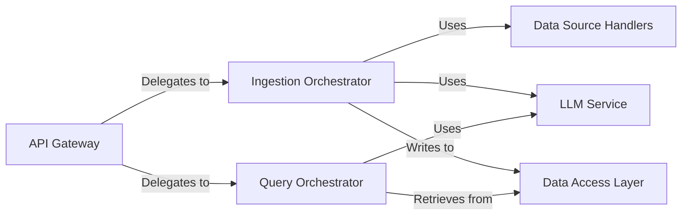

## Details

One paragraph explaining the functionality which is represented by this graph. What the main flow is and what is its purpose.

### API Gateway
The primary entry point for the backend, implemented in FastAPI. It defines all HTTP endpoints (e.g., `/ingest`, `/chat`), validates request and response models using Pydantic, and acts as a controller, delegating incoming requests to the appropriate orchestrator.

**Related Classes/Methods**:

- `backend/src/main.py`
- `backend/src/api.py`

### Ingestion Orchestrator
Manages the entire ETL pipeline for processing new data sources. It coordinates fetching data from `Data Source Handlers`, orchestrates the transformation of unstructured text into a knowledge graph using the `LLM Service`, and loads the final graph structure into the database via the `Data Access Layer`.

**Related Classes/Methods**:

- `backend/src/processing_source.py`

### Query Orchestrator
Handles the RAG workflow for user-facing queries. It retrieves relevant context from the knowledge graph, manages conversational history, and leverages the `LLM Service` to generate coherent, context-aware answers.

**Related Classes/Methods**:

- `backend/src/qa.py`

### Data Source Handlers
A collection of specialized modules responsible for handling different data sources. Each handler implements the logic to extract processable text from a specific source type (e.g., web pages, YouTube transcripts, local files).

**Related Classes/Methods**:

- `backend/src/document_sources/extract_graph_from_web_page.py`
- `backend/src/document_sources/extract_graph_from_file_youtube.py`

### LLM Service
A dedicated wrapper for interacting with external Large Language Models (e.g., OpenAI, Google Cloud AI Platform). It standardizes the process of making LLM calls, handles configuration (e.g., API keys, model selection), and provides a unified interface for use by other components like the `Ingestion Orchestrator` and `Query Orchestrator`.

**Related Classes/Methods**:

- `backend/src/llm.py`

### Data Access Layer
An abstraction layer that centralizes all interactions with the Neo4j database. It provides a clean, high-level API for creating, reading, and updating graph data, hiding the specific Cypher queries from the rest of the application.

**Related Classes/Methods**:

- `backend/src/graphDB_dataAccess.py`

### [FAQ](https://github.com/CodeBoarding/GeneratedOnBoardings/tree/main?tab=readme-ov-file#faq)