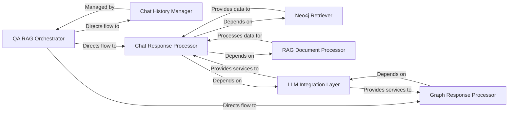

## Details

This subsystem is central to the platform's interactive capabilities, managing the conversational flow, leveraging Retrieval Augmented Generation (RAG) to fetch relevant information from the knowledge graph, and generating natural language responses using integrated LLM capabilities. It also ensures chat history and context are maintained across user sessions.

### QA RAG Orchestrator
Serves as the primary entry point for all conversational AI and RAG functionalities. It orchestrates the overall flow based on the active chat mode, delegating specific tasks to other specialized sub-components. This component is crucial for directing user queries to the appropriate processing paths (e.g., general chat vs. graph-specific queries).

**Related Classes/Methods**:

- <a href="https://github.com/neo4j-labs/llm-graph-builder/blob/main/backend/src/QA_integration.py#L655-L690" target="_blank" rel="noopener noreferrer">`backend.src.QA_integration.QA_RAG` (655:690)</a>

### Chat History Manager
Responsible for the persistence, retrieval, and management of conversational chat history for individual user sessions. It ensures that context is maintained throughout a dialogue, allowing for coherent and continuous interactions.

**Related Classes/Methods**:

- <a href="https://github.com/neo4j-labs/llm-graph-builder/blob/main/backend/src/QA_integration.py#L42-L53" target="_blank" rel="noopener noreferrer">`backend.src.QA_integration.SessionChatHistory` (42:53)</a>
- <a href="https://github.com/neo4j-labs/llm-graph-builder/blob/main/backend/src/QA_integration.py#L66-L71" target="_blank" rel="noopener noreferrer">`backend.src.QA_integration.get_history_by_session_id` (66:71)</a>

### Neo4j Retriever
Initializes and provides the mechanism to efficiently fetch relevant documents, nodes, or relationships from the Neo4j knowledge graph. This component is fundamental for the "Retrieval" aspect of RAG, ensuring that the LLM has access to the most pertinent information from the knowledge base.

**Related Classes/Methods**:

- <a href="https://github.com/neo4j-labs/llm-graph-builder/blob/main/backend/src/QA_integration.py#L397-L409" target="_blank" rel="noopener noreferrer">`backend.src.QA_integration.get_neo4j_retriever` (397:409)</a>

### RAG Document Processor
Handles the formatting, processing, and preparation of retrieved documents for integration into the RAG chain. This includes managing token counts, structuring the input for the LLM, and ensuring the retrieved context is optimized for response generation.

**Related Classes/Methods**:

- <a href="https://github.com/neo4j-labs/llm-graph-builder/blob/main/backend/src/QA_integration.py#L227-L269" target="_blank" rel="noopener noreferrer">`backend.src.QA_integration.process_documents` (227:269)</a>

### Chat Response Processor
Manages the end-to-end processing of general user chat queries. It orchestrates the retrieval of documents via the `Neo4j Retriever`, processes them using the `RAG Document Processor`, and then utilizes the `LLM Integration Layer` to generate the final natural language chat response.

**Related Classes/Methods**:

- <a href="https://github.com/neo4j-labs/llm-graph-builder/blob/main/backend/src/QA_integration.py#L433-L490" target="_blank" rel="noopener noreferrer">`backend.src.QA_integration.process_chat_response` (433:490)</a>

### Graph Response Processor
Specifically designed to manage queries and generate responses related to direct interactions with the knowledge graph. This component might handle graph-based question answering or facilitate data exploration by translating natural language queries into graph traversals or queries.

**Related Classes/Methods**:

- <a href="https://github.com/neo4j-labs/llm-graph-builder/blob/main/backend/src/QA_integration.py#L574-L619" target="_blank" rel="noopener noreferrer">`backend.src.QA_integration.process_graph_response` (574:619)</a>

### LLM Integration Layer
Provides the core Large Language Model capabilities for generating natural language responses across the subsystem. It acts as an abstraction layer for various LLM providers, ensuring that the `Chat Response Processor` and `Graph Response Processor` can leverage LLM functionalities seamlessly.

**Related Classes/Methods**:

- `backend.src.llm`

### [FAQ](https://github.com/CodeBoarding/GeneratedOnBoardings/tree/main?tab=readme-ov-file#faq)